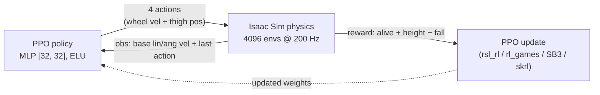

<div align="center">

# Wheeled Quadruped Robot — Deep RL Balancing in Isaac Lab

### A self-balancing wheeled-quadruped robot that learns to stand upright with Deep Reinforcement Learning (PPO) in NVIDIA Isaac Lab

The robot has four legs tipped with wheels. Using massively-parallel simulation in **NVIDIA Isaac Lab / Isaac Sim**, a **PPO** policy learns to keep the body balanced and upright — controlling its rear wheels and front thighs from proprioceptive feedback alone, across **4096 environments** trained in parallel on the GPU.

[](https://isaac-sim.github.io/IsaacLab/)
[](https://developer.nvidia.com/isaac-sim)
[](https://www.python.org/)
[](https://pytorch.org/)
[](https://arxiv.org/abs/1707.06347)
[](LICENSE)

<br/>


<sub><i>The wheeled quadruped balancing upright in Isaac Sim (target base height ≈ 0.83 m).</i></sub>

</div>

---

## Table of contents

- [Overview](#overview)
- [Preview](#preview)
- [How it works](#how-it-works)
- [The robot](#the-robot)
- [Repository layout](#repository-layout)
- [Prerequisites](#prerequisites)
- [Installation](#installation)
- [Usage](#usage)
- [PPO hyperparameters](#ppo-hyperparameters)
- [Notes & limitations](#notes--limitations)
- [Roadmap](#roadmap)
- [Acknowledgements](#acknowledgements)
- [Citation](#citation)
- [License](#license)

## Overview

This project trains a **wheeled quadruped** — a four-legged robot whose feet are wheels — to **balance and stay standing** using deep reinforcement learning. It is built as a custom task on top of **[NVIDIA Isaac Lab](https://isaac-sim.github.io/IsaacLab/)** (the RL framework layered on Isaac Sim / Omniverse), using its **manager-based RL environment** API.

The control problem is essentially a **3D inverted-pendulum / self-balancing** task: the policy must actuate the robot's rear wheels and front thigh joints so the torso stays near an upright target height and does not tip over. Training runs across **4096 parallel environments** on the GPU and is optimized with **Proximal Policy Optimization (PPO)**.

The task is registered as a Gymnasium environment (`Custom-Wheeled-Quadruped-v0`) with ready-made PPO configs for four RL libraries — **rsl_rl, rl_games, Stable-Baselines3, and skrl** — so it plugs directly into Isaac Lab's standard training workflows.

## Preview

<div align="center">

| Balancing upright | Standing pose | Collision / articulation view |
|:---:|:---:|:---:|
|  |  |  |

</div>

<sub>Renders of the robot's USD asset in Isaac Sim.</sub>

## How it works

The task is a **Markov Decision Process** solved with PPO. The policy observes proprioceptive state and outputs continuous joint commands each control step (100 Hz).

**Observations — 10 values** (`policy` group, concatenated):

| Term | Size | Description |
|---|:---:|---|
| Base linear velocity | 3 | Torso linear velocity |
| Base angular velocity | 3 | Torso angular velocity |
| Last action | 4 | Previous command (helps the policy stay smooth) |

**Actions — 4 continuous values:**

| Actuator | Joints | Control |
|---|---|---|
| Rear wheels | `robot1_rl_wheel_joint`, `robot1_rr_wheel_joint` | Joint **velocity** |
| Front thighs | `robot1_front_left_thigh_joint`, `robot1_front_right_thigh_joint` | Joint **position** |

**Rewards:**

| Term | Weight | Meaning |
|---|:---:|---|
| `is_alive` | +1.0 | Constant reward for every surviving step |
| `is_terminated` | −2.0 | Penalty for falling / early termination |
| `base_height_l2` | +1.0 | Stay at the target base height (**0.828 m**) — the balance objective |

**Terminations:** episode time-out (**5 s**), or `bad_orientation` when the torso tilts more than **π/3 (60°)** from upright (i.e. the robot has fallen).

**Simulation & scene:** 4096 parallel environments, 4 m spacing, ground plane, dome + distant lighting. Physics runs at **200 Hz** (`dt = 0.005`) with decimation 2 → a **100 Hz** control rate. Wheels use velocity-mode actuators (high damping, zero stiffness); thighs use position-mode actuators (high stiffness).



## The robot

The robot is described in `src/robot_description/` as a **ROS 2 (ament) package** — URDF/xacro parts (base, four thighs, leg joints, shins, front & rear wheels) with DAE/STL meshes — which is exported to a **USD** articulation (`quadruped_robot.usd`) for simulation in Isaac Sim. Joints are prefixed `robot1_*`; the RL task actuates the two rear wheels and the two front thighs.

## Repository layout

```
wheeled_quadruped_robot/
├── README.md
├── LICENSE
├── CITATION.cff
├── docs/images/                      # render previews used in this README
├── create_wheeled_quadruped_env.py   # standalone Isaac Lab demo (spawns env, random actions)
├── wheeled_quadruped_env_cfg.py      # env config variant (references the Isaac Lab install path)
├── wheeled_quadruped_stage.usd       # USD stage
├── wheeled_quadruped/                # Isaac Lab task package (registered Gym env)
│   ├── __init__.py                   # gym.register("Custom-Wheeled-Quadruped-v0")
│   ├── wheeled_quadruped_env_cfg.py  # ManagerBasedRLEnvCfg: scene / obs / actions / rewards
│   ├── quadruped_robot.usd
│   └── agents/                       # PPO configs: rsl_rl, rl_games, Stable-Baselines3, skrl
└── src/robot_description/            # ROS 2 URDF/xacro description + meshes for the robot
```

## Prerequisites

| Requirement | Notes |
|---|---|
| **NVIDIA GPU** (RTX) + recent driver | Required by Isaac Sim (PhysX GPU simulation) |
| **[Isaac Sim](https://developer.nvidia.com/isaac-sim)** | Omniverse simulation runtime |
| **[Isaac Lab](https://isaac-sim.github.io/IsaacLab/main/source/setup/installation/index.html)** | RL framework (`omni.isaac.lab`); use its bundled **Python 3.10** |
| Linux (Ubuntu 20.04/22.04) | Recommended platform for Isaac Sim |
| ROS 2 + `ament_cmake`, `xacro` | *Optional* — only to rebuild `src/robot_description/` |

> [!NOTE]
> All Python is run through Isaac Lab's launcher (`./isaaclab.sh -p ...`) or the Isaac Sim Python environment, **not** your system Python — that's what provides the `omni.isaac.lab` modules.

## Installation

Clone into your **home directory** (`~`). The code references the robot USD by an absolute, `$HOME`-relative path, so this location matters:

```bash
cd ~
git clone https://github.com/MickyasTA/wheeled_quadruped_robot.git
```

To train it as an Isaac Lab task, install the task package into Isaac Lab's `classic` tasks (this is the path the env config expects):

```bash
cp -r ~/wheeled_quadruped_robot/wheeled_quadruped \
  ~/IsaacLab/source/extensions/omni.isaac.lab_tasks/omni/isaac/lab_tasks/manager_based/classic/
```

Make sure `quadruped_robot.usd` sits inside that installed `wheeled_quadruped/` folder (the env config loads it from there).

## Usage

### Quick standalone demo (no training)

Spawns the environment and steps it with random actions — a fast way to verify the robot loads and the physics run:

```bash
cd ~/IsaacLab
./isaaclab.sh -p ~/wheeled_quadruped_robot/create_wheeled_quadruped_env.py --num_envs 8
```

### Train with PPO

Once the task package is installed (see [Installation](#installation)), use Isaac Lab's standard workflow scripts with the task id **`Custom-Wheeled-Quadruped-v0`**:

```bash
cd ~/IsaacLab

# Train (headless, 4096 envs) with rsl_rl
./isaaclab.sh -p source/standalone/workflows/rsl_rl/train.py \
  --task Custom-Wheeled-Quadruped-v0 --num_envs 4096 --headless

# Visualize the trained policy
./isaaclab.sh -p source/standalone/workflows/rsl_rl/play.py \
  --task Custom-Wheeled-Quadruped-v0 --num_envs 32
```

The task also ships configs for **rl_games**, **Stable-Baselines3 (sb3)**, and **skrl** — swap the workflow folder (e.g. `workflows/rl_games/train.py`) to use them.

## PPO hyperparameters

From [`wheeled_quadruped/agents/rsl_rl_ppo_cfg.py`](wheeled_quadruped/agents/rsl_rl_ppo_cfg.py):

| Parameter | Value | Parameter | Value |
|---|:---:|---|:---:|
| Actor / critic MLP | [32, 32], ELU | Steps per env | 16 |
| Max iterations | 150 | Learning rate | 1e-3 (adaptive) |
| Discount `γ` | 0.99 | GAE `λ` | 0.95 |
| Clip range | 0.2 | Entropy coef. | 0.005 |
| Learning epochs | 5 | Mini-batches | 4 |
| Desired KL | 0.01 | Value-loss coef. | 1.0 |

## Notes & limitations

- **Absolute USD paths.** `create_wheeled_quadruped_env.py` loads the USD from `~/wheeled_quadruped_robot/...`, while the task config loads it from the Isaac Lab install path. Clone into `$HOME` and place the USD as described, or edit the `usd_path` in the configs.
- **Template lineage.** The task is built from Isaac Lab's *cartpole* classic-task template; a leftover module docstring still reads "Cartpole balancing environment."
- **Two env-config copies exist** — the root-level `wheeled_quadruped_env_cfg.py` (standalone/reference) and the package `wheeled_quadruped/wheeled_quadruped_env_cfg.py` (the registered task). Keep changes in sync.
- Trained checkpoints are **not** committed; run the training workflow to produce them.

## Roadmap

- [ ] Commit a trained checkpoint + a short demo GIF/video of the balanced robot.
- [ ] Make the USD path configurable (CLI arg / relative resolution) instead of `$HOME`-hardcoded.
- [ ] Add velocity-command tracking so the robot can **drive** while balancing, not just stand.
- [ ] Domain randomization (mass, friction, pushes) for a more robust policy and sim-to-real transfer.
- [ ] Deduplicate the two env-config files into a single source of truth.

## Acknowledgements

- **[NVIDIA Isaac Lab](https://github.com/isaac-sim/IsaacLab)** — the RL framework and manager-based environment API this task is built on (BSD-3-Clause). The task package is adapted from Isaac Lab's *cartpole* classic task.
- **`src/robot_description/`** — the robot's ROS 2 URDF/xacro description and meshes.

## Citation

If you use this work, please cite it and Isaac Lab:

```bibtex
@software{asfaw_wheeled_quadruped,
  author  = {Asfaw, Mickyas Tamiru},
  title   = {Wheeled Quadruped Robot: Deep RL Balancing in Isaac Lab},
  url     = {https://github.com/MickyasTA/wheeled_quadruped_robot},
  year    = {2024}
}

@article{mittal2023orbit,
  author  = {Mittal, Mayank and others},
  title   = {Orbit: A Unified Simulation Framework for Interactive Robot Learning Environments},
  journal = {IEEE Robotics and Automation Letters},
  year    = {2023},
  doi     = {10.1109/LRA.2023.3270034}
}
```

## License

Released under the [MIT License](LICENSE). This project builds on **NVIDIA Isaac Lab** (BSD-3-Clause); several task files under `wheeled_quadruped/` retain their original Isaac Lab BSD-3-Clause headers. See [LICENSE](LICENSE) for the third-party attributions.
