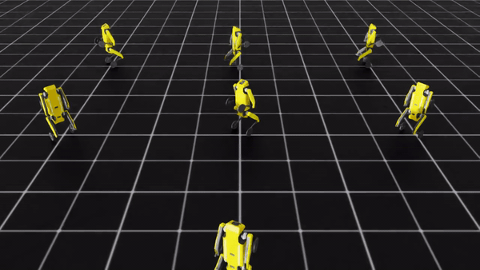
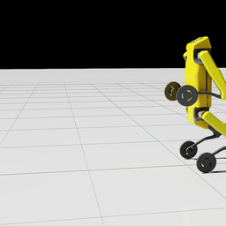
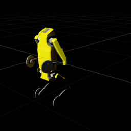
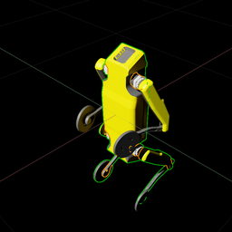
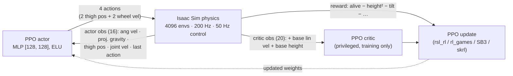

<div align="center">

# Wheeled Quadruped Robot — Deep RL Balancing in Isaac Lab

### A self-balancing wheeled-quadruped robot that learns to stand upright — and drive — with Deep Reinforcement Learning (PPO) in NVIDIA Isaac Lab

The robot stands pitched up, balancing segway-style on its two rear wheels. Using massively-parallel simulation in **NVIDIA Isaac Lab / Isaac Sim**, a **PPO** policy learns to keep the body upright at a target height — actuating its rear wheels and front thighs from **onboard sensing alone** — across **4096 environments** trained in parallel on the GPU.

[](https://isaac-sim.github.io/IsaacLab/)
[](https://developer.nvidia.com/isaac-sim)
[](https://www.python.org/)
[](https://pytorch.org/)
[](https://arxiv.org/abs/1707.06347)
[](LICENSE)

</div>

## Trained policies in action

Both policies below were trained end-to-end in this repo and are **shipped ready-to-use** in [`pretrained/`](pretrained/). The GIFs show the exported checkpoints running headless in Isaac Sim.

<div align="center">

| **Drive while balancing** (velocity task) | **Balance in place** (balance task) |
|:---:|:---:|
|  |  |
| Tracks a commanded forward + yaw velocity, staying upright the full 20 s episode. | Holds the upright 0.828 m target for the full episode. |

<sub><i>Full-resolution clips: <a href="docs/videos/velocity_demo.mp4">velocity_demo.mp4</a> · <a href="docs/videos/balance_demo.mp4">balance_demo.mp4</a></i></sub>

</div>

---

## Table of contents

- [Overview](#overview)
- [What changed in this revision](#what-changed-in-this-revision)
- [Preview](#preview)
- [How it works](#how-it-works)
- [Tasks](#tasks)
- [The robot](#the-robot)
- [Repository layout](#repository-layout)
- [Prerequisites](#prerequisites)
- [Installation](#installation)
- [Usage](#usage)
- [PPO hyperparameters](#ppo-hyperparameters)
- [Results](#results)
- [Pretrained models](#pretrained-models)
- [Documentation](#documentation)
- [Notes & limitations](#notes--limitations)
- [Roadmap](#roadmap)
- [Acknowledgements](#acknowledgements)
- [Citation](#citation)
- [License](#license)

## Overview

This project trains a **wheeled quadruped** — a four-legged robot whose rear feet are driven wheels — to **balance and stay standing**, and to **drive while balancing**, using deep reinforcement learning. It is built as a standalone **[NVIDIA Isaac Lab](https://isaac-sim.github.io/IsaacLab/) 2.3.2** external project (the modern `isaaclab` package namespace, *not* the legacy `omni.isaac.lab`), using Isaac Lab's **manager-based RL environment** API.

The control problem is a **3D inverted-pendulum / self-balancing** task: the robot is pitched up, resting on its two rear wheels at a base height of **0.828 m**, and the policy must actuate the rear wheels and front thigh joints so the torso stays near that upright target and does not tip over. Training runs across **4096 parallel environments** on the GPU and is optimized with **Proximal Policy Optimization (PPO)**.

A defining design choice is that **the policy only ever sees quantities a real robot could measure onboard** — body-frame angular velocity, a gravity direction estimate (from an IMU), joint positions, joint velocities, and its own last action. It never sees its world-frame linear velocity or absolute height. To keep learning tractable anyway, the value function *does* get those privileged signals during training — an **asymmetric actor-critic** — because they are trivially available in simulation but only used to shape the critic, which is discarded at deployment.

The tasks are registered as Gymnasium environments with ready-made PPO configs for four RL libraries — **rsl_rl, rl_games, Stable-Baselines3, and skrl** — so they plug directly into Isaac Lab's standard training workflows, and this repo also ships its own thin `scripts/rsl_rl/` train/play wrappers.

## What changed in this revision

This is a ground-up rewrite of an earlier prototype. If you saw the old version, here is what is different:

- **Isaac Lab 2.3.2 external-project layout.** The task now lives in an installable package under `source/wheeled_quadruped/` and imports the modern `isaaclab` namespace. The old approach of copying a folder into the Isaac Lab tree and hard-coding `$HOME`-relative USD paths is gone; the USD is resolved relative to the package.
- **Redesigned observations with an asymmetric actor-critic.** The actor observes **onboard-only** proprioception (~16 dims); the critic additionally observes **privileged** base linear velocity and base height (~20 dims). Base linear velocity is not measurable on the real hardware, so it is deliberately kept out of the policy input.
- **Fixed the base-height reward sign.** `base_height_l2` returns a *squared error* (a cost that grows as the robot leaves the target height). The prototype gave it a **positive** weight, which literally rewarded drifting off-height. It is now a **negative** weight (`-20.0`), so holding 0.828 m is what pays. See [TRAINING.md](docs/TRAINING.md#the-base-height-sign-bug--a-cautionary-tale).
- **A full reward suite** — upright orientation, vertical/angular-velocity damping, effort/smoothness penalties, and a wheel-spin penalty that stops the robot from quietly driving away while "balancing".
- **Domain randomization** — per-body friction/restitution, added base mass, randomized resets, and periodic velocity pushes — for robustness and sim-to-real headroom.
- **Longer, 20 s episodes** (was 5 s), giving the policy time to actually settle and recover from pushes.
- **A second task, trained.** A velocity-tracking task built on top of the balancer — drive to a commanded forward/yaw velocity while staying up — is trained to convergence, with its policy shipped in [`pretrained/`](pretrained/).

## Preview

<div align="center">

| Balancing upright | Standing pose | Collision / articulation view |
|:---:|:---:|:---:|
|  |  |  |

</div>

<sub>Renders of the robot's USD asset in Isaac Sim.</sub>

## How it works

Each task is a **Markov Decision Process** solved with PPO. Physics runs at **200 Hz** (`sim.dt = 0.005`) and the policy acts every **4th** physics step (`decimation = 4`) → a **50 Hz** control rate. Episodes last **20 s** (1000 control steps).

### Observations — asymmetric actor-critic

The **policy (actor)** reads only onboard-obtainable state, with observation noise applied during training:

| Term | Size | Onboard source |
|---|:---:|---|
| Base angular velocity | 3 | IMU gyroscope (body frame) |
| Projected gravity | 3 | IMU accelerometer → gravity direction |
| Front-thigh joint positions | 2 | Thigh joint encoders |
| Joint velocities | 4 | Joint encoders (2 wheels + 2 thighs) |
| Last action | 4 | Previous command (fed back for smoothness) |
| **Policy total** | **16** | |

The **critic (value function only)** additionally sees **privileged** simulation-only state. It is used purely to reduce value-estimate variance during training and is thrown away at deployment:

| Term | Size | Note |
|---|:---:|---|
| Base **linear** velocity | 3 | **Privileged** — not measurable onboard |
| Base angular velocity | 3 | |
| Projected gravity | 3 | |
| Base **height** (z) | 1 | **Privileged** |
| Front-thigh joint positions | 2 | |
| Joint velocities | 4 | |
| Last action | 4 | |
| **Critic total** | **20** | |

### Actions — 4 continuous values

| Actuator | Joints | Control | Scale |
|---|---|---|:---:|
| Front thighs | `robot1_front_left_thigh_joint`, `robot1_front_right_thigh_joint` | Joint **position** (offset from default) | 0.5 |
| Rear wheels | `robot1_rl_wheel_joint`, `robot1_rr_wheel_joint` | Joint **velocity** | 5.0 |

The two front wheels are **fixed** and stay that way; only these four joints are actuated.

### Rewards (balance task)

Weights are read directly from [`balance_env_cfg.py`](source/wheeled_quadruped/wheeled_quadruped/tasks/balance/balance_env_cfg.py):

| Term | Function | Weight | Purpose |
|---|---|:---:|---|
| `alive` | `is_alive` | **+1.0** | Reward for every surviving step |
| `terminating` | `is_terminated` | **−2.0** | Penalty for falling / early termination |
| `base_height` | `base_height_l2` (target 0.828 m) | **−20.0** | **Primary objective** — hold the balancing height |
| `flat_orientation` | `flat_orientation_l2` | **−5.0** | Keep the torso upright |
| `lin_vel_z` | `lin_vel_z_l2` | **−2.0** | Damp vertical bouncing |
| `ang_vel_xy` | `ang_vel_xy_l2` | **−0.05** | Damp roll/pitch wobble |
| `joint_torques` | `joint_torques_l2` | **−1.0e−5** | Effort penalty |
| `joint_acc` | `joint_acc_l2` | **−2.5e−7** | Smoothness (jerk) penalty |
| `action_rate` | `action_rate_l2` | **−0.01** | Penalize twitchy commands |
| `wheel_spin` | `joint_vel_l2` (wheels) | **−1.0e−3** | Stop the robot driving away while "balancing" |

### Terminations

| Condition | Trigger |
|---|---|
| Time-out | Episode reaches **20 s** |
| `bad_orientation` | Torso tilts more than **π/3 (60°)** from upright |
| `base_too_low` | Base height drops below **0.4 m** (it has fallen) |

### Scene & simulation

4096 parallel environments, 4 m spacing, ground plane, dome + distant lighting. Wheels use velocity-mode implicit actuators (zero stiffness, damping 10); thighs use position-mode actuators (stiffness 1000). PhysX runs 8 position solver iterations for rolling-contact stability.



## Tasks

| Task id | Description | Config |
|---|---|---|
| `Wheeled-Quadruped-Balance-v0` | Stand and balance in place on the rear wheels | `WheeledQuadrupedBalanceEnvCfg` |
| `Wheeled-Quadruped-Balance-Play-v0` | Balance, eval variant (32 envs, no noise, no pushes) | `WheeledQuadrupedBalanceEnvCfg_PLAY` |
| `Custom-Wheeled-Quadruped-v0` | Legacy alias → same balance config | `WheeledQuadrupedBalanceEnvCfg` |
| `Wheeled-Quadruped-Velocity-v0` | Drive to a commanded forward/yaw velocity while balancing | `WheeledQuadrupedVelocityEnvCfg` |
| `Wheeled-Quadruped-Velocity-Play-v0` | Velocity, eval variant (fixed forward command) | `WheeledQuadrupedVelocityEnvCfg_PLAY` |
| `Wheeled-Quadruped-Balance-Rough-v0` | Balance on uneven ground (generated rough terrain) | `WheeledQuadrupedBalanceRoughEnvCfg` |
| `Wheeled-Quadruped-Velocity-Rough-v0` | Drive while balancing on uneven ground, with a terrain curriculum | `WheeledQuadrupedVelocityRoughEnvCfg` |

*(Each rough task also has a `-Rough-Play-v0` eval variant.)*

The velocity task extends the balancer: it adds a `UniformVelocityCommand` (with lateral velocity pinned to zero, since a two-wheel stance cannot translate sideways), appends the command to both observation groups, adds exponential velocity-tracking rewards, and softens the balance-hold shaping so the policy is free to drive. See [docs/TRAINING.md](docs/TRAINING.md) for the full design.

### Rough terrain (uneven ground)

The `*-Rough-v0` tasks swap the flat ground plane for a **generated rough terrain** ([`source/wheeled_quadruped/wheeled_quadruped/terrains/`](source/wheeled_quadruped/wheeled_quadruped/terrains/__init__.py)) so the policy learns to stay up on uneven surfaces. Because a two-wheel balancer cannot climb stairs, the terrain is tuned for wheels — **low-amplitude random roughness (~1–6 cm) plus gentle slopes (≤ ~11°), no stairs or boxes**. The velocity-rough task adds a **terrain-level curriculum** (`terrain_levels_vel`): robots that track their command well are promoted to rougher tiles, those that fall behind are demoted. Train them exactly like the flat tasks:

```bash
python scripts/rsl_rl/train.py --task Wheeled-Quadruped-Balance-Rough-v0 --headless --num_envs 2048
python scripts/rsl_rl/train.py --task Wheeled-Quadruped-Velocity-Rough-v0 --headless --num_envs 2048
```

## The robot

The robot is described in `src/robot_description/` as a **ROS 2 (ament) package** — URDF/xacro parts (base, four thighs, leg joints, shins, front & rear wheels) with DAE/STL meshes — exported to a **USD** articulation (`quadruped_robot.usd`) for simulation in Isaac Sim. Joints are prefixed `robot1_*`. Only **four joints are actuated**: the two rear wheels (`*_rl_wheel_joint`, `*_rr_wheel_joint`, continuous) and the two front thighs (`*_front_left_thigh_joint`, `*_front_right_thigh_joint`, revolute, ±0.785 rad). The front wheels are fixed.

## Repository layout

```
wheeled_quadruped_robot/
├── README.md
├── LICENSE                              # MIT (+ Isaac Lab BSD-3-Clause attribution)
├── CITATION.cff
├── docs/
│   ├── images/                          # render previews used in this README
│   ├── SETUP_WINDOWS.md                 # Windows bring-up runbook (this machine)
│   └── TRAINING.md                      # RL design document (obs/reward/event rationale)
├── scripts/
│   ├── list_envs.py                     # list every registered Wheeled-Quadruped task
│   ├── verify_env.py                    # smoke test: load env, random rollout, NaN/Inf checks
│   └── rsl_rl/
│       ├── train.py                     # PPO training entry point
│       ├── play.py                      # roll out / export a trained checkpoint
│       └── cli_args.py                  # rsl_rl CLI helpers (verbatim from Isaac Lab)
├── source/
│   └── wheeled_quadruped/               # installable Isaac Lab extension package
│       ├── pyproject.toml
│       └── wheeled_quadruped/
│           ├── assets/
│           │   ├── __init__.py          # WHEELED_QUADRUPED_CFG (ArticulationCfg)
│           │   └── quadruped_robot.usd  # robot USD (~18 MB)
│           └── tasks/
│               ├── balance/             # balance task: env cfg + agents (rsl_rl/skrl/sb3/rl_games)
│               └── velocity/            # velocity-tracking task: env cfg + rsl_rl agent
└── src/robot_description/               # ROS 2 URDF/xacro description + meshes for the robot
```

## Prerequisites

| Requirement | Notes |
|---|---|
| **NVIDIA RTX GPU** + recent driver | Isaac Sim 5.1 needs a modern driver; PhysX GPU simulation is required |
| **~60–80 GB free disk** | Isaac Sim + Isaac Lab + the extension cache are large. **Budget 60+ GB free before you start** — see the disk warning below |
| **Python 3.11** | The exact interpreter Isaac Sim 5.1 / Isaac Lab 2.3.2 target |
| Windows 10/11 **or** Linux | This repo is developed Windows-native; see [docs/SETUP_WINDOWS.md](docs/SETUP_WINDOWS.md) |
| ROS 2 + `ament_cmake`, `xacro` | *Optional* — only to rebuild `src/robot_description/` |

> [!WARNING]
> **Disk space is the number-one gotcha.** A full Isaac Sim 5.1 + Isaac Lab 2.3.2 install (pip wheels, the Omniverse extension cache, and the first-run extension-registry pull) commonly consumes **60+ GB**. On WSL2 the Isaac Sim GPU stack is **not** supported *and* the WSL virtual disk still lives on your Windows `C:` drive, so WSL does not save you the space. Free the room first.

## Installation

Isaac Sim and Isaac Lab are installed **via pip into a Python 3.11 virtual environment** (the modern workflow; no `isaaclab.sh`/`isaaclab.bat` wrapper is assumed anywhere in this repo).

```bash
# 1. Clone
git clone https://github.com/MickyasTA/wheeled_quadruped_robot.git
cd wheeled_quadruped_robot

# 2. Create and activate a Python 3.11 venv
python3.11 -m venv .venv
# Linux/macOS:
source .venv/bin/activate
# Windows (PowerShell):
#   .\.venv\Scripts\Activate.ps1

# 3. Upgrade pip
python -m pip install --upgrade pip

# 4. Install Isaac Sim 5.1
pip install "isaacsim[all,extscache]==5.1.0" --extra-index-url https://pypi.nvidia.com

# 5. Install the matching PyTorch (CUDA 12.8 build)
pip install torch==2.7.0 torchvision --index-url https://download.pytorch.org/whl/cu128

# 6. Install Isaac Lab 2.3.2 (pulls in the RL frameworks: rsl-rl, skrl, sb3, rl-games)
pip install "isaaclab[all]==2.3.2.post1" --extra-index-url https://pypi.nvidia.com

# 7. Install this project's task package (editable)
pip install -e source/wheeled_quadruped
```

On Windows, **enable long paths** before installing (Isaac Sim's dependency tree exceeds the legacy 260-char limit) and expect the **first run to stall for 10+ minutes** while the Omniverse extension registry is pulled and compiled. The full step-by-step for this machine — including the mandatory disk cleanup — is in **[docs/SETUP_WINDOWS.md](docs/SETUP_WINDOWS.md)**.

> [!NOTE]
> Isaac Lab 2.3.2 pairs with **rsl-rl-lib ≥ 3.0** (installed by the `isaaclab[all]` extras); the `scripts/rsl_rl/` train/play scripts target that API. If your environment pins an older `rsl-rl-lib`, upgrade it to match Isaac Lab 2.3.2.

### Verify the install

```bash
python scripts/verify_env.py --num_envs 8
```

This loads the environment, prints the robot's joints/bodies and per-observation-group shapes, runs a short random rollout, checks every observation and reward tensor for NaN/Inf, and prints a PASS/FAIL summary. Treat it as the acceptance gate before training.

## Usage

All scripts are launched with the venv's `python` (no wrapper). From the repo root:

```bash
# List every registered task in this project
python scripts/list_envs.py

# Train the balance policy (headless, 2048 envs — start here on a 16 GB GPU)
python scripts/rsl_rl/train.py --task Wheeled-Quadruped-Balance-v0 --headless --num_envs 2048

# Train the velocity-tracking policy
python scripts/rsl_rl/train.py --task Wheeled-Quadruped-Velocity-v0 --headless --num_envs 2048

# Watch / export a trained checkpoint (loads the latest run by default)
python scripts/rsl_rl/play.py --task Wheeled-Quadruped-Balance-Play-v0 --num_envs 32
```

Checkpoints and TensorBoard logs are written to `logs/rsl_rl/<experiment_name>/` (`wheeled_quadruped_balance` or `wheeled_quadruped_velocity`).

> [!NOTE]
> Because the **balance** tasks register `skrl_cfg_entry_point`, `sb3_cfg_entry_point`, and `rl_games_cfg_entry_point`, **Isaac Lab's own** `scripts/reinforcement_learning/{skrl,sb3,rl_games}/train.py` workflow scripts also work with the Balance task ids — *provided the script imports this package first* (`import wheeled_quadruped.tasks`). The velocity tasks register **rsl_rl only**. Note also that only the rsl_rl workflow consumes the privileged `critic` observation group (asymmetric actor-critic); skrl/sb3/rl_games train symmetrically on the `policy` group. The `scripts/` folder in this repo is the supported, batteries-included path.

## PPO hyperparameters

From the rsl_rl agent configs ([balance](source/wheeled_quadruped/wheeled_quadruped/tasks/balance/agents/rsl_rl_ppo_cfg.py), [velocity](source/wheeled_quadruped/wheeled_quadruped/tasks/velocity/agents/rsl_rl_ppo_cfg.py)):

| Parameter | Balance | Velocity |
|---|:---:|:---:|
| Actor / critic MLP | [128, 128], ELU | [256, 128, 64], ELU |
| Steps per env (rollout) | 24 | 24 |
| Max iterations | 1000 | 3000 |
| Learning rate | 1e-3 (adaptive) | 1e-3 (adaptive) |
| Discount `γ` | 0.99 | 0.99 |
| GAE `λ` | 0.95 | 0.95 |
| Clip range | 0.2 | 0.2 |
| Entropy coef. | 0.005 | 0.005 |
| Learning epochs | 5 | 5 |
| Mini-batches | 4 | 4 |
| Desired KL | 0.01 | 0.01 |
| Value-loss coef. | 1.0 | 1.0 |
| Init. action noise std | 1.0 | 1.0 |
| Empirical normalization | off | off |

The actor reads the `policy` observation group and the critic reads the `critic` group; this mapping is declared in the runner cfg via `obs_groups = {"policy": ["policy"], "critic": ["critic"]}` (resolved by rsl-rl ≥ 3.0 from the runner cfg, not the env wrapper).

## Results

Both tasks were trained to convergence on a single RTX 4090 Laptop GPU (16 GB), 2048 environments, headless. Episode length is out of **1000** control steps (a full 20 s episode); the velocity tracking scores are the mean exponential-kernel reward in `[0, 1]`.

| Task | Iterations | Mean reward | Episode length | Lin-vel tracking | Yaw tracking |
|---|:---:|:---:|:---:|:---:|:---:|
| **Balance** | 1000 | ≈ 19.5 | **1000 / 1000** | — | — |
| **Velocity** | 3000 | ≈ 28.2 | **1000 / 1000** | ≈ 0.85 / 1.0 | ≈ 0.43 / 0.5 |

The balancer learned to stand in a sharp transition around iteration 500–600 (episode length jumping from ~13 steps to the full episode). The velocity policy learned to stay up and follow commands remarkably fast (episode length ~886 by iteration 200), then spent the remaining iterations refining tracking accuracy. See the GIFs at the [top of this README](#trained-policies-in-action).

## Pretrained models

The final trained policies are committed in [`pretrained/`](pretrained/) for immediate use — no training required. Each task folder ships three forms of the same network:

| File | Format | Use it for |
|---|---|---|
| `policy.onnx` | ONNX | Framework-agnostic inference (onnxruntime) — deployment, C++, other runtimes |
| `policy_torchscript.pt` | TorchScript | Standalone PyTorch inference without Isaac Lab installed |
| `model_1399.pt` / `model_2999.pt` | rsl-rl checkpoint | Replay or resume in-sim with `scripts/rsl_rl/play.py` |

```bash
# Replay a shipped policy in Isaac Sim (point --checkpoint at the committed file):
python scripts/rsl_rl/play.py --task Wheeled-Quadruped-Velocity-Play-v0 --num_envs 9 \
  --checkpoint pretrained/velocity/model_2999.pt
```

The exported `policy.onnx` / `policy_torchscript.pt` contain only the actor MLP (+ observation normalizer) — i.e. the **onboard-only** deployable policy, with the privileged critic already stripped. See [`pretrained/README.md`](pretrained/README.md) for the observation layout and a minimal ONNX inference example.

## Documentation

A full, textbook-style **[project wiki](docs/wiki/Home.md)** (`docs/wiki/`) explains everything — the robot, RL/MDP foundations, Isaac Lab's architecture, both task specifications, the PPO math, the asymmetric actor-critic and sim-to-real, the code architecture, and a reproduction manual — in both plain language and full mathematics. Start at [`docs/wiki/Home.md`](docs/wiki/Home.md). See also [docs/SETUP_WINDOWS.md](docs/SETUP_WINDOWS.md) (install runbook) and [docs/TRAINING.md](docs/TRAINING.md) (RL design notes).

## Notes & limitations

- **Onboard-only policy, privileged critic.** The actor never sees base linear velocity or absolute height. This is intentional for sim-to-real; the critic's extra signals exist only to stabilize training and are discarded at deployment.
- **Yaw tracking is the weakest metric.** The velocity policy tracks forward speed closely (~0.85/1.0) but yaw a bit less tightly (~0.43/0.5). Raising the `track_ang_vel_z` weight or tightening its kernel `std` is the first knob to turn for sharper turning.
- **rl_games / SB3 batch-size coupling.** Those YAML configs assume `num_envs = 4096` (rollout = `num_envs × n_steps`). If you change `--num_envs`, the `minibatch_size` / `batch_size` must still evenly divide the rollout — see [docs/SETUP_WINDOWS.md](docs/SETUP_WINDOWS.md#rl_games--sb3-batch-size-coupling).
- **USD is a committed binary.** `quadruped_robot.usd` (~18 MB) is tracked directly and marked binary in `.gitattributes`. If the asset grows, migrate it to Git LFS.
- **Not yet on hardware.** Both policies are trained and validated in simulation only; physical deployment (sim-to-real) is the next milestone.

## Roadmap

- [x] Redesign observations/rewards with an asymmetric actor-critic and onboard-only actor obs.
- [x] Fix the base-height reward sign; add the full effort/smoothness reward suite.
- [x] Domain randomization (mass, friction, restitution, resets, pushes).
- [x] Scaffold a velocity-command tracking task on top of the balancer.
- [x] Train the velocity task to convergence.
- [x] Commit trained checkpoints + demo GIFs/videos (see [`pretrained/`](pretrained/)).
- [x] Rough-terrain tasks (uneven ground) with a terrain-level curriculum.
- [ ] Train the rough-terrain policies to convergence and ship their checkpoints.
- [ ] Further tune the velocity reward weights (yaw tracking headroom).
- [ ] Sim-to-real: deploy the onboard-only policy on the physical robot.
- [ ] USD/asset hygiene: move the USD to Git LFS if it grows.

## Acknowledgements

- **[NVIDIA Isaac Lab](https://github.com/isaac-sim/IsaacLab)** — the RL framework and manager-based environment API this project is built on (BSD-3-Clause). The train/play/CLI scripts and the config structure are adapted from Isaac Lab's velocity locomotion task; those files retain their original BSD-3-Clause headers.
- **`src/robot_description/`** — the robot's ROS 2 URDF/xacro description and meshes.

## Citation

If you use this work, please cite it and Isaac Lab:

```bibtex
@software{asfaw_wheeled_quadruped,
  author  = {Asfaw, Mickyas Tamiru},
  title   = {Wheeled Quadruped Robot: Deep RL Balancing in Isaac Lab},
  url     = {https://github.com/MickyasTA/wheeled_quadruped_robot},
  year    = {2024}
}

@article{mittal2023orbit,
  author  = {Mittal, Mayank and others},
  title   = {Orbit: A Unified Simulation Framework for Interactive Robot Learning Environments},
  journal = {IEEE Robotics and Automation Letters},
  year    = {2023},
  doi     = {10.1109/LRA.2023.3270034}
}
```

## License

Released under the [MIT License](LICENSE). This project builds on **NVIDIA Isaac Lab** (BSD-3-Clause); several files under `source/` and `scripts/` retain their original Isaac Lab BSD-3-Clause headers. See [LICENSE](LICENSE) for the third-party attributions.
