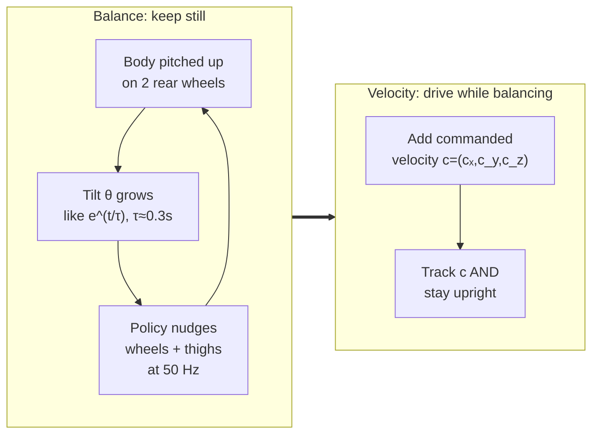
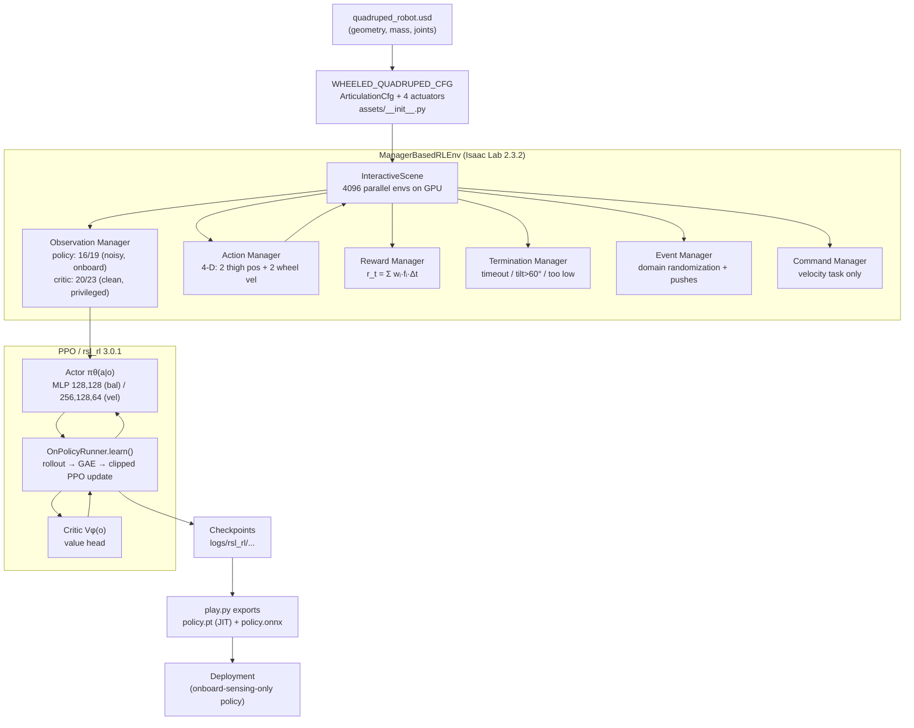

# Project Overview

This project teaches a **wheeled quadruped** — a four-legged robot whose rear feet are wheels — to stand up and balance *segway-style* on those two rear wheels, and then to drive around while staying upright, using deep reinforcement learning (**PPO**) inside NVIDIA **Isaac Lab 2.3.2**. This page is the front door: it explains what the robot is, why balancing it is fundamentally a 3‑D inverted-pendulum problem, what the two learning tasks are, and how every other page of this wiki fits together.

**Prerequisites / see also:** none — start here. Then continue to [The Robot](02-The-Robot.md) and [RL & MDP Foundations](03-RL-and-MDP-Foundations.md). Later pages: [Isaac Lab Architecture](04-Isaac-Lab-Architecture.md), [Balance Task](05-Balance-Task.md), [Velocity Task](06-Velocity-Task.md), [PPO Algorithm](07-PPO-Algorithm.md), [Asymmetric Actor-Critic & Sim2Real](08-Asymmetric-Actor-Critic-and-Sim2Real.md), [Code Architecture](09-Code-Architecture.md), [Training & Reproducing](10-Training-and-Reproducing.md). ([Home](Home.md) is the table of contents.)

---

## 1. What is a "wheeled quadruped"?

A **quadruped** is a four-legged robot (think of a robot dog). A **wheeled** quadruped replaces some or all of its feet with wheels, so it can both articulate its limbs *and* roll. The specific machine in this repository is an unusual hybrid: it has **two front legs** ending in a hinge ("thigh") joint, and **two rear legs** ending in **wheels**. During operation it does not stand on all four contact points like a normal animal. Instead it **pitches its whole body up and balances on just the two rear wheels**, holding the two front legs in the air — exactly the way a *Segway* or a hoverboard balances a rider on two coaxial wheels.

 
<i>The robot balancing upright on its two rear wheels at a target base height of ≈ 0.83 m (docs/images/robot.png).</i>

The robot has exactly **four actuated joints**, and this is the entire "muscle" set the policy controls. In the shared notation used throughout this wiki, the joint-position vector is

$$q = (q_1, q_2, q_3, q_4) \in \mathbb{R}^4,\qquad q = [\text{front-left-thigh},\; \text{front-right-thigh},\; \text{rl-wheel},\; \text{rr-wheel}].$$

Here $q$ is the vector of joint angles (radians for the revolute thighs, wheel rotation angle for the wheels), and $\dot q$ is the vector of joint velocities. The two **front thighs** are *position-controlled* revolute hinges (the policy commands an angle), and the two **rear wheels** are *velocity-controlled* (the policy commands a spin rate). How those commands become physical torques — through a proportional-derivative actuator law — is the subject of [The Robot](02-The-Robot.md). The robot's articulation, physics properties, initial pose, and the four actuators are all defined in one file, [`source/wheeled_quadruped/wheeled_quadruped/assets/__init__.py`](../../source/wheeled_quadruped/wheeled_quadruped/assets/__init__.py), which loads the 3‑D geometry from a binary USD asset, `quadruped_robot.usd`.

A few approximate physical numbers appear as engineering comments in the code (they describe the CAD design, not tunable parameters): wheel radius $\approx 0.1008$ m, wheel track (left-to-right spacing) $\approx 0.44$ m (comments in [`velocity_env_cfg.py`](../../source/wheeled_quadruped/wheeled_quadruped/tasks/velocity/velocity_env_cfg.py)), a trunk mass of $\approx 17.94$ kg, and thigh limits of $\pm 0.785$ rad ($\pm 45°$) (comments/docstrings in [`balance_env_cfg.py`](../../source/wheeled_quadruped/wheeled_quadruped/tasks/balance/balance_env_cfg.py) and `assets/__init__.py`). Treat these as *approximate design intent*, not as verified simulation constants.

---

## 2. The core problem: a 3‑D inverted pendulum

Why is balancing on two wheels hard? Because an upright body pivoting on a low contact patch is an **inverted pendulum** — the textbook example of an *unstable equilibrium*. Standing straight up is a balance point, but it is like balancing a broom on your palm: the tiniest lean grows, and grows *faster the more it has already leaned*, until the thing topples. The robot must therefore make constant, fast corrections just to *stay still*.

Let us make the intuition quantitative with the simplest possible model. Model the body as a point mass at height $L$ above the wheel axle, leaning by an angle $\theta$ away from vertical. Gravity $g \approx 9.81~\text{m/s}^2$ pulls the mass down, producing a toppling torque. For a frictionless pendulum the equation of motion is

$$\ddot{\theta} = \frac{g}{L}\sin\theta,$$

where $\ddot\theta$ is the angular acceleration of the lean. The key sign detail: unlike a *hanging* pendulum (whose restoring term is $-\tfrac{g}{L}\sin\theta$ and which swings back to the bottom), the **inverted** pendulum has a $+$ sign — gravity *amplifies* the lean instead of correcting it. Linearizing near upright ($\sin\theta \approx \theta$ for small $\theta$) gives

$$\ddot\theta \approx \frac{g}{L}\,\theta \quad\Longrightarrow\quad \theta(t) \approx \theta_0\, e^{\,t/\tau},\qquad \tau = \sqrt{\frac{L}{g}}.$$

The solution *grows exponentially*: any initial tilt $\theta_0$ blows up with a characteristic **fall time** $\tau$. Using the base height as a rough stand-in for the pendulum length, $L \approx 0.83$ m, we get an order-of-magnitude estimate

$$\tau \approx \sqrt{\frac{0.83}{9.81}}~\text{s} \approx 0.29~\text{s}.$$

This single number explains the whole control-design philosophy. The body falls on a $\sim\!0.3$ s timescale, so the controller must sense and react *much faster than that*. The project runs the learned policy at a **control frequency $f_c = 50$ Hz** (control period $\Delta t = 0.02$ s), while the underlying physics integrates at $dt = 0.005$ s (200 Hz) with **decimation $D = 4$** (so $\Delta t = D\cdot dt$). That gives roughly $\tau/\Delta t \approx 0.29/0.02 \approx 14$ control decisions inside a single fall time — comfortably enough authority to catch and reverse a lean before it runs away. (These timing values are set in `__post_init__` of the env config; see [Isaac Lab Architecture](04-Isaac-Lab-Architecture.md).)

The real problem is harder than this 1‑D cartoon in two ways. First, it is **3‑D**: the body can pitch (fall forward/back), roll (fall sideways), and yaw (twist), and it has a height $h = p_z$ it must hold near the target $h^\star = 0.828$ m. Second, the robot's only actuators are two wheels and two thighs, so it must balance a $\sim\!18$ kg body *using wheel torque and leg posture alone* — there is no third support to lean on. The policy senses its tilt through **projected gravity** $g_b = R_b^{\top}\hat g$ (the gravity direction expressed in the body frame, $\approx(0,0,-1)$ when perfectly upright and tilting away from that as the body leans) and its rotation rate through the base angular velocity $\omega=(\omega_x,\omega_y,\omega_z)$. Those two 3‑vectors are the robot's "inner ear."

---

## 3. The two tasks

The project is deliberately staged into two learning problems, from easier to harder. Both share the *same robot, same physics, same 20‑second episodes* (`episode_length_s = 20.0` → $20.0/\Delta t = 1000$ control steps per episode) and the same 4‑dimensional action space; they differ only in what the policy is asked to do. Each task is registered as a Gymnasium environment id so it can be launched from the command line.

| Task | Gym id (train) | Gym id (play) | Goal | Policy obs dim | Critic obs dim |
|---|---|---|---|---|---|
| **Balance** | `Wheeled-Quadruped-Balance-v0` | `Wheeled-Quadruped-Balance-Play-v0` | Stand upright, stay in place | 16 | 20 |
| **Velocity** | `Wheeled-Quadruped-Velocity-v0` | `Wheeled-Quadruped-Velocity-Play-v0` | Track a commanded velocity while upright | 19 | 23 |

**Balance** ([details](05-Balance-Task.md)) is the foundation: the robot must reach and hold the upright pose, keep its base near $h^\star = 0.828$ m, keep flat orientation, and *not move much*. It is the pure inverted-pendulum stabilization problem. Balance is registered three times in [`tasks/balance/__init__.py`](../../source/wheeled_quadruped/wheeled_quadruped/tasks/balance/__init__.py): the main id above, a byte-for-byte **legacy alias** `Custom-Wheeled-Quadruped-v0`, and the `-Play-v0` evaluation variant. It also wires configs for four RL frameworks (rsl_rl, skrl, sb3, rl_games), though only the rsl_rl path is driven by the scripts in this repo.

**Velocity** ([details](06-Velocity-Task.md)) builds *directly on top of* balance — literally, in Python: [`velocity_env_cfg.py`](../../source/wheeled_quadruped/wheeled_quadruped/tasks/velocity/velocity_env_cfg.py) subclasses the balance environment config rather than defining a new scene. It adds a **commanded velocity** $c = (c_x, c_y, c_z) = (\text{lin-vel-x}^\star,\, \text{lin-vel-y}^\star,\, \text{ang-vel-z}^\star)$ that the policy now sees as three extra observations (16→19 for the actor, 20→23 for the critic), plus two exponential *tracking* rewards that pay the robot for matching the command. It also cranks the wheel action scale up (5.0 → 12.0 rad/s) so the wheels can actually reach driving speeds, and re-weights the balance rewards so staying upright no longer dominates driving. Velocity registers only two ids (train + play) and only the rsl_rl config.

---

## 4. High-level architecture map

How does a policy get from a USD mesh to a running controller? The pipeline below is the mental model for the entire wiki. On the left is the **environment** (Isaac Lab, built on Isaac Sim / PhysX); in the middle is the **learning algorithm** (PPO via rsl_rl); on the right is **deployment**. Every box maps to a page you can drill into.

Reading the map in words: the robot's USD geometry is wrapped in an `ArticulationCfg` with four PD actuators; that robot is instantiated **4096 times in parallel** on the GPU for sample-efficient training. Isaac Lab's **manager** subsystem turns raw simulator state into the RL interface — an *observation* $o_t$, an *action* $a_t$, a scalar *reward* $r_t$, *termination* flags, randomizing *events*, and (for velocity) a *command*. Crucially the observation manager builds **two** views: a noisy 16/19‑dimensional **policy** view containing only quantities the robot could measure onboard, and a clean, privileged 20/23‑dimensional **critic** view. The PPO algorithm (rsl_rl) trains an **actor** $\pi_\theta(a\mid o)$ that sees only the policy view and a **critic** $V_\phi(o)$ that sees the privileged view — the *asymmetric actor-critic* setup detailed in [page 08](08-Asymmetric-Actor-Critic-and-Sim2Real.md). Training runs a loop of *collect rollout → estimate advantages (GAE) → clipped policy/value update*; `play.py` then exports the trained actor to `policy.pt` (TorchScript) and `policy.onnx` for deployment. Because the actor never sees anything but onboard-obtainable, noisy observations, the exported policy is deployable on real hardware without motion capture or external positioning.

---

## 5. What was achieved

The **balance task is solved**. Trained with PPO across 4096 parallel environments for up to 1000 policy iterations, the robot reliably pitches up and holds a stable upright pose on its two rear wheels at the target height, actuating *only* its wheels and thighs and using *only* onboard sensing. The reward manager scales every reward term by the control period $\Delta t = 0.02$ s (so per-step rewards are $r_t = \sum_i w_i f_i \Delta t$; see [Balance Task](05-Balance-Task.md)), which means the dominant "alive" bonus of weight $+1.0$ contributes $1.0\times0.02 = 0.02$ per step and up to $\approx 20$ over a full 1000‑step episode — and the trained policy achieves an episodic mean reward near that ceiling (≈ 19.5), the quantitative signature of a robot that survives full episodes upright.

 
<i>The trained balance policy holding the body upright and steady (docs/images/robot_balancing.png).</i>

The **velocity task** extends this to *drive-while-balancing* by reusing the balance solution as its backbone. See [Training & Reproducing](10-Training-and-Reproducing.md) for how to run either task end-to-end, and the repository `README.md` / `docs/TRAINING.md` for setup.

---

## 6. How to read this wiki

This wiki is written as a **textbook**, meant to be read roughly in order — each page assumes the concepts introduced before it. If you are new to RL and robotics, read straight through. If you already know PPO, you can jump to the task and code pages. Recommended order and a one-line summary of every page:

1. **[Home](Home.md)** — the table of contents and quick-navigation index for the whole wiki.
2. **[01 · Overview](01-Overview.md)** *(this page)* — what the robot is, the inverted-pendulum framing, the two tasks, the architecture map, and this reading guide.
3. **[02 · The Robot](02-The-Robot.md)** — the articulation, its four joints, the implicit PD actuator law $\tau = k_p(q^\star-q) + k_d(\dot q^\star-\dot q)$, and how normalized actions become physical targets.
4. **[03 · RL & MDP Foundations](03-RL-and-MDP-Foundations.md)** — states, observations $o_t$, actions $a_t$, rewards $r_t$, discounting $\gamma$, returns $G_t$, policies $\pi_\theta$ and value functions $V_\phi$ from scratch.
5. **[04 · Isaac Lab Architecture](04-Isaac-Lab-Architecture.md)** — the `ManagerBasedRLEnv`, the observation/action/reward/termination/event/command managers, the scene, and the 50 Hz / 200 Hz timing.
6. **[05 · Balance Task](05-Balance-Task.md)** — the full balance MDP: the 16/20‑dim observations, 10 reward terms and their weights, 3 terminations, and 5 domain-randomization events.
7. **[06 · Velocity Task](06-Velocity-Task.md)** — how velocity subclasses balance: the commanded velocity $c$, the exponential tracking rewards, re-weighting, and the wheel-scale increase to 12.0.
8. **[07 · PPO Algorithm](07-PPO-Algorithm.md)** — Proximal Policy Optimization end-to-end: GAE advantages $A_t$, the clipped surrogate, clipped value loss, entropy bonus, and adaptive-KL learning rate.
9. **[08 · Asymmetric Actor-Critic & Sim2Real](08-Asymmetric-Actor-Critic-and-Sim2Real.md)** — why the critic gets privileged clean observations while the actor sees only noisy onboard ones, and why that enables sim-to-real transfer.
10. **[09 · Code Architecture](09-Code-Architecture.md)** — the package layout, the gym registration chain, config-class inheritance, and how the training/play/verify scripts are wired together.
11. **[10 · Training & Reproducing](10-Training-and-Reproducing.md)** — the exact commands to train, play/evaluate, export, and verify each task, with the PPO hyperparameters used.

Throughout, every technical claim is grounded in an actual repository file, and every symbol is defined the first time it appears. Turn the page to [The Robot](02-The-Robot.md) to meet the machine in detail.
