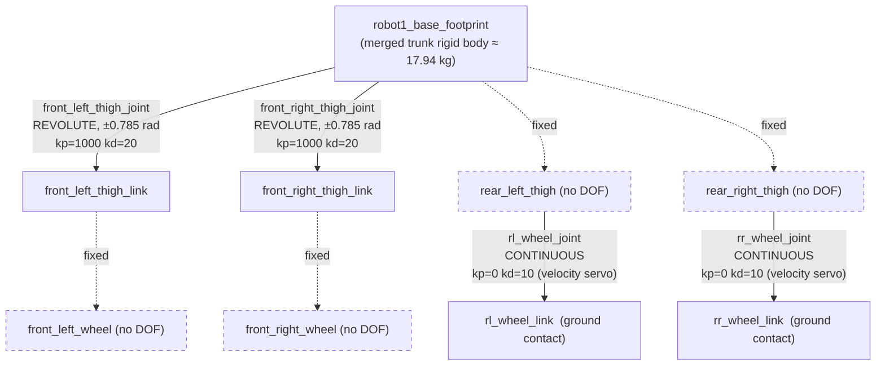
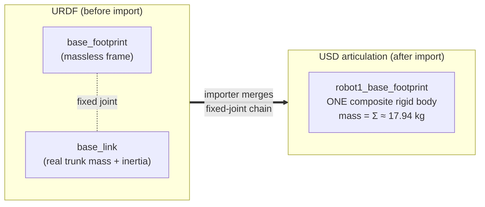

# The Robot — Morphology, Kinematics & Physical Model

**Abstract.** This chapter dissects the machine that every later chapter trains, rewards, and deploys: a four‑legged robot that has been re‑purposed into a two‑wheeled self‑balancer — a quadruped "skeleton" that stands pitched up on its two rear wheels like a Segway. We inventory the exact joints that move (only **four**), explain the physics of *why* the rest are welded rigid, derive the numbers behind its stance geometry (base height $h = 0.828\ \text{m}$), and unpack the URDF→USD asset pipeline whose "fixed‑joint merge" is the reason the trunk rigid body is named `robot1_base_footprint` (~17.94 kg) instead of `base_link`.

**Prerequisites / see also:** [Overview](01-Overview.md) · [RL & MDP Foundations](03-RL-and-MDP-Foundations.md) · [Isaac Lab Architecture](04-Isaac-Lab-Architecture.md) · [Balance Task](05-Balance-Task.md) · [Velocity Task](06-Velocity-Task.md) · [Asymmetric Actor‑Critic & Sim2Real](08-Asymmetric-Actor-Critic-and-Sim2Real.md) · [Code Architecture](09-Code-Architecture.md)

---

## 1. Intuition: a quadruped that thinks it's a Segway

Picture a four‑legged robot — thighs, lower legs, a foot at the end of each leg. Now replace the feet with wheels, tip the whole body backward so it rests only on the two **rear** wheels, and lift the front of the body into the air. That is this robot. It is mechanically a quadruped, but it behaves like an *inverted pendulum on wheels*: intrinsically unstable, forever on the edge of toppling, kept upright only by continuously spinning its rear wheels to drive the contact point back underneath its center of mass. This is exactly the control problem a Segway or a self‑balancing hoverboard solves, and it is why the first task in this project is literally called **balance** (see the [Balance Task](05-Balance-Task.md)).

The design source (`source/wheeled_quadruped/wheeled_quadruped/assets/__init__.py`, lines 6–12) states the concept in one docstring:

> *"The robot has four actuated joints only: the two rear wheels (continuous) and the two front thighs (revolute, +/-0.785 rad). The front wheels are fixed. The robot stands pitched up, balancing on its two rear wheels, with the base at a height of 0.828 m."*

Two ideas in that sentence drive this entire chapter: (a) **only four joints actually move**, and (b) the robot's resting posture is a *pitched‑up, two‑wheel stance* whose geometry we can reconstruct from the numbers.

---

## 2. Joint inventory: four moving joints out of a full skeleton

A "degree of freedom" (DOF) is an independent quantity the robot can change. A joint contributes a DOF only if it is **actuated** (has a motor) or at least free to rotate. In this asset, the full quadruped skeleton is imported, but **only four joints are given actuators; every other joint in the URDF is a rigid *fixed* joint** with zero DOF. The robot therefore lives in a 4‑dimensional configuration space, even though its mesh looks like a full four‑legged machine.

The four actuated joints, in the canonical order used everywhere in this wiki for the joint vector $q\in\mathbb{R}^4$ (see the [shared notation](03-RL-and-MDP-Foundations.md)), are:

| # | Joint name (in USD) | Type | Actuator role | $k_p$ (stiffness) | $k_d$ (damping) | Effort limit | Range |
|---|---------------------|------|---------------|-------------------|------------------|--------------|-------|
| 1 | `robot1_front_left_thigh_joint` | revolute | **position** servo | 1000 | 20 | 400 N·m | ±0.785 rad (doc) |
| 2 | `robot1_front_right_thigh_joint` | revolute | **position** servo | 1000 | 20 | 400 N·m | ±0.785 rad (doc) |
| 3 | `robot1_rl_wheel_joint` | continuous | **velocity** servo | 0 | 10 | 100 N·m | unbounded |
| 4 | `robot1_rr_wheel_joint` | continuous | **velocity** servo | 0 | 10 | 100 N·m | unbounded |

*(gains and effort limits are the `ImplicitActuatorCfg` values on lines 55–84 of `assets/__init__.py`; the ±0.785 rad thigh limit is documented in the module docstring on line 9 but is **not** re‑declared as an explicit joint‑limit override in the config — see §7.)*

**Why these four, and why not the others?** The design deliberately under‑actuates the machine to make it a *two‑wheel balancer with an active front posture*:

- **Rear wheels (RL, RR) — actuated, continuous.** These are the only propulsion and the only balancing authority. Spinning them forward/backward moves the ground‑contact point to catch the falling body; spinning them *differentially* (left faster than right, or vice‑versa) yaws the robot. They are **velocity‑controlled**: the policy commands a wheel *speed*, not a torque or an angle. A continuous joint has no angle limit — a wheel must be able to rotate forever.
- **Front thighs (FL, FR) — actuated, revolute.** These are not for walking. They let the policy shift the front legs to trim the robot's center of mass and posture while it balances — the front legs act as a movable counterweight / stance‑shaping mechanism. They are **position‑controlled** revolute joints, clamped to roughly ±0.785 rad (±45°).
- **Front wheels — fixed.** The front of the body is lifted off the ground in the balancing stance, so the front wheels never touch anything. Actuating them would be dead weight in the action space, so they are welded to their legs.
- **Rear thighs — fixed.** The rear legs are held in a fixed splayed pose that plants the rear wheels where they need to be for the balancing geometry. Letting them move would add DOFs the balance controller does not need and would only enlarge the search space the policy must explore.

The engineering principle here is **minimal actuation**: expose to the learning algorithm only the DOFs that matter for the task. Fewer actuated joints ⇒ a smaller action space (dimension 4, see [Balance Task](05-Balance-Task.md)) ⇒ a dramatically easier reinforcement‑learning problem. The full skeleton (four legs × thigh/shin/wheel segments ≈ 17 skeleton joints in the design) is present in the mesh for realistic mass distribution and appearance, but 13 of those joints are rigid welds carrying **zero** DOF.

> **Honesty note.** The *four actuated joints* and their gains/types are verified directly from the config code. The "≈17 total skeleton joints" figure and the presence of distinct *shin* segments come from the design brief and typical quadruped morphology — they could **not** be independently confirmed here because `quadruped_robot.usd` is a compressed binary "USD crate" (18.3 MB, LZ4‑compressed) that no USD reader was available to parse in this environment. Treat the full joint tally as design intent, not a byte‑verified fact.

---

## 3. The kinematic chain

A **kinematic chain** is the parent→child tree of rigid links connected by joints, rooted at the robot's base. Transforms compose down the tree: a child link's pose in the world is its parent's pose times the joint transform. Below is the *actuated* structure — the root trunk, the two rear wheels that touch the ground, and the two front thighs that trim the posture. Fixed (rigid) links are shown as dashed to emphasize they carry no DOF.



Reading the tree: the two rear wheels are the *only* links in contact with the ground; the two front thighs are the *only* other things that can move; and everything else hangs rigidly off the trunk. The base frame $b$ is attached to `robot1_base_footprint` and is the reference for every base‑frame observation in the [MDP](03-RL-and-MDP-Foundations.md) (base linear velocity $v$, angular velocity $\omega$, projected gravity $g_b$).

---

## 4. Actuation as a physical model

Both actuator types are **implicit PD servos** running inside PhysX at the 200 Hz physics rate ($dt = 0.005\ \text{s}$). The controller law each substep is

$$
\tau \;=\; k_p\,(q^{*} - q) \;+\; k_d\,(\dot q^{*} - \dot q) \;+\; \tau_{\text{ff}},
$$

where $q^{*}$ is the commanded target angle, $\dot q^{*}$ the commanded target velocity, $q,\dot q$ the measured angle/velocity, $k_p,k_d$ the stiffness/damping gains, and $\tau_{\text{ff}}=0$ here (no feed‑forward). The computed torque $\tau$ is clipped to the joint's effort limit. The two servo *personalities* fall out of the gains:

- **Wheels** set $k_p=0$, so $\tau = k_d(\dot q^{*}-\dot q) = 10(\dot q^{*}-\dot q)$. With zero stiffness there is no notion of a "target angle" — the wheel is a pure **velocity servo** that pushes toward the commanded speed $\dot q^{*}$. This is exactly what a driven wheel wants.
- **Thighs** set $k_p=1000,\ k_d=20$, so $\tau = 1000(q^{*}-q) + 20(0-\dot q)$: a stiff **position servo** that holds a commanded angle $q^{*}$ and damps its own motion. The damping was deliberately raised "from the legacy 0.005 … into the critically‑damped range" on a *~2.5 kg* thigh assembly (comment, `assets/__init__.py` line 69–70) to kill oscillatory ringing.

The full derivation of how the policy's normalized action $a\in[-1,1]^4$ becomes $q^{*}$ and $\dot q^{*}$ (position scale 0.5 with a default offset for thighs; velocity scale 5.0 in balance / 12.0 in velocity for wheels) lives in the [Balance Task](05-Balance-Task.md) and [Velocity Task](06-Velocity-Task.md) chapters. Here the takeaway is physical: **the robot is a two‑wheel velocity drive with a pair of stiff posture‑trim actuators, and nothing else moves.**

A handful of rigid‑body and solver properties round out the physical model (`assets/__init__.py` lines 26–40): velocity caps of 1000 (linear/angular) and a 100 depenetration cap, gyroscopic forces enabled, self‑collisions **off**, and — critically for a rolling robot — the articulation's position solver iterations raised from 4 to **8** "for rolling‑contact stability." Rolling contact is numerically stiff, so more solver iterations buy accuracy at the wheel/ground interface.

---

## 5. Stance geometry: deriving the 0.828 m spawn height

At spawn the base origin is placed at world position $(0,0,0.828)$ (`init_state`, `assets/__init__.py` line 43). Where does $h = 0.828\ \text{m}$ come from? Two documented geometric numbers explain it (both are code **comments**, see the honesty note):

- **Wheel radius** $r \approx 0.1008\ \text{m}$
- **Track width** (rear left↔right wheel spacing) $w \approx 0.44\ \text{m}$

*(both stated in the velocity config, `velocity_env_cfg.py` lines 128–129: "1.0 m/s / 0.1008 m radius … the yaw differential over the 0.44 m track").*

**Vertical decomposition.** A wheel of radius $r$ rolling on flat ground has its **axle center** at height $r$ above the ground:

$$
z_{\text{axle}} \;=\; r \;\approx\; 0.1008\ \text{m}.
$$

The base frame origin sits *above* that axle by whatever the pitched‑up leg geometry places it, call it $\Delta z_{\text{base}\leftarrow\text{axle}}$. So the spawn height splits into two stacked segments — "axle up to base" plus "ground up to axle":

$$
\boxed{\,h_{\text{spawn}} \;=\; \Delta z_{\text{base}\leftarrow\text{axle}} \;+\; r\,}
$$

$$
\Rightarrow\quad \Delta z_{\text{base}\leftarrow\text{axle}} \;=\; h_{\text{spawn}} - r \;\approx\; 0.828 - 0.1008 \;=\; 0.727\ \text{m}.
$$

In words: of the 0.828 m, about **0.10 m** is the wheel lifting the axle off the ground, and the remaining **~0.73 m** is the vertical rise from the low rear axle, up along the pitched‑up rear legs and body, to the base frame. Because the machine tips backward to balance, most of its height is this pitched‑body rise — exactly the tall, top‑heavy geometry that makes it an inverted pendulum and makes the balancing problem non‑trivial. The number 0.828 m is not arbitrary: it is precisely the base height at which the robot is in mechanical equilibrium in its two‑wheel stance, which is why the same value reappears as the **target height** in the balance reward $\big(\text{base\_height\_l2} = (p_z - 0.828)^2\big)$ and as the spawn pose (see [Balance Task](05-Balance-Task.md)).

**Track width and yaw.** The 0.44 m track width $b$ (the lateral distance between the two rear wheel contact points) is the lever arm for **differential steering**. If the left and right rear wheels spin at surface speeds $u_L = r\,\dot q_{RL}$ and $u_R = r\,\dot q_{RR}$, the body's forward speed and yaw rate are approximately

$$
v_x \;\approx\; \tfrac{1}{2}(u_L+u_R), \qquad
\omega_z \;\approx\; \frac{u_R - u_L}{b}.
$$

(The [Velocity Task](06-Velocity-Task.md) uses the same symbol $b$ for this track width in its full differential-drive derivation.)

This is why the [Velocity Task](06-Velocity-Task.md) had to raise the wheel action scale from 5.0 to 12.0: hitting a 1.0 m/s command needs $\dot q = v_x/r \approx 1.0/0.1008 \approx 9.9\ \text{rad/s}$ at the wheels, plus extra for the yaw differential across the 0.44 m track — roughly 12 rad/s at the command extremes.

> **Honesty note.** $r \approx 0.1008\ \text{m}$ and $w \approx 0.44\ \text{m}$ appear only in code comments, not as configured parameters, and were **not** independently verified against the binary USD (no `usdcat`/`pxr` tooling was available). The spawn height $h=0.828\ \text{m}$ **is** a verified config value (`init_state.pos`), and the *decomposition* above is the physically‑correct way to read it, but the intermediate $\sim0.727\ \text{m}$ rise depends on link offsets baked into the un‑inspectable USD.

---

## 6. From URDF to USD: the fixed‑joint merge

The robot begins life as a **URDF** (Unified Robot Description Format — the standard XML that lists links, their masses/inertias, and the joints connecting them). Isaac Lab / Isaac Sim import that URDF and bake it into a **USD** file (`quadruped_robot.usd`), the native scene format PhysX simulates. That importer does something with a lasting consequence for this project: **it merges chains of fixed joints into a single rigid body.**

Why merge? A PhysX *articulation* is a tree of rigid bodies connected by *movable* joints. A **fixed** joint has no DOF — it is just a rigid weld. Rather than waste a body and a constraint on a weld, the importer collapses every maximal cluster of fixed‑joint‑connected links into **one composite rigid body**. The composite's mass is the **sum** of the merged links' masses, and its inertia is the parallel‑axis combination of their inertia tensors about the new common center of mass.

The design's URDF had a `base_footprint` link fixed‑jointed to a `base_link` (a very common ROS convention: `base_footprint` is a massless ground‑projection frame welded to the real trunk `base_link`). After the merge, those became a **single** trunk rigid body, and the importer kept the name of the cluster root — hence the trunk body is `robot1_base_footprint`, **not** `robot1_base_link`. The config even documents this explicitly (`balance_env_cfg.py` lines 151–153):

> *"The USD export merged fixed joints: the trunk rigid body is `robot1_base_footprint` (~17.94 kg), not `robot1_base_link`."*

This is not a cosmetic detail — it changes which name your code must reference. The **domain‑randomization mass event** adds a payload to the trunk, and it *must* target the merged body:

```python
add_base_mass = EventTerm(
    func=mdp.randomize_rigid_body_mass, mode="startup",
    params={"asset_cfg": SceneEntityCfg("robot", body_names="robot1_base_footprint"),
            "mass_distribution_params": (-1.0, 2.0), "operation": "add"})
```

If it had targeted `robot1_base_link`, the term would silently match nothing (that link no longer exists as an independent body) and the randomization would do nothing. The same naming subtlety is why every body/joint reference in the configs is spelled with the `robot1_` prefix and the merged names.



---

## 7. Masses, inertias, and the placeholder debt

**Masses.** The two masses documented in the code are the trunk `robot1_base_footprint` at **~17.94 kg** and the front‑thigh assembly at **~2.5 kg** (comment, `assets/__init__.py` line 70). At runtime the trunk mass is *randomized* every episode by adding a uniform payload in $[-1, +2]$ kg, so the effective trunk mass spans roughly **16.94–19.94 kg** — a deliberate robustness measure so the balancing policy does not overfit to one exact mass (this belongs to the domain‑randomization story in [Balance Task](05-Balance-Task.md) and [Sim2Real](08-Asymmetric-Actor-Critic-and-Sim2Real.md)).

**Inertias.** Every rigid body also carries an inertia tensor $I$ that governs its rotational dynamics ($\tau = I\dot\omega + \omega\times I\omega$). When Isaac Lab's mass randomization runs with `recompute_inertia` enabled, it rescales a body's inertia by the mass ratio $I' = I\cdot(m'/m)$ — i.e. it assumes the *shape* stays fixed and only the density changes. That is a first‑order approximation, not a re‑integration of the true geometry.

**The placeholder debt.** The exact per‑link inertia tensors are baked into the compressed binary `quadruped_robot.usd`, which **could not be read** in this environment (it is an LZ4‑compressed USD crate; plain‑text extraction recovered only a handful of tokens — `Xform`, `robot1_base_footprint`, `front_left_thigh_link`, `Mesh` — near the file tail). Consequently the inertia values are **unverified from the repo**, and there is a standing risk that some were left as importer defaults or coarse placeholders rather than values computed from the true CAD mass distribution. For a top‑heavy inverted‑pendulum robot, inertia errors bias exactly the dynamics the balance policy is most sensitive to (how fast the body pitches when disturbed). Flagging this as **known technical debt** — "the inertias in the USD are not independently confirmed and may be placeholders" — is the honest state of the physical model until a USD reader (`usdcat`/`pxr`) is available to audit the tensors against CAD.

---

## 8. Coordinate frames: world vs. base

Two frames matter throughout the wiki.

- **World frame $W$** — the fixed, inertial frame of the simulation. Gravity points straight down: the acceleration vector is $\mathbf{g}_W = (0,0,-9.81)\ \text{m/s}^2$, with unit direction $\hat{g} = (0,0,-1)$. The base height observation $h = p_z$ is the base origin's $z$ in this frame.
- **Base frame $b$** — rigidly attached to the trunk (`robot1_base_footprint`). Its orientation relative to world is the rotation matrix $R_b$ (mapping base‑frame vectors *into* world). All the "base‑frame" observations — linear velocity $v=(v_x,v_y,v_z)$, angular velocity $\omega=(\omega_x,\omega_y,\omega_z)$ — are the trunk's velocities expressed in $b$, which is what an **onboard IMU** would report (a real robot has no world‑frame sensor; see the onboard‑sensing philosophy in [Sim2Real](08-Asymmetric-Actor-Critic-and-Sim2Real.md)).

The single most important frame‑dependent quantity is **projected gravity**, the world "down" direction rotated into the base frame:

$$
g_b \;=\; R_b^{\mathsf T}\,\hat{g}.
$$

$R_b^{\mathsf T}$ maps a world vector into base coordinates, so $g_b$ tells the robot which way is *down relative to its own body* — a purely onboard, IMU‑derivable signal that needs no external tracking. When the trunk is level in its balancing pose, $g_b \approx (0,0,-1)$; as it tilts, the "down" vector rotates into the base $x$/$y$ components. That is precisely what the **flat‑orientation reward** penalizes:

$$
\text{flat\_orientation\_l2} \;=\; g_{b,x}^{2} + g_{b,y}^{2},
$$

which is zero only when gravity points straight down the base $z$‑axis, i.e. when the trunk is upright. The balancing pose is engineered so that the base frame is level (z up) at equilibrium, even though the *quadruped body* is physically pitched up on its rear wheels — reconciling "stands pitched up" with "penalize any tilt." Details of these observation and reward terms are in [Balance Task](05-Balance-Task.md).

---

## 9. Key numbers at a glance

| Quantity | Symbol | Value | Source / status |
|---|---|---|---|
| Actuated joints | — | 4 (2 thigh + 2 wheel) | ✅ config (`assets/__init__.py`) |
| Spawn / target base height | $h$ | 0.828 m | ✅ config (`init_state.pos`, reward target) |
| Wheel radius | $r$ | ≈ 0.1008 m | ⚠️ comment only |
| Track width (rear) | $w$ | ≈ 0.44 m | ⚠️ comment only |
| Base‑above‑axle rise | $\Delta z$ | ≈ 0.727 m | derived ($h-r$) |
| Trunk (merged) mass | $m_{\text{base}}$ | ≈ 17.94 kg | ⚠️ comment; randomized $+[-1,+2]$ kg |
| Front‑thigh assembly mass | — | ≈ 2.5 kg | ⚠️ comment only |
| Thigh angle limit | — | ±0.785 rad (±45°) | ⚠️ docstring, no config override |
| Thigh gains | $k_p,k_d$ | 1000, 20 (400 N·m) | ✅ config |
| Wheel gains | $k_p,k_d$ | 0, 10 (100 N·m) | ✅ config |
| Physics / control rate | $dt$, $\Delta t$ | 0.005 s (200 Hz) / 0.02 s (50 Hz) | ✅ config (decimation 4) |

**Legend:** ✅ verified from configured code values; ⚠️ documented in a source comment/docstring but *not* independently verified against the binary USD in this environment.

---

## Where this leads

You now know *what* is being controlled: a top‑heavy, four‑legged, two‑wheel‑balancing robot with a 4‑DOF action interface (two velocity‑servoed rear wheels, two position‑servoed front thighs), a merged ~17.94 kg trunk, and onboard, base‑frame sensing. The next chapters formalize *how* it is controlled — the [RL & MDP Foundations](03-RL-and-MDP-Foundations.md) define state/observation/action/reward on this exact morphology, the [Isaac Lab Architecture](04-Isaac-Lab-Architecture.md) shows how the config classes above become a simulated environment, and the [Balance](05-Balance-Task.md) and [Velocity](06-Velocity-Task.md) chapters turn this physical model into a learnable task.
