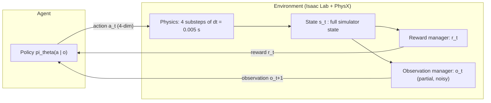
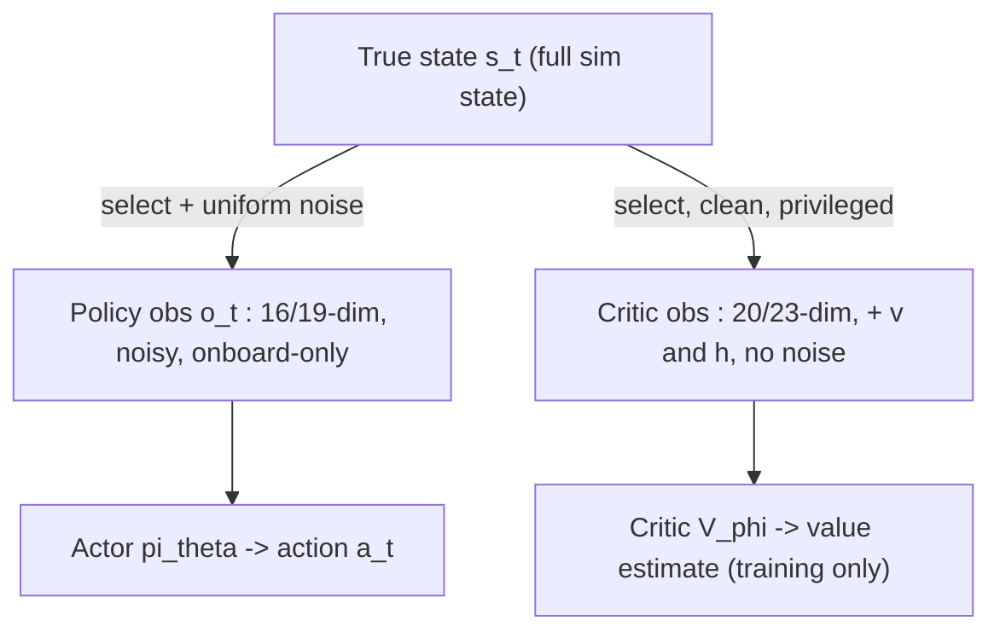

# Reinforcement Learning & MDP Foundations

This chapter builds the theoretical backbone of the whole wiki: what a Markov Decision Process (MDP) is, what policies, returns, and value functions mean, and why our wheeled quadruped is — strictly speaking — a *partially observed* MDP. We develop every concept twice: first in plain words with intuition, then with the exact mathematics, and finally we instantiate the abstract tuple $(\mathcal{S}, \mathcal{A}, P, R, \gamma)$ concretely for the two tasks in this repository, the **balance** task and the **velocity** task.

**Prerequisites / see also:** [The Robot](02-The-Robot.md) for the hardware/joint layout used in the examples · [Isaac Lab Architecture](04-Isaac-Lab-Architecture.md) for how these MDP pieces map to manager classes · [Balance Task](05-Balance-Task.md) and [Velocity Task](06-Velocity-Task.md) for full term-by-term configs · [PPO Algorithm](07-PPO-Algorithm.md) for how the objective defined here is optimized · [Asymmetric Actor-Critic & Sim2Real](08-Asymmetric-Actor-Critic-and-Sim2Real.md) for the POMDP consequences.

---

## 1. The agent–environment loop

Reinforcement learning (RL) is learning by trial and error. There is no dataset of "correct answers." Instead there is an **agent** (here: a neural network controlling the robot) embedded in an **environment** (here: an Isaac Lab / PhysX simulation of the robot). Time is chopped into discrete **control steps** indexed by $t = 0, 1, 2, \dots$. At every step the loop is:

1. The environment is in some **state** $s_t$ (every physical quantity of the sim: all positions, velocities, contact forces, randomized masses and frictions…).
2. The agent receives an **observation** $o_t$ — a *measured*, generally incomplete and noisy view of $s_t$ (Section 5).
3. The agent picks an **action** $a_t$ (here a vector in $\mathbb{R}^4$: two thigh position targets and two wheel velocity targets — see [The Robot](02-The-Robot.md)).
4. The environment advances physics, and returns a scalar **reward** $r_t$ plus the next observation $o_{t+1}$.

In this project the loop runs at a **control frequency** $f_c = 50\,\text{Hz}$, i.e. a control period $\Delta t = 0.02\,\text{s}$. Physics is simulated finer, with a **physics timestep** $dt = 0.005\,\text{s}$ (200 Hz), and one control step spans a **decimation** of $D = 4$ physics substeps, so $\Delta t = D \cdot dt = 4 \times 0.005 = 0.02\,\text{s}$. These values come straight from the env config: `decimation = 4`, `sim.dt = 0.005`, `episode_length_s = 20.0` in `source/wheeled_quadruped/wheeled_quadruped/tasks/balance/balance_env_cfg.py` (the velocity task inherits them unchanged via `super().__post_init__()` in `tasks/velocity/velocity_env_cfg.py`). An episode therefore lasts $20.0 / 0.02 = 1000$ control steps.

> **Intuition.** The agent "thinks" (evaluates its neural network) 50 times per second; between two thoughts, the physics engine quietly integrates the world 4 times at 200 Hz while the actuators track the last targets it gave. This split matters: real robot controllers also run their high-level policy slower than their low-level motor loops.

## 2. The Markov Decision Process

The formal model of the loop above is a **Markov Decision Process**, the 5-tuple

$$
\mathcal{M} = (\mathcal{S}, \mathcal{A}, P, R, \gamma).
$$

Let us define every symbol.

- $\mathcal{S}$ — the **state space**, the set of all possible states $s$. For a simulated robot the state is everything PhysX tracks: base position $p \in \mathbb{R}^3$ and orientation, base linear velocity $v = (v_x, v_y, v_z)$ and angular velocity $\omega = (\omega_x, \omega_y, \omega_z)$ (expressed in the base frame unless noted), joint positions $q \in \mathbb{R}^4$ in the order $[\text{front\_left\_thigh}, \text{front\_right\_thigh}, \text{rl\_wheel}, \text{rr\_wheel}]$, joint velocities $\dot q$, plus the *episode-specific randomizations* (added base mass, friction coefficients — see Section 8) and, for the velocity task, the current command $c$.
- $\mathcal{A}$ — the **action space**, the set of admissible actions. Here $\mathcal{A} = \mathbb{R}^4$ by convention normalized to roughly $[-1, 1]$ per dimension (the repo's smoke test `scripts/verify_env.py` samples random actions as `2*rand-1`, i.e. uniform on $[-1,1]$); physical meaning is given downstream by affine scaling in the action terms ([Balance Task](05-Balance-Task.md)).
- $P(s' \mid s, a)$ — the **transition kernel**: the probability (density) of landing in state $s'$ after taking action $a$ in state $s$. In words: the physics. Here $P$ is implemented by PhysX integrating $D = 4$ substeps of rigid-body dynamics with the actuator PD laws applied. Given a *fully specified* state the sim is essentially deterministic, but from the agent's standpoint $P$ is stochastic because the environment injects randomness: random pushes every 10–15 s, randomized reset poses, per-episode randomized mass and friction (all in `balance_env_cfg.py`, lines 130–190).
- $R(s, a)$ — the **reward function**, a scalar signal defining *what we want*, not *how to do it*. In this project it is a weighted sum of hand-designed terms (Sections 8–9); crucially, Isaac Lab's `RewardManager` multiplies every term by its weight *and* by $\Delta t$:
  $$
  r_t = \sum_i w_i\, f_i(s_t, a_t)\, \Delta t,
  $$
  where $f_i$ are the raw kernels (e.g. $(h - h^*)^2$) and $w_i$ the configured weights. The $\Delta t$ factor makes accumulated reward approximately invariant to the control rate — a reward "per second," integrated over time.
- $\gamma \in [0, 1)$ — the **discount factor**, weighting how much the agent cares about the future. Both tasks use $\gamma = 0.99$ (`tasks/*/agents/rsl_rl_ppo_cfg.py`).

The defining assumption is the **Markov property**: the next state depends only on the *current* state and action, not the whole history,

$$
P(s_{t+1} \mid s_t, a_t, s_{t-1}, a_{t-1}, \dots, s_0) = P(s_{t+1} \mid s_t, a_t).
$$

This holds for the full simulator state $s_t$ (Newtonian mechanics is memoryless given positions and velocities). It does **not** hold for the observation $o_t$ — that is the POMDP wrinkle of Section 5.

## 3. Policies, trajectories, and the return

A **policy** is the agent's decision rule. We write $\pi_\theta(a \mid o)$: a probability distribution over actions given the observation, parameterized by neural-network weights $\theta$. (We condition on $o$, not $s$, deliberately — the deployed controller only ever sees observations.)

Running the policy in the environment produces a **trajectory** (also called a rollout or episode):

$$
\tau = (s_0, o_0, a_0, r_0,\; s_1, o_1, a_1, r_1,\; \dots,\; s_T),
$$

where $T$ is the episode length — at most $1000$ steps here, fewer if the robot falls (Section 8). The probability of a trajectory factorizes into things the agent controls and things it does not:

$$
p_\theta(\tau) = \rho(s_0) \prod_{t=0}^{T-1} \pi_\theta(a_t \mid o_t)\, P(s_{t+1} \mid s_t, a_t),
$$

with $\rho(s_0)$ the initial-state distribution (here: the randomized reset events).

The quantity the agent tries to make large is the **return** — the discounted sum of future rewards from step $t$ onward:

$$
G_t = \sum_{k=0}^{\infty} \gamma^k\, r_{t+k} = r_t + \gamma\, r_{t+1} + \gamma^2\, r_{t+2} + \cdots
$$

Each future reward is discounted by $\gamma^k$: a reward $k$ steps away is worth $\gamma^k$ times a reward now. Two standard intuitions: (i) $\gamma$ encodes mild impatience, and (ii) $1/(1-\gamma)$ acts as an **effective horizon**. With $\gamma = 0.99$ that horizon is $1/(1 - 0.99) = 100$ steps $= 2$ seconds of robot time — the agent effectively plans about two seconds ahead, plenty for balance recovery.

> **Worked example — the "alive" bonus.** The balance task pays $f_{\text{alive}} = 1$ with weight $w = +1.0$ every step the robot has not fallen, so per step it contributes $1.0 \times 1 \times \Delta t = 0.02$ to $r_t$. Over a full 1000-step episode the *undiscounted* sum is $1000 \times 0.02 = 20$ — which is why healthy balance training reports mean episode rewards near 20. The *discounted* return from $t=0$ is instead
> $$
> \sum_{k=0}^{999} 0.99^k \times 0.02 = 0.02 \cdot \frac{1 - 0.99^{1000}}{1 - 0.99} \approx 2 \times (1 - 4.3\times 10^{-5}) \approx 2.0 .
> $$
> Same behavior, very different number — always know whether a plotted "reward" is discounted or not (training logs report the undiscounted episode sum).

## 4. Value functions and the Bellman equations

How good is a situation? The **state-value function** of a policy $\pi$ answers exactly that: the expected return if you start in state $s$ and follow $\pi$ forever,

$$
V^\pi(s) = \mathbb{E}_\pi\!\left[\, G_t \mid s_t = s \,\right].
$$

The **action-value function** additionally fixes the first action:

$$
Q^\pi(s, a) = \mathbb{E}_\pi\!\left[\, G_t \mid s_t = s,\, a_t = a \,\right],
$$

so $V^\pi(s) = \mathbb{E}_{a \sim \pi(\cdot\mid s)}[\,Q^\pi(s,a)\,]$ — the value of a state is the average value of the actions your policy would take there. The difference

$$
A^\pi(s, a) = Q^\pi(s, a) - V^\pi(s)
$$

is the **advantage**: how much *better than your average behavior* action $a$ is in state $s$. Advantages, estimated with Generalized Advantage Estimation (GAE, parameter $\lambda = 0.95$ here), are the actual learning signal in PPO — see [PPO Algorithm](07-PPO-Algorithm.md).

Because the return is recursive ($G_t = r_t + \gamma G_{t+1}$), values satisfy the **Bellman expectation equations**:

$$
V^\pi(s) = \mathbb{E}_{a \sim \pi,\; s' \sim P}\!\left[\, R(s,a) + \gamma\, V^\pi(s') \,\right],
\qquad
Q^\pi(s, a) = \mathbb{E}_{s' \sim P}\!\left[\, R(s,a) + \gamma\, \mathbb{E}_{a' \sim \pi}\, Q^\pi(s', a') \,\right].
$$

In words: *the value of now = the reward you get now + $\gamma$ times the value of where you end up*. These one-step consistency conditions are the workhorse of all of RL: the critic $V_\phi(o)$ (a second neural network with parameters $\phi$) is trained precisely to satisfy a sampled version of the first equation.

Two boundary cases matter in practice and both appear in this codebase:

- **Termination** (a real failure, e.g. the robot falls): the episode genuinely ends, the future is empty, so the bootstrap target is just $r_t$ — equivalently $V(s_{T}) \equiv 0$ beyond the end.
- **Truncation / time-out** (the 20 s clock expires mid-balance): the world *would have continued*; treating it as termination would wrongly teach the agent that surviving 20 s is worth nothing beyond that point. rsl_rl 3.0.1 handles this by adding $\gamma\, V_\phi(o_t)$ back into the reward on time-out steps (the `time_outs` bootstrap in `PPO.process_env_step`), and correspondingly the `terminating` penalty term `mdp.is_terminated` fires **only** on non-timeout terminations.

## 5. This is really a POMDP: observation vs. state

Everything above conditioned policies and values on the state $s$. But our robot's policy never sees $s$. It sees an **observation** $o_t$: a 16-dimensional (balance) or 19-dimensional (velocity) vector assembled from *onboard-plausible* signals, corrupted with noise. Formally the problem is a **Partially Observable MDP** (POMDP), the 7-tuple $(\mathcal{S}, \mathcal{A}, P, R, \gamma, \Omega, O)$ where $\Omega$ is the observation space and $O(o \mid s)$ the observation function — here, "select some entries of $s$ and add uniform noise."

Concretely, from `balance_env_cfg.py` (policy group, `enable_corruption=True`), each term gets additive uniform noise $\eta \sim \mathcal{U}(-b, b)$:

| Policy observation | Symbol | Dim | Noise bound $b$ |
|---|---|---|---|
| Base angular velocity | $\omega$ | 3 | 0.2 |
| Projected gravity | $g_b = R_b^\top \hat g$ | 3 | 0.05 |
| Thigh positions (relative to default) | $q_{\text{thigh}} - q_{\text{default}}$ | 2 | 0.01 |
| Joint velocities (all 4) | $\dot q$ | 4 | 1.5 |
| Previous action | $a_{t-1}$ | 4 | — |

Here $g_b = R_b^\top \hat g$ is the unit gravity vector rotated into the base frame ($R_b$ = base rotation matrix, $\hat g$ = world "down"); it is what an IMU's accelerometer effectively gives you at rest — $\approx (0,0,-1)$ when upright, tilting components into $x,y$ as the robot leans.

What is *missing* from $o_t$ is the point: the policy never sees the base **linear velocity** $v$ (no odometry/no mocap), never sees the base **height** $h = p_z$, and never sees the randomized mass/friction. The state is not recoverable from a single observation — the Markov property fails at the observation level. Two standard mitigations appear in this project:

1. **Weak memory through the action channel.** Feeding $a_{t-1}$ back as an observation gives the policy one step of history for free, which together with $\dot q$ and $\omega$ lets it *infer* much of what it cannot sense (e.g. base velocity ≈ wheel speed × wheel radius when not slipping).
2. **Asymmetric actor–critic.** The *critic* is a training-time-only tool, so it is allowed to cheat: its observation group (20-dim / 23-dim) additionally contains the true $v$ (3) and $h$ (1), with **no noise** (`enable_corruption=False`). A better-informed critic yields lower-variance advantage estimates without contaminating the deployable policy. This is the central topic of [Asymmetric Actor-Critic & Sim2Real](08-Asymmetric-Actor-Critic-and-Sim2Real.md).

## 6. Stochastic Gaussian policies

Why is $\pi_\theta(a \mid o)$ a *distribution* rather than a function $a = \mu(o)$? Three reasons: (i) **exploration** — a deterministic policy tries the same thing forever and never discovers better actions; (ii) **smooth optimization** — policy-gradient methods need $\log \pi_\theta(a\mid o)$ to be differentiable in $\theta$; (iii) partial observability can even make the *optimal* policy stochastic.

The concrete parameterization (rsl_rl `ActorCritic`) is a **diagonal Gaussian**:

$$
\pi_\theta(a \mid o) = \mathcal{N}\!\big(\mu_\theta(o),\; \operatorname{diag}(\sigma^2)\big),
$$

where $\mu_\theta(o) \in \mathbb{R}^4$ is the output of an MLP (hidden sizes $[128, 128]$ with ELU activations for balance, $[256, 128, 64]$ for velocity), and $\sigma \in \mathbb{R}^4$ is a **learned, state-independent** standard-deviation parameter initialized to $\sigma_0 = 1.0$ (`init_noise_std=1.0` in `rsl_rl_ppo_cfg.py`). At each step the executed action is a sample $a_t = \mu_\theta(o_t) + \sigma \odot \epsilon$, $\epsilon \sim \mathcal{N}(0, I)$. The log-probability, needed by PPO, is the sum over the 4 independent dimensions:

$$
\log \pi_\theta(a \mid o) = \sum_{j=1}^{4} \left[ -\frac{(a_j - \mu_j)^2}{2\sigma_j^2} - \log \sigma_j - \tfrac{1}{2}\log 2\pi \right].
$$

As training converges, the optimizer typically shrinks $\sigma$: exploration anneals itself. At deployment ("play" scripts) one uses the mean $\mu_\theta(o)$ — the noise was scaffolding for learning.

## 7. The objective, and on-policy vs. off-policy

Everything reduces to one number to maximize — the expected return from the start of an episode:

$$
J(\theta) = \mathbb{E}_{\tau \sim p_\theta}\!\left[\, G_0 \,\right] = \mathbb{E}_{\tau \sim p_\theta}\!\left[\, \sum_{t=0}^{T-1} \gamma^t r_t \,\right].
$$

Note $\theta$ appears inside the trajectory distribution $p_\theta(\tau)$: changing the policy changes *which states you visit*, not just what you do in them. That is what makes RL harder than supervised learning, and it is exactly what the policy-gradient machinery of [PPO Algorithm](07-PPO-Algorithm.md) is built to handle.

One vocabulary distinction, in one paragraph: an **on-policy** algorithm improves $\pi_\theta$ using only data collected by (essentially) the *current* $\pi_\theta$, discarding it after each update — simple and stable, but data-hungry; an **off-policy** algorithm (Q-learning, SAC) can reuse old data from a replay buffer — data-efficient but trickier to stabilize. PPO, used throughout this project, is **on-policy**: each iteration collects a fresh batch of 24 steps × 4096 parallel environments, performs a few clipped update epochs on it, and throws it away. Massive GPU-parallel simulation is what makes this data appetite affordable.

## 8. The balance task as a concrete MDP

Everything in this section is configured in `source/wheeled_quadruped/wheeled_quadruped/tasks/balance/balance_env_cfg.py`; the algorithm side is in `tasks/balance/agents/rsl_rl_ppo_cfg.py`. Full narrative in [Balance Task](05-Balance-Task.md).

- **Goal in words:** stand still on the two rear wheels, torso level, base at the nominal height, wasting as little energy as possible.
- **State $\mathcal S$:** the full PhysX articulation state, plus per-episode randomizations: material friction (static $\in (0.5, 1.25)$, dynamic $\in (0.4, 1.0)$, restitution $\in (0, 0.05)$, 64 buckets) and an added base mass drawn from $\mathcal{U}(-1, +2)$ kg on the trunk body.
- **Observation $o_t \in \mathbb{R}^{16}$** (policy) / $\mathbb{R}^{20}$ (critic): as in the Section 5 table; the critic additionally sees $v$ and $h$, noise-free.
- **Action $a_t \in \mathbb{R}^4$:** thigh position targets $q^* = 0.5\,a_{\text{thigh}} + q_{\text{default}}$ and wheel velocity targets $\dot q^* = 5.0\, a_{\text{wheel}}$ rad/s, tracked by implicit PD actuators (details in [The Robot](02-The-Robot.md)).
- **Reward $R$:** $r_t = \sum_i w_i f_i \Delta t$ with 10 terms:

| Term | Kernel $f_i$ | Weight $w_i$ |
|---|---|---|
| alive | $\mathbb{1}[\text{not terminated}]$ | $+1.0$ |
| terminating | $\mathbb{1}[\text{early termination}]$ | $-2.0$ |
| base_height | $(h - 0.828)^2$ | $-20.0$ |
| flat_orientation | $g_{b,x}^2 + g_{b,y}^2$ | $-5.0$ |
| lin_vel_z | $v_z^2$ | $-2.0$ |
| ang_vel_xy | $\omega_x^2 + \omega_y^2$ | $-0.05$ |
| joint_torques | $\sum_j \tau_j^2$ | $-10^{-5}$ |
| joint_acc | $\sum_j \ddot q_j^2$ | $-2.5\times 10^{-7}$ |
| action_rate | $\lVert a_t - a_{t-1}\rVert^2$ | $-0.01$ |
| wheel_spin | $\sum_{j \in \text{wheels}} \dot q_j^2$ | $-10^{-3}$ |

  Note every kernel is non-negative; *penalties are penalties purely because their weights are negative*. The target height $h^* = 0.828$ m equals the spawn height of the base.
- **Termination:** three conditions — `time_out` at 20 s (truncation, bootstrapped, not penalized); `bad_orientation` when the tilt exceeds $\pi/3 \approx 60°$; `base_too_low` when $h < 0.4$ m. The last two are true failures: they end the return and trigger the $-2.0$ terminating penalty (worth $-2.0 \times \Delta t = -0.04$ on that step — small, because losing the $+0.02$/step alive stream for the rest of the episode is already the dominant punishment).
- **Transition stochasticity:** besides noisy resets ($\pm 0.1$ m/rad pose offsets, random yaw, $\pm 0.1$ joint offsets), an interval event shoves the base with a random velocity kick of up to $\pm 0.5$ m/s in $x, y$ every 10–15 s — forcing the policy to learn *recovery*, not just equilibrium.
- **Discount:** $\gamma = 0.99$; GAE $\lambda = 0.95$.

## 9. The velocity task as a concrete MDP

The velocity task (`tasks/velocity/velocity_env_cfg.py`) is a Python *subclass* of the balance MDP — same robot, same scene, same timing ($\Delta t = 0.02$ s, 1000 steps), same terminations, same events, same $\gamma$ — with three deltas:

1. **A command channel.** Every 10 s each environment resamples a commanded velocity $c = (c_x, c_y, c_z)$ with $c_x \sim \mathcal{U}(-1, 1)$ m/s (forward/backward), $c_y \equiv 0$ (the robot cannot translate sideways on two wheels), and $c_z \sim \mathcal{U}(-1, 1)$ rad/s (yaw rate); about 10% of environments are commanded to stand still ($c = 0$). The command is appended to both observation groups: $o_t \in \mathbb{R}^{19}$ (policy), $\mathbb{R}^{23}$ (critic). Note that $c$ is part of the *state* — the same physical pose demands different behavior under different commands.
2. **Reward reshaping** — from "stand perfectly" to "track $c$ while staying stable." Two positive **tracking** terms are added, using an exponential kernel that is maximal (=1) at zero error and decays smoothly:
   $$
   r_{\text{lin}} = \exp\!\left(-\frac{\lVert c_{xy} - v_{xy}\rVert^2}{\sigma^2}\right)\ (w = +1.0),
   \qquad
   r_{\text{ang}} = \exp\!\left(-\frac{(c_z - \omega_z)^2}{\sigma^2}\right)\ (w = +0.5),
   $$
   with $\sigma = 0.5$ (so $\sigma^2 = 0.25$): a tracking error of 0.5 m/s already cuts the reward to $e^{-1} \approx 0.37$. (Config attribute names are `track_lin_vel_xy` / `track_ang_vel_z`; the underlying functions are `mdp.track_lin_vel_xy_exp` / `mdp.track_ang_vel_z_exp`.) Meanwhile the stand-still-shaped terms are relaxed: alive $1.0 \to 0.25$, base_height $-20 \to -10$, flat_orientation $-5 \to -2$, and wheel_spin is **removed** entirely (spinning wheels is now the job, not a vice) — 11 active terms total.
3. **More action authority.** The wheel action scale is raised $5.0 \to 12.0$, so $\dot q^* = 12\, a_{\text{wheel}}$ rad/s — roughly what 1 m/s plus a yaw differential requires given the wheel geometry (per the comment in `velocity_env_cfg.py:128-131`).

Seen through the MDP lens, the velocity task is a **goal-conditioned** MDP: one policy $\pi_\theta(a \mid o, c)$ must implement a whole family of behaviors indexed by $c$, and the exponential tracking terms are a smooth, dense stand-in for the sparse instruction "match the command."

---

## 10. Summary and where to go next

| Concept | Symbol | This project |
|---|---|---|
| Control step / period | $t$, $\Delta t$ | 50 Hz, $\Delta t = 0.02$ s $= D\,dt = 4 \times 0.005$ s |
| State / observation | $s_t$, $o_t$ | full sim state vs. 16/19-dim noisy onboard obs (POMDP) |
| Action | $a_t \in \mathbb{R}^4$ | 2 thigh position targets + 2 wheel velocity targets, $\sim[-1,1]$ |
| Reward | $r_t = \sum_i w_i f_i \Delta t$ | 10 terms (balance) / 11 terms (velocity) |
| Return, discount | $G_t$, $\gamma = 0.99$ | effective horizon $\approx 100$ steps = 2 s |
| Policy | $\pi_\theta(a\mid o)$ | diagonal Gaussian, ELU MLP, learned $\sigma$, $\sigma_0 = 1$ |
| Values / advantage | $V_\phi$, $Q^\pi$, $A_t$ | critic on privileged 20/23-dim obs; GAE $\lambda = 0.95$ |
| Objective | $J(\theta) = \mathbb{E}[G_0]$ | maximized on-policy by PPO |

With the MDP scaffolding in place: [Isaac Lab Architecture](04-Isaac-Lab-Architecture.md) shows how each tuple element becomes a *manager* in code; [Balance Task](05-Balance-Task.md) and [Velocity Task](06-Velocity-Task.md) dissect every term; [PPO Algorithm](07-PPO-Algorithm.md) derives how $J(\theta)$ is actually climbed; and [Asymmetric Actor-Critic & Sim2Real](08-Asymmetric-Actor-Critic-and-Sim2Real.md) picks up the POMDP thread from Section 5.
