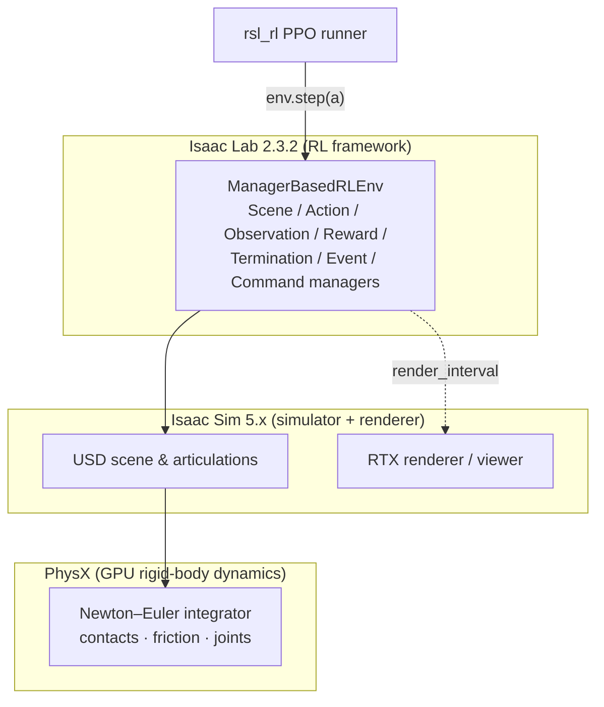
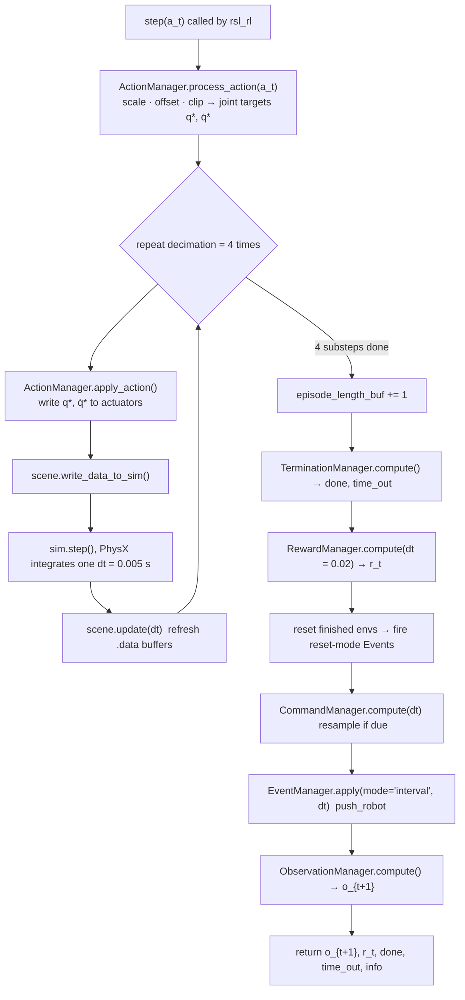
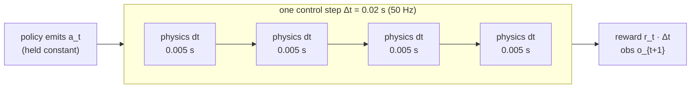

# Isaac Lab & the Manager-Based Environment

**Abstract.** This chapter explains the simulation stack our project runs on: **Isaac Sim** (NVIDIA's GPU physics engine, PhysX) at the bottom, **Isaac Lab** (a reinforcement-learning framework) layered on top, and the **manager-based environment** paradigm that turns a pile of physics into a clean Markov Decision Process. We walk through every *manager* (Scene, Action, Observation, Reward, Termination, Event, Command, Curriculum), the exact `step()` pipeline that runs 50 times per simulated second, the decimation/timing math that separates 200 Hz physics from 50 Hz control, and the massive parallelism (thousands of cloned robots on one GPU) that makes on-policy RL practical in wall-clock hours instead of weeks.

**Prerequisites / see also:** [RL and MDP Foundations](03-RL-and-MDP-Foundations.md) for the MDP vocabulary ($s_t, o_t, a_t, r_t, \gamma$) used throughout; [The Robot](02-The-Robot.md) for the articulation this scene spawns; [Balance Task](05-Balance-Task.md) and [Velocity Task](06-Velocity-Task.md) for the concrete term-by-term configs the managers execute; [Code Architecture](09-Code-Architecture.md) for how the config classes wire into gym registration; [PPO Algorithm](07-PPO-Algorithm.md) for what consumes the observations and rewards this environment produces.

---

## 1. The three-layer stack: PhysX → Isaac Sim → Isaac Lab

Think of the software as a wedding cake with three tiers, each hiding the messy details of the one below it.

**Tier 1, PhysX (the physics engine).** At the very bottom sits NVIDIA **PhysX**, a rigid-body dynamics solver. Its one job is to answer the question: *given the current positions, velocities, forces, and contacts of every body, what does the world look like a tiny slice of time $dt$ later?* It integrates Newton–Euler equations of motion, resolves collisions and friction, and, crucially for us, it does this **on the GPU** for thousands of independent worlds *simultaneously*. This GPU batching is the single fact that makes everything else in this project feasible.

**Tier 2, Isaac Sim (the simulator + renderer).** Isaac Sim wraps PhysX with a scene description format (**USD**, Universal Scene Description, the file format of our robot, `quadruped_robot.usd`), a renderer (RTX ray-tracing for cameras and the viewer), and asset/actuator abstractions. When Isaac Lab says "spawn a robot from this USD file with these joint actuators," it is Isaac Sim that reads the crate, builds the articulation, and hands PhysX the resulting rigid-body graph.

**Tier 3, Isaac Lab (the RL framework).** Isaac Sim by itself gives you a physics playground, not a learning problem. **Isaac Lab** (this project pins **v2.3.2**) is the layer that turns the playground into a gym-compatible **Markov Decision Process**: it defines what an *observation* is, how an *action* becomes joint targets, how a scalar *reward* is computed each step, when an episode *terminates*, and how the whole thing is **vectorized** across thousands of parallel environments. Isaac Lab exposes this as a standard `gymnasium` environment (`ManagerBasedRLEnv`) so that any RL library, in our case **rsl_rl**, can drive it with a plain `env.step(action)` loop.



Our project touches **only Tier 3**. Every observation, reward, event, and action function it uses is a *stock* `isaaclab.envs.mdp` symbol, the repository supplies naming, parameters, and composition, but contributes **zero custom MDP algorithm code**. That is a deliberate design point we return to in [Code Architecture](09-Code-Architecture.md): the whole task is expressed declaratively as configuration.

---

## 2. The manager-based paradigm

A naive RL environment is one giant `step()` method that mixes physics, sensor reads, reward math, and reset logic into a tangle. Isaac Lab instead factors these concerns into independent **managers**, each responsible for one slice of the MDP and each configured by its own `@configclass`. The environment (`ManagerBasedRLEnv`) simply owns a list of managers and calls them in a fixed order.

The analogy: a manager is like a department in a company. The **Action** department translates the CEO's (policy's) orders into machine instructions; the **Observation** department writes the status report the CEO reads next; the **Reward** department scores the quarter; the **Termination** department decides when to close the books and start fresh; the **Event** department shakes things up with random disturbances. Nobody does everyone else's job, and you can swap out one department without touching the others.

Here is how each manager maps to a config class in **our** repository (`balance_env_cfg.py`, extended by `velocity_env_cfg.py`):

| Manager | Responsibility (MDP role) | Configured by (this repo) |
|---|---|---|
| **Scene** (`InteractiveScene`) | Spawn ground, lights, and the robot articulation; clone across all envs | `WheeledQuadrupedSceneCfg(InteractiveSceneCfg)` |
| **Action** | Map raw action $a_t\in[-1,1]^4$ to joint targets | `ActionsCfg` (`thigh_pos`, `wheel_vel`) |
| **Observation** | Build $o_t$ from sim state; add noise; concatenate | `ObservationsCfg` with `PolicyCfg` + `CriticCfg` groups |
| **Reward** | Compute scalar $r_t=\sum_i w_i f_i(s_t)\,\Delta t$ | `RewardsCfg` (10 terms) / `VelocityRewardsCfg` (+2) |
| **Termination** | Decide `done`: time-out, fall, too low | `TerminationsCfg` (3 terms) |
| **Event** | Domain randomization at startup/reset/interval | `EventCfg` (5 terms) |
| **Command** | Sample & hold task goals (target velocity $c$) | `CommandsCfg`, *velocity task only* |
| **Curriculum** | Progressively harden the task over training | **not used** (no `CurriculumCfg` present) |

We look at each in turn.

### 2.1 Scene / InteractiveScene manager

The scene manager owns the physical world. In `WheeledQuadrupedSceneCfg` it declares a $100\times100$ m ground plane at `/World/ground`, a dome light and a distant light for the renderer, and, the important line, 

```python
robot: ArticulationCfg = WHEELED_QUADRUPED_CFG.replace(prim_path="{ENV_REGEX_NS}/Robot")
```

The token `{ENV_REGEX_NS}` is a **namespace placeholder**. Isaac Lab expands it to `/World/envs/env_0`, `/World/envs/env_1`, …, `/World/envs/env_{N-1}`, one per parallel environment. This is how a single config line becomes $N$ physically independent robots (see §5). The scene is *interactive* because it also exposes typed handles (`scene["robot"]`) whose `.data` fields, `root_lin_vel_b`, `projected_gravity_b`, `joint_pos`, etc., are exactly the tensors the observation and reward functions read. See [The Robot](02-The-Robot.md) for what `WHEELED_QUADRUPED_CFG` contains.

### 2.2 Action manager

The action manager receives the policy's raw output and turns it into physical joint targets. Our `ActionsCfg` has two terms, giving a **4-dimensional** action $a_t=(a^{\text{FL}},a^{\text{FR}},a^{\text{RL}},a^{\text{RR}})$:

- `thigh_pos = JointPositionActionCfg(..., scale=0.5, use_default_offset=True)`, a **position** command for the two front thighs. The processed target is
$$q^{\ast } = 0.5\,a + q_{\text{default}},$$
i.e. the policy nudges each thigh by up to $\pm0.5$ rad around its nominal angle $q_{\text{default}}$.
- `wheel_vel = JointVelocityActionCfg(..., scale=5.0)`, a **velocity** command for the two rear wheels, target
$$\dot q^{\ast } = 5.0\,a \quad(\text{balance}),\qquad \dot q^{\ast }=12.0\,a \quad(\text{velocity task}).$$

These targets $q^{\ast },\dot q^{\ast }$ are then fed to the robot's PD actuators, which PhysX integrates. The raw action itself is *unbounded* from the network, but rsl_rl and the action space treat it as a normalized $[-1,1]$ box, `verify_env.py` samples random actions as `2*rand-1`, confirming the convention. The full PD/actuator math (why the wheels are pure velocity servos with $k_p=0$) lives in [The Robot](02-The-Robot.md); the reason `wheel_vel.scale` jumps from 5 to 12 in the velocity task is in [Velocity Task](06-Velocity-Task.md).

### 2.3 Observation manager

The observation manager builds the vector $o_t$ the agent sees. What makes our setup notable is that `ObservationsCfg` defines **two groups**:

- `PolicyCfg`, the **actor's** view, 16-dimensional, with `enable_corruption=True` (additive uniform sensor noise) and `concatenate_terms=True`. It contains only quantities a real robot could measure onboard: base angular velocity $\omega$, projected gravity $g_b$, relative thigh positions, joint velocities $\dot q$, and the last action.
- `CriticCfg`, the **critic's** view, 20-dimensional, with `enable_corruption=False` (clean), adding *privileged* signals the real robot lacks: base linear velocity $v$ and base height $h$.

This split is the **asymmetric actor-critic**, the subject of its own chapter, [Asymmetric Actor-Critic and Sim2Real](08-Asymmetric-Actor-Critic-and-Sim2Real.md). The exact term list and dimension arithmetic ($3+3+2+4+4=16$; $3+3+3+1+2+4+4=20$) is in [Balance Task](05-Balance-Task.md). The manager reads each term's function, applies its noise config, then concatenates in declared order, order matters because the network's input layer is positional.

### 2.4 Reward manager

The reward manager computes the scalar $r_t$. Each term is a `(func, weight)` pair; the manager evaluates every function on the current state and forms

$$r_t \;=\; \sum_{i} w_i\, f_i(s_t)\,\Delta t,$$

where $w_i$ is the term's `weight`, $f_i$ its kernel (e.g. `base_height_l2` returns $(h-0.828)^2$), and $\Delta t = 0.02$ s is the **control period**. The multiplication by $\Delta t$ is easy to miss and important: Isaac Lab's `RewardManager.compute(dt)` scales *every* term by the timestep so that rewards are integrals over time, not per-tick sums. That is why the `alive` bonus of weight $+1.0$ actually contributes $1.0\times0.02=0.02$ per step, summing to $\approx20$ over a full 1000-step episode. Penalties are simply terms with **negative** weights (the kernels themselves return non-negative quadratics). Full term tables: [Balance Task](05-Balance-Task.md), [Velocity Task](06-Velocity-Task.md).

### 2.5 Termination manager

The termination manager decides when the episode ends, setting the `done` flag. `TerminationsCfg` has three terms:

- `time_out`, fires at `episode_length_s = 20.0` s (marked `time_out=True`, so it is a *truncation*, not a failure).
- `bad_orientation`, the base tilts past $\pi/3\approx60°$ (the robot has fallen).
- `base_too_low`, base height drops below $0.4$ m (it has collapsed).

The distinction between *termination* (a genuine failure) and *time-out* (the clock simply ran out) matters for the value bootstrap in PPO, a truncated episode should have its value estimate bootstrapped rather than treated as a terminal zero. See [PPO Algorithm](07-PPO-Algorithm.md) for how rsl_rl handles the timeout bootstrap.

### 2.6 Event manager

The event manager injects **domain randomization**, controlled randomness that forces the policy to be robust rather than overfit to one exact world. Events have a `mode` that decides *when* they fire. `EventCfg` has five:

- `physics_material` (**startup**), randomize friction/restitution per body once at spawn.
- `add_base_mass` (**startup**), add $U(-1,+2)$ kg to the trunk body, so the policy cannot assume an exact mass.
- `reset_base` (**reset**), on every episode reset, perturb the base pose (including full yaw) and velocity.
- `reset_joints` (**reset**), offset joint positions/velocities at reset.
- `push_robot` (**interval**), every 10–15 s, add a random $\pm0.5$ m/s shove in the horizontal plane.

Startup events run once; reset events run for the specific envs that just finished; interval events run periodically during the episode. The exact ranges and the sampling math are catalogued in [Balance Task](05-Balance-Task.md), and the *why*, robustness and sim-to-real transfer, in [Asymmetric Actor-Critic and Sim2Real](08-Asymmetric-Actor-Critic-and-Sim2Real.md).

### 2.7 Command manager

The command manager samples and holds the **task goal**. It exists **only in the velocity task**: `CommandsCfg.base_velocity` is a `UniformVelocityCommandCfg` that every 10 s draws a fresh commanded velocity $c=(c_x,c_y,c_z)$, forward speed, lateral (pinned to 0 because a two-wheel segway cannot strafe), and yaw rate. The current command is fed back into the observation via `generated_commands`, growing the policy vector from 16 to 19 and the critic from 20 to 23. The balance task has no command manager at all, its only goal is "stay upright," which needs no external signal. Details: [Velocity Task](06-Velocity-Task.md).

### 2.8 Curriculum manager

Isaac Lab also offers a **Curriculum** manager that can *change task difficulty over training*, e.g. widen the command range or grow push magnitude as the policy improves. **Our project does not use it**: there is no `CurriculumCfg` in either task, so difficulty is fixed from step one. We mention it for completeness because it is a standard manager you will meet in other Isaac Lab tasks; here, robustness comes entirely from the (static) event randomization above.

---

## 3. The `step()` pipeline, in exact order

Every call to `env.step(a_t)` runs the managers in a fixed sequence. Understanding this order is the key to understanding *when* each quantity is valid. Here is the `ManagerBasedRLEnv.step()` flow:



Reading it in words:

1. **Process the action.** The action manager scales/offsets/clips $a_t$ once into joint targets $q^{\ast },\dot q^{\ast }$.
2. **Decimated physics loop.** The inner loop runs `decimation = 4` times. Each iteration writes the (unchanged) targets to the actuators and asks PhysX to advance the world by one physics step $dt=0.005$ s. **The action is held constant across all four substeps**, the policy does not get to change its mind mid-control-period. This is *zero-order-hold* control.
3. **Post-step bookkeeping.** After the loop, the step counter increments.
4. **Terminations** are evaluated on the *new* state, producing `done` and `time_out`.
5. **Reward** is computed on the new state and scaled by $\Delta t=0.02$ s.
6. **Resets.** Any env whose episode just ended is reset, this is where *reset-mode events* fire, so the returned observation for those envs is already the fresh start state.
7. **Command** manager advances (resampling $c$ if 10 s have elapsed).
8. **Interval events** (`push_robot`) may fire.
9. **Observations** for the next step $o_{t+1}$ are computed *last*, so what the agent receives already reflects resets, new commands, and any push.

The return signature is `(obs, reward, terminated, truncated, info)`, the standard `gymnasium` five-tuple that rsl_rl's `RslRlVecEnvWrapper` consumes (see [PPO Algorithm](07-PPO-Algorithm.md)).

---

## 4. Timing and decimation: two clocks, one controller

A recurring source of confusion in robotics RL is that there are **two different clocks**. Let us pin them down with the repo's actual numbers (`balance_env_cfg.__post_init__`, inherited unchanged by the velocity task).

**The physics clock.** `sim.dt = 0.005` s. PhysX integrates the equations of motion once every 5 ms, i.e. at

$$f_{\text{phys}} = \frac{1}{dt} = \frac{1}{0.005\,\text{s}} = 200\ \text{Hz}.$$

Fine-grained physics keeps contacts and rolling wheels numerically stable.

**The control clock.** The policy does **not** run at 200 Hz. It runs once per **decimation** block of $D=4$ physics steps. The **control period** is therefore

$$\Delta t = D\cdot dt = 4\times0.005\,\text{s} = 0.02\ \text{s},\qquad f_c=\frac{1}{\Delta t}=50\ \text{Hz}.$$

So the policy emits a new action 50 times per simulated second, each action is *held* for four physics substeps, and the reward integrates over that 0.02 s window. The discrete control index $t$ used everywhere in this wiki ticks at 50 Hz.

**Episode length.** `episode_length_s = 20.0` s. That is

$$\text{control steps per episode} = \frac{20.0}{0.02} = 1000,\qquad \text{physics steps per episode} = \frac{20.0}{0.005}=4000.$$

Every RL episode is exactly **1000 policy decisions** long, a fact that recurs in the reward budgeting (§2.4) and in the PPO rollout accounting.

**Rendering.** `sim.render_interval = decimation = 4`, so the viewer/cameras redraw at most once per control step (50 Hz), never wastefully at every physics substep.



Why decimate at all? Two reasons. **Stability:** contact-rich dynamics (a wheel rolling, a robot balancing) need small physics steps or the solver diverges, hence 200 Hz. **Learnability and realism:** a policy that had to output a new action every 5 ms would face a needlessly long horizon (4000 steps/episode) and a control rate faster than real hardware and real sensors can sustain. 50 Hz is a sweet spot matching typical legged-robot control loops. Decimation lets each clock run at its natural rate.

---

## 5. Massive parallelism: thousands of robots on one GPU

Here is the punchline that makes on-policy RL, which is notoriously *sample-hungry*, actually trainable in hours. The scene is configured with

```python
scene = WheeledQuadrupedSceneCfg(num_envs=4096, env_spacing=4.0)
```

`num_envs = 4096` means Isaac Lab clones the robot **4096 times** (the `{ENV_REGEX_NS}` expansion of §2.1), laying them out on a grid with 4 m spacing so they cannot collide, and steps **all 4096 through PhysX in a single batched GPU call**. Every manager is *vectorized*: observations come back as a $4096\times16$ tensor, rewards as a $4096$-vector, actions go in as $4096\times4$. There is no Python `for`-env loop, it is all tensor ops. The **Play** configs drop this to `num_envs = 32` for lightweight visual evaluation, and Isaac Lab tasks commonly run anywhere from ~2048 to 4096 envs; this project trains at 4096.

Why does this make PPO **sample-efficient in wall-clock time**? PPO is *on-policy*: it can only learn from data generated by the *current* policy, then must throw that data away after a few gradient epochs. Its bottleneck is therefore raw throughput, transitions collected per second. With one robot you might gather 50 transitions/second (one per control step). With 4096 robots stepping in lockstep on the GPU you gather

$$4096 \times 50\ \text{Hz} \approx 2.0\times10^{5}\ \text{transitions per simulated second},$$

all sharing one physics solve. A PPO rollout of `num_steps_per_env = 24` steps (see [PPO Algorithm](07-PPO-Algorithm.md)) then yields $24\times4096 = 98{,}304$ transitions in a single batch, a rich, decorrelated gradient estimate, collected in a fraction of a second of wall time. The parallelism does not reduce the *number of samples* PPO needs; it collapses the *wall-clock time* to gather them, and it decorrelates the batch (4096 robots in slightly different states thanks to the randomized resets of §2.6), which stabilizes the gradient. This is the whole reason GPU-parallel simulators displaced single-environment CPU gyms for legged-robot RL.

---

## 6. The config-class pattern: `@configclass` and `__post_init__`

Everything above is expressed as **data**, not code, using Isaac Lab's `@configclass` decorator. A `@configclass` is a typed, nestable settings object (built on Python dataclasses) with two conveniences that matter here.

**Declarative composition.** Each manager's config is just a class whose attributes are its terms:

```python
@configclass
class WheeledQuadrupedBalanceEnvCfg(ManagerBasedRLEnvCfg):
    scene: WheeledQuadrupedSceneCfg = WheeledQuadrupedSceneCfg(num_envs=4096, env_spacing=4.0)
    observations: ObservationsCfg = ObservationsCfg()
    actions: ActionsCfg = ActionsCfg()
    events: EventCfg = EventCfg()
    rewards: RewardsCfg = RewardsCfg()
    terminations: TerminationsCfg = TerminationsCfg()
```

The environment cfg is a *tree* of manager cfgs; the `ManagerBasedRLEnv` walks this tree at construction time and instantiates one manager per branch. Adding a reward is literally adding an attribute.

**`__post_init__` for derived and cross-cutting settings.** A dataclass field can only be a static default. Anything that depends on *other* fields, or that you want to set imperatively, goes in `__post_init__`, which runs *after* the fields are populated:

```python
def __post_init__(self) -> None:
    self.decimation = 4
    self.episode_length_s = 20.0
    self.sim.dt = 0.005
    self.sim.render_interval = self.decimation   # derived from decimation
    self.viewer.eye = (8.0, 0.0, 5.0)
```

This pattern also powers **inheritance-based task variants**, which is exactly how the whole project stays DRY:

- `WheeledQuadrupedBalanceEnvCfg_PLAY(WheeledQuadrupedBalanceEnvCfg)` calls `super().__post_init__()` first (inheriting all timing) and then overrides `num_envs=32`, disables observation noise, and removes the push event, a lightweight eval variant with zero duplicated config.
- `WheeledQuadrupedVelocityEnvCfg(WheeledQuadrupedBalanceEnvCfg)` is an entire *new task* built as a subclass: it calls `super().__post_init__()` (so it silently inherits `decimation=4`, `sim.dt=0.005`, `episode_length_s=20.0` → 1000 steps, viewer, and the whole balance MDP), then adds a `commands` group, extends the observation/reward groups, re-weights three rewards, drops the wheel-spin penalty, and bumps `wheel_vel.scale` to 12.0. **The velocity task shares balance's timing and scene by construction, not by copy-paste.**

This is why [Code Architecture](09-Code-Architecture.md) can describe the entire package as "one base env cfg plus a subclass": the manager pattern plus `@configclass` inheritance means a second task costs a few dozen lines of *deltas*, and `__post_init__` guarantees the derived and shared settings stay consistent. When Hydra/gym instantiates a task by its registered id, it resolves exactly these cfg classes and hands the fully-resolved tree to `ManagerBasedRLEnv`.

---

## 7. Summary

- **PhysX → Isaac Sim → Isaac Lab** is a three-tier stack; our project lives entirely in the top (RL-framework) tier and uses only stock MDP functions.
- The **manager-based paradigm** factors the MDP into independent departments, Scene, Action, Observation, Reward, Termination, Event, Command (velocity only), Curriculum (unused), each a `@configclass`.
- `ManagerBasedRLEnv.step()` runs them in a fixed order: process action → **4× decimated physics** → terminations → reward ($\times\Delta t$) → resets → command → interval events → observations.
- **Two clocks:** physics at $dt=0.005$ s (200 Hz), control at $\Delta t = D\cdot dt = 0.02$ s (50 Hz) via decimation $D=4$; 20 s episodes = **1000 control steps**.
- **4096 GPU-parallel environments** (via `{ENV_REGEX_NS}` cloning) make on-policy PPO fast in wall-clock time and decorrelate its batches.
- **`@configclass` + `__post_init__`** make tasks composable and inheritable, so the velocity task is a thin subclass of the balance task rather than a rewrite.

Next, see [Balance Task](05-Balance-Task.md) to watch these managers filled in term-by-term, or [PPO Algorithm](07-PPO-Algorithm.md) for what consumes the observation/reward tensors this environment emits.
