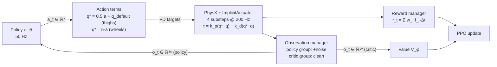

# The Balance Task — Full MDP Specification

This chapter is the complete, equation-level reference for the **balance task**: the environment in which the wheeled quadruped learns to stand upright on its two rear wheels, holding a target base height, without ever being told *how* — only being scored on the outcome. Everything the agent sees (observations), everything it can do (actions), everything it is scored on (rewards), and everything that ends an episode (terminations) is defined in one file, `source/wheeled_quadruped/wheeled_quadruped/tasks/balance/balance_env_cfg.py`, and this page walks through every line of that MDP with full mathematical detail.

**Prerequisites / see also:** [RL and MDP Foundations](03-RL-and-MDP-Foundations.md) for the meaning of $s_t, o_t, a_t, r_t, \gamma$; [The Robot](02-The-Robot.md) for the articulation and actuator hardware model; [Isaac Lab Architecture](04-Isaac-Lab-Architecture.md) for how managers assemble this config into a running environment; [Velocity Task](06-Velocity-Task.md) for the task that subclasses this one; [PPO Algorithm](07-PPO-Algorithm.md) for how the reward defined here is turned into gradient updates; [Asymmetric Actor-Critic and Sim2Real](08-Asymmetric-Actor-Critic-and-Sim2Real.md) for *why* the two observation groups differ.

---

## 1. The task in one paragraph

The robot has four joints: two front **thigh** joints (revolute, position-controlled) and two rear **wheel** joints (continuous, velocity-controlled). It starts each episode with its base (torso) at height $h^* = 0.828$ m — the nominal balancing pose — with small random perturbations. An inverted-pendulum-like system on two wheels is unstable: do nothing and it falls. The policy must learn, at $f_c = 50$ Hz, to command wheel speeds and thigh angles that keep the base upright and at the target height for a full 20-second episode. There is no velocity command in this task (that arrives in the [Velocity Task](06-Velocity-Task.md)); the only objective is *survive, upright, at height, smoothly*.

Formally, this is a discounted, episodic, partially observed MDP. At each control step $t$ the agent receives an observation $o_t$ (a *noisy, incomplete* view of the true simulator state $s_t$), emits an action $a_t \in \mathbb{R}^4$, and receives a scalar reward $r_t$. The learning objective is to maximize the expected return $G_t = \sum_{k \ge 0} \gamma^k r_{t+k}$ with discount $\gamma = 0.99$ (set in the PPO config; see [PPO Algorithm](07-PPO-Algorithm.md)).

### Timing

Two clocks run in this environment, and confusing them is a classic beginner error:

| Quantity | Symbol | Value | Where set |
|---|---|---|---|
| Physics timestep | $dt$ | $0.005$ s (200 Hz) | `sim.dt` in `__post_init__`, `balance_env_cfg.py` |
| Decimation | $D$ | 4 | `decimation` in `__post_init__` |
| Control period | $\Delta t = D \cdot dt$ | $0.02$ s ($f_c = 50$ Hz) | derived |
| Episode length | — | $20.0$ s $= 1000$ control steps | `episode_length_s` |

The policy acts once every $\Delta t = 0.02$ s; between two policy actions, PhysX integrates the dynamics $D = 4$ times at $dt = 0.005$ s, with the actuator PD law (Section 4) applied at every physics substep. The renderer runs at `render_interval = 4`, i.e. once per control step.

---

## 2. The scene

The scene config `WheeledQuadrupedSceneCfg` (`balance_env_cfg.py`, lines 42–64) declares what exists in the world. During training it is cloned into **4096 parallel environments** (`num_envs=4096`) on a grid with `env_spacing=4.0` m — every environment is an independent copy of this scene, all stepped in one batched GPU simulation (see [Isaac Lab Architecture](04-Isaac-Lab-Architecture.md)).

| Entity | Config | Details |
|---|---|---|
| `ground` | `GroundPlaneCfg(size=(100.0, 100.0))` at `/World/ground` | A flat 100 m × 100 m plane. No terrain difficulty in this task. |
| `robot` | `WHEELED_QUADRUPED_CFG.replace(prim_path="{ENV_REGEX_NS}/Robot")` | The articulation defined in `source/.../wheeled_quadruped/assets/__init__.py`, spawned from `quadruped_robot.usd`. Initial base position $(0, 0, 0.828)$, all four joints at $0.0$ rad. See [The Robot](02-The-Robot.md). |
| `dome_light` | `DomeLightCfg(color=(0.9,0.9,0.9), intensity=500.0)` | Ambient illumination (visual only — no physics effect). |
| `distant_light` | `DistantLightCfg(color=(0.9,0.9,0.9), intensity=2500.0)`, rotation quaternion $(0.738, 0.477, 0.477, 0.0)$ | Directional "sun" light (visual only). |

Note the deliberate coincidence: the spawn height $0.828$ m equals the reward target height $h^*$ in Section 5. The robot starts *at* the pose it is paid to hold.

---

## 3. Observation space: two groups, one for each network

This environment defines **two observation groups** (`ObservationsCfg`, lines 87–123). This is the *asymmetric actor-critic* pattern: the **policy** group is what the actor network $\pi_\theta(a \mid o)$ sees — restricted to signals obtainable from onboard sensors (IMU + joint encoders) and deliberately corrupted with noise — while the **critic** group is what the value network $V_\phi(o)$ sees — a larger, noise-free, "privileged" state readout that only exists in simulation. The critic is discarded at deployment, so it may cheat; the actor may not. The full rationale is in [Asymmetric Actor-Critic and Sim2Real](08-Asymmetric-Actor-Critic-and-Sim2Real.md); how rsl-rl wires the two groups to the two networks is in [PPO Algorithm](07-PPO-Algorithm.md).

Both groups set `concatenate_terms=True`: the terms below are flattened and concatenated *in declaration order* into a single vector.

### 3.1 Notation for the terms

- $q \in \mathbb{R}^4$ — joint positions, ordered $[\text{front-left-thigh}, \text{front-right-thigh}, \text{rl-wheel}, \text{rr-wheel}]$; $\dot q \in \mathbb{R}^4$ the joint velocities.
- $q_{\text{default}}$ — the default (nominal) joint positions from the articulation's initial state. Here $q_{\text{default}} = \mathbf{0}$ (all joints spawn at 0 rad), a fact we use below.
- $v = (v_x, v_y, v_z)$, $\omega = (\omega_x, \omega_y, \omega_z)$ — base linear and angular velocity **in the base frame**.
- $g_b = R_b^\top \hat g$ — the **projected gravity**: the world unit gravity vector $\hat g = (0,0,-1)$ rotated into the base frame by the transpose of the base rotation matrix $R_b$. When the robot stands perfectly upright, $g_b \approx (0, 0, -1)$; any tilt shows up as nonzero $g_{b,x}, g_{b,y}$. It is the standard IMU-derivable substitute for "orientation" that avoids yaw (a yaw rotation leaves $g_b$ unchanged — the robot cannot tell which compass direction it faces, and for balancing it should not need to).
- $h = p_z$ — the world-frame $z$ coordinate of the base.
- $a_{t-1} \in \mathbb{R}^4$ — the raw action emitted at the previous control step (`last_action`).

### 3.2 Policy group — 16 dimensions, onboard-only, noisy

`PolicyCfg` (lines 87–104), with `enable_corruption=True`:

| # | Term (cfg name) | MDP function | Math | Dim | Noise (additive uniform) |
|---|---|---|---|---|---|
| 1 | `base_ang_vel` | `mdp.base_ang_vel` | $\omega$ | 3 | $\mathcal{U}(-0.2, 0.2)$ rad/s |
| 2 | `projected_gravity` | `mdp.projected_gravity` | $g_b$ | 3 | $\mathcal{U}(-0.05, 0.05)$ |
| 3 | `thigh_pos` | `mdp.joint_pos_rel` (thigh joints) | $q_{\text{thigh}} - q_{\text{default,thigh}}$ | 2 | $\mathcal{U}(-0.01, 0.01)$ rad |
| 4 | `joint_vel` | `mdp.joint_vel_rel` (all 4 joints) | $\dot q - \dot q_{\text{default}} = \dot q$ | 4 | $\mathcal{U}(-1.5, 1.5)$ rad/s |
| 5 | `actions` | `mdp.last_action` | $a_{t-1}$ | 4 | none |

$$
o_t^{\text{policy}} = \big[\, \omega;\; g_b;\; q_{\text{thigh}} - q_{\text{default,thigh}};\; \dot q;\; a_{t-1} \,\big] + n_t \;\in \mathbb{R}^{16},
$$

where $n_t$ is the per-term uniform noise vector above (zero on the `actions` slot). `Unoise(lo, hi)` in the config is Isaac Lab's additive uniform noise: each element independently gets $n \sim \mathcal{U}(lo, hi)$ added every step.

Three things to internalize:

1. **Every policy term is onboard-obtainable.** $\omega$ and $g_b$ come from an IMU (gyroscope and gravity-referenced attitude filter), $q$ and $\dot q$ from joint encoders, and $a_{t-1}$ is the controller's own memory of its last command. Nothing here requires motion capture, GPS, or a simulator oracle. Notably *absent*: base linear velocity $v$ (hard to measure onboard without drift-prone integration or vision) and base height $h$ (requires external referencing). Those live only in the critic group.
2. **Why corruption is on.** Real sensors are noisy: gyros have noise floors, encoders quantize, velocity estimates from finite-differencing are jittery (hence the large $\pm 1.5$ rad/s band on $\dot q$ versus the tight $\pm 0.01$ rad on positions). Training with `enable_corruption=True` forces the policy to be robust to exactly this class of error, so that the sim-trained network does not shatter on first contact with real signals. This is observation-space domain randomization — the twin of the dynamics randomization in Section 7. See [Asymmetric Actor-Critic and Sim2Real](08-Asymmetric-Actor-Critic-and-Sim2Real.md).
3. **Why feed back $a_{t-1}$.** The actuators do not respond instantly (the PD servo of Section 4 takes time to track a target), so the previous command is genuinely informative state; it also lets the `action_rate` penalty concept (Section 5) be *observable* by the policy, and gives a partially-observed system a one-step memory for free.

Also note that `joint_pos_rel` returns positions *relative to default*, $q - q_{\text{default}}$ — the standard trick that centers observations around the nominal pose so the network sees small numbers near zero at the operating point. Because this robot's defaults are all zero, relative and absolute coincide numerically here, but the config uses the relative form so the pattern generalizes.

### 3.3 Critic group — 20 dimensions, privileged, clean

`CriticCfg` (lines 106–123), with `enable_corruption=False` — **no noise on any term**:

| # | Term (cfg name) | MDP function | Math | Dim |
|---|---|---|---|---|
| 1 | `base_lin_vel` | `mdp.base_lin_vel` | $v$ | 3 |
| 2 | `base_ang_vel` | `mdp.base_ang_vel` | $\omega$ | 3 |
| 3 | `projected_gravity` | `mdp.projected_gravity` | $g_b$ | 3 |
| 4 | `base_height` | `mdp.base_pos_z` | $h = p_z$ | 1 |
| 5 | `thigh_pos` | `mdp.joint_pos_rel` (thighs) | $q_{\text{thigh}} - q_{\text{default,thigh}}$ | 2 |
| 6 | `joint_vel` | `mdp.joint_vel_rel` | $\dot q$ | 4 |
| 7 | `actions` | `mdp.last_action` | $a_{t-1}$ | 4 |

$$
o_t^{\text{critic}} = \big[\, v;\; \omega;\; g_b;\; h;\; q_{\text{thigh}} - q_{\text{default,thigh}};\; \dot q;\; a_{t-1} \,\big] \in \mathbb{R}^{20}.
$$

The two extra signals — $v$ (3 dims) and $h$ (1 dim) — are precisely the quantities the reward function depends on ($h$ drives `base_height`, $v_z$ drives `lin_vel_z`) that the actor cannot see. Giving them to the critic makes value estimation far easier (lower-variance advantage estimates in [PPO Algorithm](07-PPO-Algorithm.md)) at zero deployment cost, because $V_\phi$ never runs on the robot.

Neither group is normalized by a running statistic: the PPO runner config sets `empirical_normalization=False` and `actor/critic_obs_normalization=False` (`tasks/balance/agents/rsl_rl_ppo_cfg.py`) — the raw physical units above are what the networks ingest.

---

## 4. Action space and the actuator model

### 4.1 The action vector

The action $a_t \in \mathbb{R}^4$ is split by `ActionsCfg` (lines 72–79) into two terms:

| Term | Type | Joints | Scale | Offset |
|---|---|---|---|---|
| `thigh_pos` | `JointPositionActionCfg` | `robot1_front_left_thigh_joint`, `robot1_front_right_thigh_joint` | $0.5$ | $q_{\text{default}}$ (`use_default_offset=True`) |
| `wheel_vel` | `JointVelocityActionCfg` | `robot1_rl_wheel_joint`, `robot1_rr_wheel_joint` | $5.0$ | $0$ |

Isaac Lab action terms apply an elementwise affine map, $\text{processed} = \text{scale} \cdot a + \text{offset}$, and hand the result to the actuator as a *target*, not a torque:

$$
q^*_{\text{thigh}} = 0.5\, a_{1:2} + q_{\text{default,thigh}}, \qquad
\dot q^*_{\text{wheel}} = 5.0\, a_{3:4} \;\; \text{[rad/s]}.
$$

In words: the first two action components command a **thigh angle offset** of up to $\pm 0.5$ rad around the nominal pose (for a nominal action range of $[-1,1]$; the thigh joints are described as limited to $\pm 0.785$ rad in the asset docstring), and the last two command **wheel angular velocities** up to $\pm 5$ rad/s. The `use_default_offset=True` flag is what makes the thigh action a *delta around nominal* — action $a = 0$ means "hold the default pose", which is a sane resting point for an untrained random policy. The $[-1,1]$ convention is confirmed by the smoke test `scripts/verify_env.py`, which drives the env with uniform random actions `2*rand-1`; the Gaussian policy itself is unbounded, and the scale factors are what map "order-one network outputs" to physically meaningful targets.

### 4.2 The ImplicitActuator PD law

Targets become torques through Isaac Lab's `ImplicitActuator` (see [The Robot](02-The-Robot.md) for the config, [Isaac Lab Architecture](04-Isaac-Lab-Architecture.md) for where it sits in the pipeline). The law is a proportional–derivative (PD) servo:

$$
\tau = k_p \,(q^* - q) + k_d\,(\dot q^* - \dot q) + \tau_{ff}, \qquad \tau \leftarrow \operatorname{clip}(\tau,\, -\tau_{\max},\, +\tau_{\max}),
$$

where $k_p$ (the *stiffness*) penalizes position error, $k_d$ (the *damping*) penalizes velocity error, $\tau_{ff}$ is a feed-forward torque (zero here), and $\tau_{\max}$ is `effort_limit_sim`. "Implicit" means the PD law is not evaluated by Python and applied as an external force — the gains and targets are handed to PhysX, which folds the servo into its implicit integrator at every 200 Hz physics substep (this is numerically stiffer-stable than explicit torque application). The Python-side `computed/applied_effort` is tracked anyway so the torque penalty in Section 5 has a value to read.

With the actual gains from `source/.../assets/__init__.py`:

- **Thighs** ($k_p = 1000$, $k_d = 20$, $\tau_{\max} = 400$ N·m). The position action sets $q^*$; the velocity target defaults to $\dot q^* = 0$, so
$$
\tau_{\text{thigh}} = 1000\,(q^* - q) - 20\,\dot q,
$$
a stiff position servo with damping — the thighs snap to and hold the commanded angle.
- **Wheels** ($k_p = 0$, $k_d = 10$, $\tau_{\max} = 100$ N·m). With zero stiffness the position error term vanishes identically:
$$
\tau_{\text{wheel}} = 10\,(\dot q^* - \dot q),
$$
a **pure velocity servo**: torque is proportional to the speed error. This is exactly what you want for a wheel — there is no meaningful "position" for a continuously rotating joint, and the policy thinks in wheel *speeds*.

So the policy is not doing torque control. It is scheduling *setpoints* for two fast low-level servos, 50 times a second — a hierarchical structure (RL on top, PD below) that is the workhorse pattern of modern legged/wheeled RL.

---

## 5. The reward function — all 10 terms

`RewardsCfg` (lines 194–219) declares ten terms. Two universal facts before the table:

**Fact 1 — the manager multiplies every term by its weight *and* by $\Delta t$.** Isaac Lab's `RewardManager.compute()` (in `isaaclab/managers/reward_manager.py`) computes, each control step,

$$
\boxed{\; r_t \;=\; \sum_{i} w_i \, f_i(s_t)\,\Delta t \;}, \qquad \Delta t = 0.02\ \text{s},
$$

where $f_i$ is the raw kernel of term $i$ and $w_i$ its configured weight. The $\Delta t$ factor makes the *episode return* approximately invariant to the control frequency (halving $\Delta t$ doubles the step count but halves each step's reward), which keeps reward scales portable across timing changes. Practical consequence: the `alive` term contributes $1.0 \times 1 \times 0.02 = 0.02$ per step, so a perfect 1000-step episode earns at most $\approx 20$ from it — which is why healthy trained runs report mean episode returns just under 20 (≈19.5 observed), not "1000".

**Fact 2 — signs live in the weights, not the functions (a cautionary tale).** Every `*_l2` kernel below returns a **non-negative** number — it is a squared error. The function `base_height_l2` does *not* return "reward for being at the right height"; it returns the *penalty magnitude* $(h - h^*)^2 \ge 0$. It only becomes a penalty because the config assigns it weight $w = -20.0$. Get this sign wrong — write `weight=+20.0` in a moment of "height is good, so positive weight!" — and you have built a reward that *pays the robot to be as far from 0.828 m as possible*: the optimal policy under that sign error is to dive to the floor or launch itself upward, and PPO will find it with enthusiasm. The same applies to all eight quadratic penalty terms. When auditing any Isaac Lab reward config, the invariant to check is: *non-negative kernel ⇒ negative weight for a penalty, positive weight only for terms you truly want maximized* (`alive`, and the exp-kernel tracking terms of the [Velocity Task](06-Velocity-Task.md)).

### 5.1 The terms

All kernels below are per-environment scalars; symbols as in Section 3.1, with $\tau_j$ the applied joint torques, $\ddot q_j$ the joint accelerations, and $a_t$ the raw action.

| # | Term | Kernel $f_i(s_t)$ | Weight $w_i$ | Purpose (plain words) |
|---|---|---|---|---|
| 1 | `alive` | $\mathbb{1}[\text{not terminated}]$ | $+1.0$ | The paycheck. +1 for every step still standing; the only positive term, so *survival is the primary objective* and everything else is a tax on sloppy ways of surviving. |
| 2 | `terminating` | $\mathbb{1}[\text{terminated early}]$ | $-2.0$ | One-time fine on the step a failure termination fires (falling over / sinking too low). Timeouts are excluded — reaching 20 s is success, not failure. |
| 3 | `base_height` | $(h - h^*)^2$, $h^* = 0.828$ | $-20.0$ | Hold the torso at the nominal balancing height. Largest penalty weight in the task: height *is* the task. |
| 4 | `flat_orientation` | $g_{b,x}^2 + g_{b,y}^2$ | $-5.0$ | Stay upright: the $x,y$ components of projected gravity are zero exactly when the base $z$-axis is vertical. Yaw-invariant by construction. |
| 5 | `lin_vel_z` | $v_z^2$ | $-2.0$ | Don't bounce: penalizes vertical base velocity (pogo-ing, hopping). |
| 6 | `ang_vel_xy` | $\omega_x^2 + \omega_y^2$ | $-0.05$ | Don't wobble: penalizes roll/pitch *rates* (term 4 penalizes tilt itself, this penalizes tilting *fast*). |
| 7 | `joint_torques` | $\sum_j \tau_j^2$ | $-1\times 10^{-5}$ | Energy/effort regularizer: prefer solutions that do not saturate the motors. Tiny weight because $\tau^2$ is numerically large ($\tau$ up to 400 N·m). |
| 8 | `joint_acc` | $\sum_j \ddot q_j^2$ | $-2.5\times 10^{-7}$ | Smoothness at the joint level: discourage jerky accelerations that would rattle real hardware. |
| 9 | `action_rate` | $\lVert a_t - a_{t-1}\rVert^2$ | $-0.01$ | Smoothness at the command level: discourage the policy from flapping its setpoints step to step (a common sim artifact that destroys real actuators). |
| 10 | `wheel_spin` | $\sum_{j \in \text{wheels}} \dot q_j^2$ | $-1\times 10^{-3}$ | **Balance-task-specific.** With no velocity command, the ideal robot balances *in place*. Without this term, a policy can "balance" by driving off at constant speed or oscillating the wheels — segway-style perpetual motion is a perfectly good survival strategy. Penalizing wheel speed selects the *stationary* balancing solution. (The [Velocity Task](06-Velocity-Task.md) deletes this term — there, spinning the wheels is the whole point.) |

A useful way to read this table: term 1 defines *what* success is; terms 2–4 define the task geometry (upright, at height); terms 5–9 are *style* penalties shaping how the task is achieved (smooth, low-energy, non-jerky — all of which correlate with policies that transfer to hardware); term 10 pins down *which* of the many surviving behaviors is wanted. The weights span seven orders of magnitude ($10^0$ to $2.5\times 10^{-7}$) because the kernels have wildly different natural scales — a weight is only meaningful multiplied by the typical magnitude of its kernel.

### 5.2 Worked example: one control step, by hand

Take a single environment mid-episode in a plausible "balancing but slightly perturbed" state:

- $h = 0.800$ m (2.8 cm below target); $g_b = (0.05, -0.02, -0.9985)$ (a few degrees of tilt);
- $v = (0.15, 0.02, 0.10)$ m/s, $\omega = (0.20, 0.10, 0.05)$ rad/s;
- applied torques $\tau = (30, 25, 5, -4)$ N·m (thighs, then wheels), accelerations $\ddot q = (10, -10, 8, -8)$ rad/s²;
- wheel speeds $\dot q_{\text{wheels}} = (2.0, -1.5)$ rad/s;
- $a_t = (0.10, -0.05, 0.30, 0.25)$, $a_{t-1} = (0.00, 0.00, 0.10, 0.10)$;
- not terminated.

Each row computes $w_i \, f_i \, \Delta t$ with $\Delta t = 0.02$:

| Term | Kernel value $f_i$ | $w_i \, f_i \,\Delta t$ |
|---|---|---|
| `alive` | $1$ | $+0.020000$ |
| `terminating` | $0$ | $0$ |
| `base_height` | $(0.800-0.828)^2 = 7.84\times 10^{-4}$ | $-20 \cdot 7.84\times 10^{-4} \cdot 0.02 = -0.000314$ |
| `flat_orientation` | $0.05^2 + 0.02^2 = 0.0029$ | $-5 \cdot 0.0029 \cdot 0.02 = -0.000290$ |
| `lin_vel_z` | $0.10^2 = 0.01$ | $-2 \cdot 0.01 \cdot 0.02 = -0.000400$ |
| `ang_vel_xy` | $0.20^2 + 0.10^2 = 0.05$ | $-0.05 \cdot 0.05 \cdot 0.02 = -0.000050$ |
| `joint_torques` | $30^2{+}25^2{+}5^2{+}4^2 = 1566$ | $-10^{-5} \cdot 1566 \cdot 0.02 = -0.000313$ |
| `joint_acc` | $100{+}100{+}64{+}64 = 328$ | $-2.5\times 10^{-7} \cdot 328 \cdot 0.02 = -0.0000016$ |
| `action_rate` | $0.1^2{+}0.05^2{+}0.2^2{+}0.15^2 = 0.075$ | $-0.01 \cdot 0.075 \cdot 0.02 = -0.000015$ |
| `wheel_spin` | $2.0^2 + 1.5^2 = 6.25$ | $-10^{-3} \cdot 6.25 \cdot 0.02 = -0.000125$ |
| **Total** $r_t$ | | $\mathbf{+0.018491}$ |

The penalties shave about 7.5 % off the alive bonus. This is the intended regime for a competent policy: $r_t$ slightly below $0.02$, integrating to an episode return slightly below 20. If instead you saw the penalties *dominating* (large negative $r_t$), the state above would have to be far from nominal — the reward landscape funnels the policy toward "quietly upright at 0.828 m."

---

## 6. Terminations

`TerminationsCfg` (lines 223–228) defines three boolean predicates, evaluated every control step. Firing any of them ends the episode for that environment (which is then immediately reset by the events in Section 7):

$$
\text{time-out}: \quad t \,\Delta t \ge 20.0 \text{ s} \quad (t \ge 1000),
$$

$$
\text{bad-orientation}: \quad \theta_{\text{tilt}} > \frac{\pi}{3} \approx 1.047 \text{ rad } (60^\circ), \qquad \cos\theta_{\text{tilt}} = -\,g_{b,z},
$$

$$
\text{base-too-low}: \quad h < 0.4 \text{ m}.
$$

In words: the episode ends when the clock runs out; or when the base has tipped more than 60° from vertical (the tilt angle $\theta_{\text{tilt}}$ is read off the projected gravity — upright gives $g_{b,z} = -1 \Rightarrow \theta = 0$); or when the torso has sunk below 0.4 m (roughly half the nominal height — the robot has effectively collapsed onto its front legs or the ground).

The distinction between the first predicate and the other two matters enormously for learning. `time_out` is flagged `time_out=True`, making it a **truncation**: the episode *would have continued*, we just stopped watching. `bad_orientation` and `base_too_low` are genuine **terminations**: the MDP really has entered a failure absorbing state. Three mechanisms honor this split:

1. the `terminating` reward term fires only on true terminations (a timeout costs nothing);
2. `alive` still pays out on the timeout step;
3. PPO's value bootstrap treats them differently — on truncation, rsl-rl adds $\gamma V_\phi(o_t)$ back into the reward so the agent is *not* taught that the world ends at 20 s (the `time_outs` bootstrap in `process_env_step`; full derivation in [PPO Algorithm](07-PPO-Algorithm.md)).

Get this wrong — treat timeouts as deaths — and the value function learns a spurious "cliff" at the episode horizon that visibly distorts behavior near $t = 1000$.

---

## 7. Events: randomization and resets (summary)

The MDP above is deliberately *not* fixed across episodes. `EventCfg` (lines 130–190) schedules five stock randomization events — friction and base-mass randomization at startup ($\mu_s \sim \mathcal{U}(0.5, 1.25)$, $\mu_d \sim \mathcal{U}(0.4, 1.0)$, restitution $\sim \mathcal{U}(0, 0.05)$ over 64 material buckets; base mass offset $\sim \mathcal{U}(-1, +2)$ kg added to `robot1_base_footprint`), pose/velocity and joint-state randomization at every reset (base $x,y \sim \mathcal{U}(\pm 0.1)$ m, yaw $\sim \mathcal{U}(\pm \pi)$, all root velocity components $\sim \mathcal{U}(\pm 0.1)$; joint offsets $\sim \mathcal{U}(\pm 0.1)$), and a random **push** every 10–15 s that adds $\mathcal{U}(\pm 0.5)$ m/s to the base's planar velocity mid-episode. The pushes are why trained policies exhibit active disturbance rejection rather than a frozen equilibrium pose. Full mathematical treatment of each event, and why this randomization is the backbone of sim-to-real transfer, is in [Asymmetric Actor-Critic and Sim2Real](08-Asymmetric-Actor-Critic-and-Sim2Real.md).

---

## 8. Registered variants

The balance task registers **three** Gym IDs (`tasks/balance/__init__.py`; see [Code Architecture](09-Code-Architecture.md) for the registration chain):

| Gym ID | Env cfg | Purpose |
|---|---|---|
| `Wheeled-Quadruped-Balance-v0` | `WheeledQuadrupedBalanceEnvCfg` | Training: 4096 envs, noise on, pushes on. |
| `Custom-Wheeled-Quadruped-v0` | same | Legacy alias — byte-identical kwargs, kept for backward compatibility. |
| `Wheeled-Quadruped-Balance-Play-v0` | `WheeledQuadrupedBalanceEnvCfg_PLAY` | Evaluation: 32 envs, `enable_corruption=False` (clean policy obs), `push_robot=None`. |

The `_PLAY` variant answers the question "what has the policy *actually* learned?" without the confound of injected noise and shoves; it is what `scripts/rsl_rl/play.py` runs, and it is also the config under which policies are exported to `policy.pt` / `policy.onnx` (see [Training and Reproducing](10-Training-and-Reproducing.md)).

## 9. The MDP at a glance

| Component | Value |
|---|---|
| Action space | $a \in \mathbb{R}^4$: 2 thigh position deltas (scale 0.5) + 2 wheel velocities (scale 5.0) |
| Policy observation | $\mathbb{R}^{16}$, onboard-only, uniform noise |
| Critic observation | $\mathbb{R}^{20}$, adds $v$ and $h$, noise-free |
| Reward | 10 terms, $r_t = \sum_i w_i f_i \Delta t$; alive-dominated, max episode return $\approx 20$ |
| Terminations | timeout 20 s (truncation) · tilt > 60° · height < 0.4 m |
| Events | 2 startup + 2 reset + 1 interval (push every 10–15 s) |
| Timing | $dt = 0.005$ s, $D = 4$, $\Delta t = 0.02$ s, 1000 steps/episode |
| Parallelism | 4096 envs (train) / 32 (play) |

Next: the [Velocity Task](06-Velocity-Task.md) inherits every one of these choices as a Python subclass and surgically edits a handful of them — a case study in curriculum-by-configuration.
