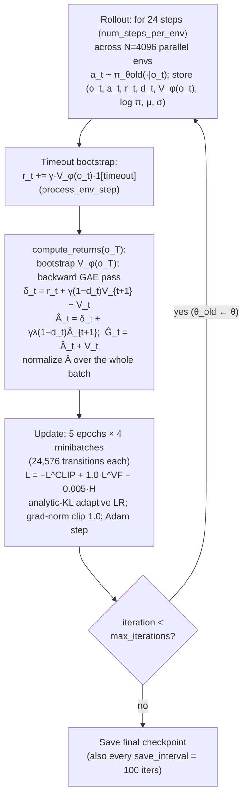

# PPO & the Training Algorithm

This chapter is the mathematical heart of the wiki: it derives, from first principles, the algorithm that actually turns 98,304 simulated transitions per iteration into a balancing controller — Proximal Policy Optimization (PPO) as implemented in **rsl_rl v3.0.1** and configured in this repo's `rsl_rl_ppo_cfg.py` files. We build up from the policy-gradient theorem, through actor-critic methods and Generalized Advantage Estimation (GAE), to the clipped surrogate objective, the exact loss the code minimizes, the KL-driven adaptive learning rate, and the full `OnPolicyRunner` training loop with its batch arithmetic. Every equation below is the equation the code runs, cited to the file that runs it.

**Prerequisites / see also:** [RL & MDP Foundations](03-RL-and-MDP-Foundations.md) (returns, values, discounting), [Balance Task](05-Balance-Task.md) and [Velocity Task](06-Velocity-Task.md) (the environments being solved), [Asymmetric Actor-Critic & Sim2Real](08-Asymmetric-Actor-Critic-and-Sim2Real.md) (why actor and critic see different observations), [Training & Reproducing](10-Training-and-Reproducing.md) (how to launch what this page describes), [Isaac Lab Architecture](04-Isaac-Lab-Architecture.md) (where the env side of the loop lives).

---

## 1. The objective: what are we actually maximizing?

Recall from [RL & MDP Foundations](03-RL-and-MDP-Foundations.md): at each control step $t$ (50 Hz, $\Delta t = 0.02$ s) the policy receives an observation $o_t$ (the 16-dim balance vector or 19-dim velocity vector — see [Balance Task](05-Balance-Task.md)), samples an action $a_t \in \mathbb{R}^4$, and the environment returns a reward $r_t$ and the next observation. The policy is a parametrized probability distribution $\pi_\theta(a \mid o)$ — here a Gaussian whose mean comes from a neural network with parameters $\theta$ (Section 8).

The training objective is the **expected discounted return**:

$$
J(\theta) \;=\; \mathbb{E}_{\tau \sim \pi_\theta}\!\left[\, \sum_{t=0}^{\infty} \gamma^{t}\, r_t \,\right],
$$

where $\tau = (o_0, a_0, r_0, o_1, a_1, r_1, \dots)$ is a **trajectory** generated by running $\pi_\theta$ in the environment, and $\gamma \in [0,1)$ is the **discount factor** — here $\gamma = 0.99$ (`algorithm.gamma`, `source/wheeled_quadruped/wheeled_quadruped/tasks/balance/agents/rsl_rl_ppo_cfg.py`). The expectation $\mathbb{E}_{\tau\sim\pi_\theta}$ is over everything random: the environment's randomized resets and pushes, and the policy's own sampling.

**Intuition for $\gamma = 0.99$.** The discount defines how far into the future the agent "cares." A useful summary is the *effective horizon* $1/(1-\gamma) = 100$ control steps $= 100 \times 0.02\,\text{s} = 2$ seconds. Reward more than a couple of seconds away is heavily attenuated ($0.99^{100} \approx 0.37$). For a balancing robot this is a sensible time scale: falling over is a consequence that plays out in well under two seconds, so the credit-assignment window comfortably contains cause and effect.

The problem: $J(\theta)$ is an expectation over trajectories whose distribution *depends on $\theta$ itself* (the policy chooses the actions that determine which states are visited). We cannot backpropagate through the physics simulator. The policy-gradient theorem is the escape hatch.

## 2. The policy-gradient theorem

**Intuition first.** We can't differentiate the reward with respect to $\theta$, but we *can* differentiate the probability of the actions we took. So the trick is: run the policy, look at which actions led to better-than-expected outcomes, and nudge $\theta$ to make those actions more probable — and worse-than-expected actions less probable. That is the entire idea; the theorem just makes "better than expected" and "nudge" precise.

Formally, using the **likelihood-ratio (score-function) identity** $\nabla_\theta p_\theta(\tau) = p_\theta(\tau)\, \nabla_\theta \log p_\theta(\tau)$, and noting that the environment's dynamics don't depend on $\theta$ (only the policy factors $\pi_\theta(a_t \mid o_t)$ do), one obtains the **policy-gradient theorem**:

$$
\nabla_\theta J(\theta) \;=\; \mathbb{E}_{\tau \sim \pi_\theta}\!\left[\, \sum_{t} \nabla_\theta \log \pi_\theta(a_t \mid o_t)\; A_t \,\right],
$$

where $A_t$ is the **advantage** of action $a_t$: how much better the action turned out than the policy's average behavior from that observation,

$$
A_t \;=\; Q(o_t, a_t) - V(o_t),
$$

with $V(o_t) = \mathbb{E}_{\pi}[G_t \mid o_t]$ the **value function** (expected return $G_t = \sum_{k \ge 0}\gamma^k r_{t+k}$ from $o_t$) and $Q(o_t,a_t)$ the expected return if we first take $a_t$ and then follow $\pi$. Subtracting $V(o_t)$ — a *baseline* that doesn't depend on the action — leaves the gradient's expectation unchanged but dramatically reduces its variance: we no longer reward an action just because the robot happened to be in a good state; we reward it only for being better *than average for that state*.

Read the formula in words: *the gradient of performance is the average of "direction that increases the log-probability of the taken action" weighted by "how good that action was."* Positive advantage → push probability up; negative advantage → push it down.

## 3. Actor-critic: learning the baseline

The theorem needs $A_t$, which needs $V$. We don't know $V$, so we learn it: a second neural network $V_\phi(o)$ with parameters $\phi$ — the **critic** — regresses toward observed returns, while the policy network — the **actor** — follows the policy gradient. This is the *actor-critic* architecture.

This project uses an **asymmetric** actor-critic: the actor's input is the noisy, onboard-only `policy` observation group (16-dim balance / 19-dim velocity), while the critic's input is the clean, *privileged* `critic` group (20-dim / 23-dim, which additionally contains base linear velocity $v$ and base height $h$). The wiring is the `obs_groups={"policy": ["policy"], "critic": ["critic"]}` entry in both runner configs, consumed by `rsl_rl/modules/actor_critic.py` (`get_actor_obs` / `get_critic_obs` concatenate the named groups). Since the critic exists only at training time, it may freely use simulation-only ground truth; the actor must survive on what the real robot could sense. The full rationale lives in [Asymmetric Actor-Critic & Sim2Real](08-Asymmetric-Actor-Critic-and-Sim2Real.md).

One subtlety worth naming: because the actor sees an *observation* $o_t$ rather than the full simulator state $s_t$, the actor's problem is formally a POMDP. The critic's richer input is one of the standard mitigations.

## 4. Generalized Advantage Estimation (GAE)

We still must *estimate* $A_t$ from finite, noisy rollouts. There is a spectrum of estimators, and GAE (Schulman et al., 2016) interpolates across it with a single knob $\lambda$.

### 4.1 The TD error: the atom of advantage

Define the **temporal-difference (TD) error** at step $t$:

$$
\delta_t \;=\; r_t + \gamma\, V_\phi(o_{t+1}) - V_\phi(o_t).
$$

In words: "reward I actually got, plus the discounted value of where I landed, minus the value of where I started." If the critic were exact, $\mathbb{E}[\delta_t] = A_t$ for one-step lookahead — $\delta_t$ is a one-step advantage estimate. It is *low-variance* (only one random reward enters) but *biased* whenever $V_\phi$ is wrong — and early in training $V_\phi$ is very wrong.

At the other extreme, the Monte-Carlo estimate $\hat{A}_t^{MC} = G_t - V_\phi(o_t)$ (sum actual rewards to episode end) is *unbiased in the return* but has huge variance: it sums hundreds of noisy rewards, each influenced by later actions and random pushes that had nothing to do with $a_t$.

### 4.2 Interpolating: the $\lambda$-weighted sum

Telescoping $k$-step advantage estimates and geometrically weighting them by $\lambda^{l}$ gives the **GAE estimator**:

$$
\hat{A}_t \;=\; \sum_{l=0}^{\infty} (\gamma\lambda)^{l}\, \delta_{t+l},
\qquad \lambda \in [0,1],
$$

which the code computes with the equivalent backward recursion (this is verbatim the loop in `rsl_rl/storage/rollout_storage.py::compute_returns`, iterating $step = T{-}1 \dots 0$):

$$
\hat{A}_t \;=\; \delta_t + \gamma \lambda \,(1 - d_t)\, \hat{A}_{t+1},
\qquad
\delta_t = r_t + \gamma\,(1-d_t)\,V_\phi(o_{t+1}) - V_\phi(o_t),
$$

where $d_t \in \{0,1\}$ is the **done flag** (`next_is_not_terminal = 1.0 - dones`): when an episode ends, the recursion is cut so no value leaks across episode boundaries. The **returns** used as critic regression targets are then simply

$$
\hat{G}_t \;=\; \hat{A}_t + V_\phi(o_t).
$$

**The bias-variance dial.** Setting $\lambda = 0$ collapses the sum to $\hat{A}_t = \delta_t$: minimum variance, maximum reliance on (bias from) the critic. Setting $\lambda = 1$ recovers the Monte-Carlo estimate $\hat A_t = G_t - V_\phi(o_t)$: unbiased, maximally noisy. The project uses $\lambda = 0.95$ (`algorithm.lam`), the field-standard sweet spot. A concrete way to feel it: the weight on $\delta_{t+l}$ is $(\gamma\lambda)^l = (0.99 \times 0.95)^l = 0.9405^l$, which decays to $1/e$ after about $17$ steps $\approx 0.34$ s — GAE effectively trusts direct reward evidence over a third-of-a-second window and lets the critic summarize everything beyond it.

**Worked micro-example.** Suppose a 3-step fragment with rewards $r = (0.02, 0.02, 0.02)$ (the per-step alive bonus after $\Delta t$ scaling — see [Balance Task](05-Balance-Task.md)), critic values $V = (1.0, 1.1, 1.2)$, bootstrap value $V(o_3) = 1.3$, no dones. Then
$\delta_2 = 0.02 + 0.99(1.3) - 1.2 = 0.107$;
$\delta_1 = 0.02 + 0.99(1.2) - 1.1 = 0.108$;
$\delta_0 = 0.02 + 0.99(1.1) - 1.0 = 0.109$.
Backward pass with $\gamma\lambda = 0.9405$: $\hat A_2 = 0.107$, $\hat A_1 = 0.108 + 0.9405 \times 0.107 = 0.2086$, $\hat A_0 = 0.109 + 0.9405 \times 0.2086 = 0.3052$. All positive: the critic was systematically underestimating, so all three actions get reinforced.

### 4.3 Truncation vs. termination: the timeout bootstrap

The environments end episodes two ways ([Balance Task](05-Balance-Task.md)): genuine failures (`bad_orientation`, `base_too_low`) and the 20 s `time_out`. A timeout is *not* a failure — the state was fine; we just stopped watching. Treating it like a death would teach the robot that surviving 20 s is worthless. rsl_rl handles this in `PPO.process_env_step` (`rsl_rl/algorithms/ppo.py`): when the env reports `time_outs`,

$$
r_t \;\leftarrow\; r_t + \gamma\, V_\phi(o_t)\, \mathbb{1}[\text{timeout}_t],
$$

i.e. the value the episode *would have gone on to earn* is added back as a bootstrap before storage. Failures, by contrast, keep $d_t = 1$ with no bootstrap — their value beyond death really is zero (and they additionally eat the `terminating` reward penalty of $-2.0$).

### 4.4 Advantage normalization

After the backward pass, `compute_returns` normalizes advantages **once per rollout batch** (since `normalize_advantage_per_mini_batch=False`):

$$
\hat{A}_t \leftarrow \frac{\hat{A}_t - \operatorname{mean}(\hat{A})}{\operatorname{std}(\hat{A}) + 10^{-8}}.
$$

This makes the gradient scale invariant to the absolute reward magnitude (useful here, where the reward-manager's $\Delta t$ scaling shrinks all rewards by $50\times$ — see [Isaac Lab Architecture](04-Isaac-Lab-Architecture.md)) and keeps the surrogate loss in a numerically consistent range across training.

## 5. The PPO clipped surrogate: trust region without second-order machinery

### 5.1 Why plain policy gradient is dangerous

The policy gradient is only valid *at* the current $\theta$: the data was sampled from $\pi_\theta$, so a large parameter step invalidates its own justification. Worse, on-policy data is expensive — we would like to take *several* gradient epochs on each batch, but by epoch 2 the policy that collected the data is no longer the policy being updated. Importance sampling fixes the math: for the updated policy $\pi_\theta$ versus the data-collecting policy $\pi_{\theta_{old}}$, define the **probability ratio**

$$
\rho_t(\theta) \;=\; \frac{\pi_\theta(a_t \mid o_t)}{\pi_{\theta_{old}}(a_t \mid o_t)},
$$

and the reweighted surrogate objective $\mathbb{E}[\rho_t \hat{A}_t]$ has the correct gradient at $\theta = \theta_{old}$ (where $\rho_t = 1$). But maximizing it naively is catastrophic: the optimizer can drive $\rho_t \to \infty$ on any positive-advantage sample — an arbitrarily large policy change justified by a single lucky transition, far outside the region where the old data says anything at all. TRPO solved this with an explicit KL-divergence constraint requiring second-order optimization (conjugate gradients on the Fisher matrix). PPO achieves the same *trust region* effect with one `min` and one `clamp`:

$$
L^{CLIP}(\theta) \;=\; \mathbb{E}_t\!\left[\, \min\!\Big( \rho_t \hat{A}_t,\;\; \operatorname{clip}\big(\rho_t,\, 1{-}\varepsilon,\, 1{+}\varepsilon\big)\, \hat{A}_t \Big) \right],
\qquad \varepsilon = 0.2 \;(\texttt{clip\_param}).
$$

### 5.2 Why clipping works — read it case by case

- **$\hat{A}_t > 0$ (good action).** The objective grows with $\rho_t$ — but only until $\rho_t = 1+\varepsilon = 1.2$. Beyond that, the clipped branch is a constant, its gradient is zero, and the `min` selects it. The incentive to make a good action more probable *saturates* at a 20% probability increase. No single sample can drag the policy arbitrarily far.
- **$\hat{A}_t < 0$ (bad action).** Symmetrically, the incentive to suppress the action saturates at $\rho_t = 1-\varepsilon = 0.8$.
- **The `min` is pessimistic.** If clipping *helps* the objective (e.g. $\rho_t$ drifted below $1-\varepsilon$ on a positive-advantage sample), the `min` picks the *unclipped*, worse value — so the objective is a lower (pessimistic) bound on the true surrogate. Updates that would overshoot get zero gradient; updates that would recover from an overshoot still get full gradient.

**Numeric example.** Take $\hat{A}_t = +2$ after normalization. At $\rho_t = 1.1$: both branches give $2.2$, gradient flows. At $\rho_t = 1.5$: unclipped $= 3.0$, clipped $= 1.2 \times 2 = 2.4$; `min` selects $2.4$, a constant in $\theta$ — gradient is zero, the sample stops pushing. The policy update is thus *proximal*: many cheap first-order steps, each confined to a neighborhood of $\pi_{\theta_{old}}$.

The implementation (`rsl_rl/algorithms/ppo.py::update`) minimizes the negation, written as

```python
surrogate        = -advantages * ratio
surrogate_clipped = -advantages * clamp(ratio, 1-ε, 1+ε)
surrogate_loss   = max(surrogate, surrogate_clipped).mean()   # = −L^CLIP
```

which is algebraically identical ($\max$ of negatives $=$ $-\min$).

## 6. The value loss, entropy bonus, and the total loss

### 6.1 Clipped value loss

The critic is regressed onto the GAE returns $\hat{G}_t$, with its own clipping (`use_clipped_value_loss=True`): letting $V_{old}$ be the values recorded at rollout time,

$$
L^{VF}(\phi) \;=\; \mathbb{E}_t\!\left[ \max\!\Big( \big(V_\phi(o_t) - \hat{G}_t\big)^2,\; \big(V_{clip} - \hat{G}_t\big)^2 \Big) \right],
\qquad
V_{clip} = V_{old} + \operatorname{clip}\big(V_\phi - V_{old},\, -\varepsilon,\, \varepsilon\big).
$$

The same proximal philosophy applied to the critic: the new value prediction may move at most $\varepsilon = 0.2$ away from the rollout-time prediction per update; taking the pessimistic `max` of the two squared errors prevents the critic from lurching, which would in turn destabilize every future advantage estimate.

### 6.2 Entropy bonus

The differential entropy of the Gaussian policy, $H[\pi_\theta(\cdot \mid o_t)] = \sum_{j=1}^{4} \tfrac{1}{2}\log(2\pi e\, \sigma_j^2)$, is added as a bonus. It pressures the learnable standard deviations $\sigma_j$ (Section 8) not to collapse too early: exploration is what discovers, e.g., that a brief wheel spurt recovers a backward lean. With `entropy_coef` $= 0.005$ the pressure is gentle — enough to delay premature determinism, not enough to prevent eventual convergence to tight, confident actions.

### 6.3 The total loss actually minimized

Per minibatch, `PPO.update` builds (coefficients from both `rsl_rl_ppo_cfg.py` files — they are identical for balance and velocity):

$$
L(\theta, \phi) \;=\; \underbrace{-L^{CLIP}(\theta)}_{\text{surrogate\_loss}} \;+\; \underbrace{c_v}_{=1.0}\, L^{VF}(\phi) \;-\; \underbrace{c_e}_{=0.005}\, \mathbb{E}_t\big[H[\pi_\theta(\cdot\mid o_t)]\big],
$$

then runs `zero_grad() → backward() → clip_grad_norm_(1.0) → optimizer.step()` (Adam). The **gradient-norm clip** `max_grad_norm=1.0` rescales the entire gradient vector if its L2 norm exceeds 1 — a final safety net against rare exploding-gradient minibatches (e.g. a batch dominated by termination transitions). Note actor and critic are updated jointly by one optimizer over the combined parameter set $(\theta, \phi)$.

## 7. The adaptive learning rate: measured KL as the thermostat

PPO's clipping bounds each *sample's* influence, but the aggregate policy shift per iteration still depends on the learning rate. rsl_rl closes the loop with `schedule="adaptive"`: after each minibatch it *measures* how far the policy actually moved, in KL divergence, and servo-controls the learning rate toward `desired_kl` $= 0.01$.

Because both old and new policies are diagonal Gaussians, the KL is analytic (this is the exact expression in `ppo.py`, including its $10^{-5}$ guard inside the log):

$$
D_{KL}\big(\pi_{old} \,\|\, \pi_\theta\big) \;=\; \sum_{j=1}^{4} \left[ \log\!\frac{\sigma_j}{\sigma_{old,j}} + \frac{\sigma_{old,j}^2 + (\mu_{old,j} - \mu_j)^2}{2\sigma_j^2} - \frac{1}{2} \right],
$$

averaged over the minibatch, then:

$$
\alpha \leftarrow
\begin{cases}
\max(10^{-5},\, \alpha / 1.5) & \text{if } \bar{D}_{KL} > 2 \cdot 0.01 \quad (\text{moved too fast — brake}),\\[2pt]
\min(10^{-2},\, \alpha \times 1.5) & \text{if } 0 < \bar{D}_{KL} < 0.01 / 2 \quad (\text{crawling — accelerate}),\\[2pt]
\alpha & \text{otherwise.}
\end{cases}
$$

The configured `learning_rate=1.0e-3` is therefore only the *initial* value; within a few iterations the controller finds whatever rate keeps policy drift near $0.01$ nats per update. This is the pragmatic completion of the trust-region story: clipping shapes *which* directions the gradient can push, the KL thermostat sets *how far* each optimizer step travels. It also makes training remarkably insensitive to the initial learning-rate guess — one reason these configs transfer across tasks with no per-task LR tuning.

## 8. The networks

Both tasks use the rsl_rl `ActorCritic` module (`rsl_rl/modules/actor_critic.py`) with ELU activations ($\mathrm{ELU}(x) = x$ for $x>0$, $e^x - 1$ otherwise — smooth at zero, no dead neurons, the Isaac Lab locomotion default):

| | Balance (`tasks/balance/agents/rsl_rl_ppo_cfg.py`) | Velocity (`tasks/velocity/agents/rsl_rl_ppo_cfg.py`) |
|---|---|---|
| Actor input | 16 (policy group, noisy) | 19 (policy group + 3-dim command) |
| Actor hidden | $[128, 128]$, ELU | $[256, 128, 64]$, ELU |
| Actor output | $\mu \in \mathbb{R}^4$ (Gaussian mean) | same |
| Critic input | 20 (privileged group, clean) | 23 |
| Critic hidden | $[128, 128]$, ELU | $[256, 128, 64]$, ELU |
| Critic output | $V_\phi(o) \in \mathbb{R}$ | same |

The velocity network is deeper and wider because its task is strictly harder: the same balancing problem *plus* tracking a 3-dim command that resamples every 10 s (see [Velocity Task](06-Velocity-Task.md)).

**The action distribution.** The policy is $\pi_\theta(a \mid o) = \mathcal{N}\big(\mu_\theta(o),\, \operatorname{diag}(\sigma^2)\big)$ where $\sigma \in \mathbb{R}^4$ is a **learnable, state-independent** parameter vector (`noise_std_type="scalar"`), initialized to `init_noise_std=1.0`. Log-probabilities and entropies sum over the 4 action dimensions. Early in training $\sigma \approx 1$ means actions are dominated by exploration noise (recall from [Balance Task](05-Balance-Task.md) that actions are consumed in a roughly $[-1,1]$ convention before physical scaling); as the advantage signal sharpens, gradient pressure shrinks $\sigma$, opposed only by the small entropy bonus. At deployment, `play.py` uses the deterministic mean $\mu_\theta(o)$.

**No observation normalization — deliberate.** Both configs set `empirical_normalization=False`, `actor_obs_normalization=False`, `critic_obs_normalization=False`. Many rsl_rl examples enable running mean/std input normalization; here it is off, which is viable because every observation term is already order-one by construction (angular velocities in rad/s, projected gravity a unit vector, joint positions relative to defaults — see [Balance Task](05-Balance-Task.md)). The practical benefit: the exported `policy.pt` / `policy.onnx` ([Training & Reproducing](10-Training-and-Reproducing.md)) has no hidden normalizer state that must be reproduced on the robot.

## 9. The OnPolicyRunner loop and the batch arithmetic

Training is launched by `scripts/rsl_rl/train.py`, which resolves the runner config from the gym registry via `@hydra_task_config`, wraps the env in `RslRlVecEnvWrapper`, and calls `OnPolicyRunner.learn(num_learning_iterations=max_iterations, init_at_random_ep_len=True)` (`train.py:216`). One **iteration** looks like this:



**Batch arithmetic.** With the default scene of $N = 4096$ parallel environments (`WheeledQuadrupedBalanceEnvCfg`, `balance_env_cfg.py`; overridable via `--num_envs`):

- Transitions per iteration: $24 \times 4096 = 98{,}304$.
- Minibatch size: $98{,}304 / 4 = 24{,}576$ transitions; gradient steps per iteration: $5 \times 4 = 20$.
- Each transition is reused 5 times (once per epoch) — this sample reuse is exactly what the ratio $\rho_t$ and the clip make safe.
- Simulated experience per iteration: $98{,}304 \times 0.02\,\text{s} \approx 33$ minutes of aggregate robot time — gathered in a couple of wall-clock seconds on a modern GPU, which is the entire economic argument for massively parallel simulation ([Isaac Lab Architecture](04-Isaac-Lab-Architecture.md)).
- Total budget: balance `max_iterations=1000` $\Rightarrow \approx 9.8 \times 10^7$ transitions ($\approx 23$ days of aggregate sim time); velocity `max_iterations=3000` $\Rightarrow \approx 2.9 \times 10^8$ transitions. Checkpoints every `save_interval=100` iterations.

**Rollouts are much shorter than episodes.** A 24-step rollout covers only $0.48$ s of a 20 s (1000-step) episode, so an episode spans ~42 iterations of data collection. Two mechanisms make this correct: the GAE bootstrap $V_\phi(o_T)$ stands in for the un-experienced remainder of every unfinished episode, and `init_at_random_ep_len=True` randomizes each env's initial episode phase so all 4096 envs don't time-out in lockstep — keeping every rollout batch a stratified sample of early-, mid-, and late-episode states.

## 10. Hyperparameter reference

All values from `WheeledQuadrupedBalancePPORunnerCfg` / `WheeledQuadrupedVelocityPPORunnerCfg` (identical `algorithm` blocks; differences noted):

| Hyperparameter | Value | Role |
|---|---|---|
| `num_steps_per_env` | 24 | Rollout horizon per env per iteration; with 4096 envs sets batch $= 98{,}304$. Short horizon → fresh on-policy data, relies on critic bootstrap. |
| `max_iterations` | 1000 (balance) / 3000 (velocity) | Total optimization iterations; velocity gets 3× because command-tracking is harder. |
| `save_interval` | 100 | Checkpoint period (iterations). |
| `gamma` ($\gamma$) | 0.99 | Discount; 2 s effective horizon at 50 Hz. |
| `lam` ($\lambda$) | 0.95 | GAE bias-variance dial; $(\gamma\lambda)^l$ decays in ~17 steps. |
| `clip_param` ($\varepsilon$) | 0.2 | Trust-region half-width for both ratio and value clipping. |
| `entropy_coef` ($c_e$) | 0.005 | Weight of the entropy bonus; slows collapse of $\sigma$. |
| `value_loss_coef` ($c_v$) | 1.0 | Weight of $L^{VF}$ in the joint loss. |
| `num_learning_epochs` | 5 | Passes over each rollout batch — sample reuse enabled by clipping. |
| `num_mini_batches` | 4 | Batch split; minibatch $= 24{,}576$. |
| `learning_rate` | $10^{-3}$ (initial) | Adam step size; immediately handed over to the KL controller. |
| `schedule` | `"adaptive"` | Enables the KL thermostat of Section 7. |
| `desired_kl` | 0.01 | Target policy drift (nats) per update; brake above $0.02$, accelerate below $0.005$, LR clamped to $[10^{-5}, 10^{-2}]$. |
| `max_grad_norm` | 1.0 | Global gradient-norm clip before each Adam step. |
| `init_noise_std` | 1.0 | Initial exploration std $\sigma_j$ of the Gaussian policy (learnable). |
| `empirical_normalization` | False | No running obs normalization (also disabled per-network); obs are order-one by design. |
| `obs_groups` | `{"policy": ["policy"], "critic": ["critic"]}` | Asymmetric wiring: actor ← noisy onboard group, critic ← privileged group. |

**A note on the other frameworks.** The balance task also registers skrl / Stable-Baselines3 / rl_games agent configs (`tasks/balance/agents/*.yaml`) with different hyperparameters (e.g. rl_games uses `horizon_length=16`, 8 mini-epochs, entropy 0), but the repo's own `scripts/rsl_rl/train.py` consumes **only** the rsl_rl config described in this chapter, and the velocity task ships an rsl_rl config *exclusively* — see [Code Architecture](09-Code-Architecture.md).

---

**Continue to:** [Asymmetric Actor-Critic & Sim2Real](08-Asymmetric-Actor-Critic-and-Sim2Real.md) for why the critic's privileged observations don't break deployability, or [Training & Reproducing](10-Training-and-Reproducing.md) to actually run `train.py`.
