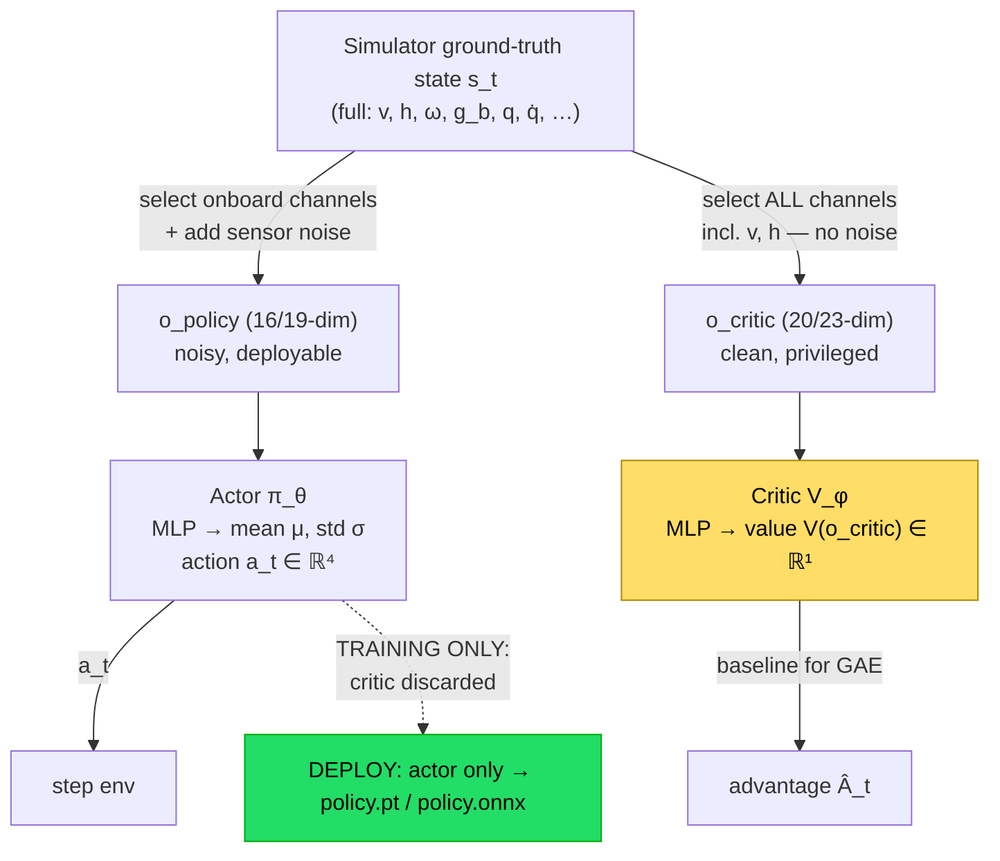
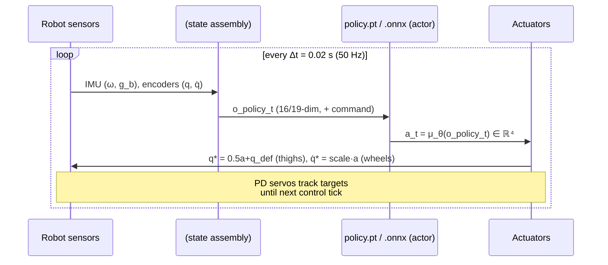

# Asymmetric Actor-Critic, Domain Randomization & Sim-to-Real

This chapter explains the single most important structural decision in the project: the **actor** (the network that ships to the robot) is deliberately blindfolded — it sees only what an onboard sensor could measure — while the **critic** (a training-only helper) is given the simulator's ground-truth state. We derive *why* feeding the critic privileged information lowers the variance of the learning signal without ever contaminating the deployable policy, then walk term-by-term through the domain-randomization events and observation noise that shrink the sim-to-real gap, and finish with exactly what gets exported to hardware and how the inference loop runs.

**Prerequisites / see also:** [RL and MDP Foundations](03-RL-and-MDP-Foundations.md) · [Isaac Lab Architecture](04-Isaac-Lab-Architecture.md) · [Balance Task](05-Balance-Task.md) · [Velocity Task](06-Velocity-Task.md) · [PPO Algorithm](07-PPO-Algorithm.md) · [The Robot](02-The-Robot.md) · [Code Architecture](09-Code-Architecture.md) · [Training and Reproducing](10-Training-and-Reproducing.md)

---

## 1. Two observation vectors, one robot

In an ordinary actor-critic setup, both the policy $\pi_\theta$ and the value function $V_\phi$ read the *same* observation. This project splits them. The environment publishes a **dictionary of observation groups**, and the two networks subscribe to different groups. Concretely, in `source/wheeled_quadruped/wheeled_quadruped/tasks/balance/balance_env_cfg.py` the `ObservationsCfg` contains two inner classes:

- **`PolicyCfg`** — the observation the actor sees, $o^{\text{policy}}_t$. It has `enable_corruption=True`, so every term is corrupted with sensor-like noise. Dimension **16** (balance) / **19** (velocity).
- **`CriticCfg`** — the observation the critic sees, $o^{\text{critic}}_t$. It has `enable_corruption=False` (perfectly clean) and includes extra ground-truth channels that no real sensor can read. Dimension **20** (balance) / **23** (velocity).

Here is what each contains, using the [shared notation](03-RL-and-MDP-Foundations.md) ($\omega$ = base angular velocity, $g_b$ = projected gravity, $q$ = joint positions, $\dot q$ = joint velocities, $v$ = base linear velocity, $h$ = base height, $a$ = action, $c$ = commanded velocity):

| Channel | Symbol | dim | In $o^{\text{policy}}$? | In $o^{\text{critic}}$? | Onboard-measurable? |
|---|---|---|---|---|---|
| base angular velocity | $\omega$ | 3 | ✅ (noisy) | ✅ (clean) | ✅ IMU gyro |
| projected gravity | $g_b$ | 3 | ✅ (noisy) | ✅ (clean) | ✅ IMU accel/attitude |
| thigh positions | $q_{\text{thigh}}-q_{\text{default}}$ | 2 | ✅ (noisy) | ✅ (rel, clean) | ✅ joint encoders |
| joint velocities | $\dot q$ | 4 | ✅ (noisy) | ✅ (clean) | ✅ (differentiated) |
| previous action | $a_{t-1}$ | 4 | ✅ | ✅ | ✅ (known internally) |
| **base linear velocity** | $v$ | 3 | ❌ | ✅ | ❌ **privileged** |
| **base height** | $h=p_z$ | 1 | ❌ | ✅ | ❌ **privileged** |
| velocity command (velocity task) | $c$ | 3 | ✅ | ✅ | ✅ (commanded) |

Balance policy $= 3+3+2+4+4 = 16$; balance critic $= 3+3+3+1+2+4+4 = 20$. The [velocity task](06-Velocity-Task.md) appends the 3-D command $c$ to both, giving 19 and 23. The two *privileged* rows — base linear velocity $v$ and base height $h$ — are exactly the difference: they live only in the critic.

The wiring that routes each group to the right network sits in `source/.../tasks/balance/agents/rsl_rl_ppo_cfg.py`:

```python
obs_groups = {"policy": ["policy"], "critic": ["critic"]}
```

Inside rsl-rl 3.0.1 (`modules/actor_critic.py`) this becomes:

$$
o^{\text{actor}} = \operatorname{cat}\big(\{o[g] : g \in \text{obs\_groups[policy]}\}\big), \qquad
o^{\text{critic}} = \operatorname{cat}\big(\{o[g] : g \in \text{obs\_groups[critic]}\}\big).
$$

The actor's `act()` reads only `get_actor_obs`, the critic's `evaluate()` reads only `get_critic_obs`. They never mix.



The green box is the punchline: **only the actor is exported**. The critic — and with it every privileged channel — is thrown away after training. What ships to the robot has never depended on $v$ or $h$.

---

## 2. Why give the critic more? The variance argument

The intuitive story first. During training, PPO needs to answer "was action $a_t$ better or worse than average from state $s_t$?" The measure of "better or worse" is the **advantage** $A_t$. To compute it, the algorithm needs a **baseline** — a prediction of how good the situation was *before* seeing what the action achieved. That baseline is the critic's job: $V_\phi(o)$ estimates the expected return. The closer $V_\phi$ is to the truth, the sharper the "better/worse" signal, and the less it jitters from one sample to the next. A critic that can *see the true state* can predict returns far more accurately than one squinting through noisy, incomplete sensors — so it produces a cleaner signal. Crucially, this cleaner signal only shapes *how the actor is updated*; it never becomes an input the actor depends on. So we can safely let the critic "cheat."

Now the math. Recall the policy-gradient estimator (see [PPO Algorithm](07-PPO-Algorithm.md)):

$$
\nabla_\theta J(\theta) \;=\; \mathbb{E}\big[\nabla_\theta \log \pi_\theta(a_t\mid o^{\text{policy}}_t)\,A_t\big].
$$

**Baselines are free (unbiased).** For *any* function $b(\cdot)$ that does not depend on the action $a$, subtracting it from the return leaves the gradient's expectation unchanged, because

$$
\mathbb{E}_{a\sim\pi}\!\big[\nabla_\theta \log \pi_\theta(a\mid o)\, b\big]
= b\,\nabla_\theta \!\!\int \pi_\theta(a\mid o)\,da
= b\,\nabla_\theta 1 = 0 .
$$

The key observation: this identity holds *regardless of what $b$ is conditioned on* — it may be conditioned on the full privileged state $s$, not just $o^{\text{policy}}$, and it is still a valid, zero-bias baseline. That is the licence to feed the critic privileged information. Using $V_\phi(o^{\text{critic}})$ as the baseline changes nothing about *what the actor converges to*; it only changes the **variance** of each gradient sample.

**Variance shrinks with a better baseline.** The per-sample gradient magnitude scales with $A_t^2$. GAE (used here with $\gamma=0.99,\ \lambda=0.95$) builds the advantage from one-step TD residuals

$$
\delta_t \;=\; r_t + \gamma\,V_\phi(o_{t+1}) - V_\phi(o_t), \qquad
\hat A_t \;=\; \sum_{l\ge 0}(\gamma\lambda)^l \delta_{t+l}.
$$

If $V_\phi$ equalled the true value $V^\star$, then $\mathbb{E}[\delta_t]=0$ and the residuals would be pure "surprise" — small and zero-mean. The farther $V_\phi$ sits from $V^\star$, the larger and more biased-looking the $\delta_t$, and the larger $\mathbb{E}[\hat A_t^2]$, hence the noisier the gradient.

Here is the part that makes privileged information *fundamentally* better, not just incidentally. This robot is a **POMDP**: from the noisy partial observation $o^{\text{policy}}$ you cannot recover the true state $s$. A critic restricted to $o^{\text{policy}}$ can, at best, learn the *conditional-mean* value

$$
V(o^{\text{policy}}) = \mathbb{E}\big[V^\star(s)\,\big|\,o^{\text{policy}}\big].
$$

The gap $V^\star(s) - \mathbb{E}[V^\star(s)\mid o^{\text{policy}}]$ is **irreducible** — no amount of training removes it, because the information simply is not in $o^{\text{policy}}$. That variance leaks straight into $\delta_t$ and inflates the advantage noise. A critic that reads the true state $s$ (via $o^{\text{critic}}$) has no such floor: it can drive its residual toward $V^\star(s)$ itself. Formally, by the law of total variance,

$$
\underbrace{\operatorname{Var}\big[V^\star(s)\big]}_{\text{critic sees }s}
= \underbrace{\operatorname{Var}\!\big[\mathbb{E}[V^\star(s)\mid o]\big]}_{\text{best partial critic}}
+ \underbrace{\mathbb{E}\big[\operatorname{Var}[V^\star(s)\mid o]\big]}_{\text{irreducible, }\ge 0},
$$

and the privileged critic escapes that last non-negative term. Lower advantage variance $\Rightarrow$ lower-variance policy gradient $\Rightarrow$ larger stable step sizes and faster, steadier convergence — while the actor still only ever consumes $o^{\text{policy}}$, so nothing about deployability is compromised.

**A concrete example of why $v$ matters to the critic.** Suppose the torso is drifting sideways at $v_y = 0.4$ m/s but momentarily upright ($g_b\approx(0,0,-1)$) with the wheels near zero velocity. From $o^{\text{policy}}$ alone the situation looks calm — yet the torso is skidding sideways (a disturbance the policy never commands, since no lateral velocity command exists in this project — the balance task has no command manager and the velocity task pins $c_y=0$) and is closer to tipping than it appears. The privileged critic *sees* $v_y=0.4$ and correctly assigns a lower value; the partial critic cannot, and would misjudge the advantage of whatever corrective action the actor just took. Multiply that across millions of transitions and the training signal is measurably cleaner.

---

## 3. Why base linear velocity (and height) are privileged

This is not an arbitrary choice — it is dictated by the project's **onboard-sensing-only principle**: a deployed policy may consume *only* quantities the robot can obtain from its own sensors, at run time, without any external motion-capture or global positioning.

- **Base angular velocity $\omega$** and **projected gravity $g_b$** come essentially for free from a strapdown **IMU** (a 3-axis gyro gives $\omega$; the accelerometer plus an attitude filter gives the gravity direction in the base frame). Both are genuinely onboard, so they are in $o^{\text{policy}}$.
- **Thigh angles and joint velocities** come from **joint encoders** — onboard, so they are in $o^{\text{policy}}$.
- **Base linear velocity $v$** has **no direct sensor**. To get it on real hardware you must run a **state estimator** that fuses IMU acceleration (which drifts when integrated), **wheel odometry** (which slips exactly when the robot is doing something dynamic), and a kinematic model — a whole subsystem with its own latency, bias, and failure modes. In simulation $v$ is a free ground-truth read (`asset.data.root_lin_vel_b`), but on the robot it is a *product of estimation*, not a measurement. So it stays out of the actor and lives only in the critic.
- **Base height $h=p_z$** is the world-frame $z$ of the torso — a *global* quantity. Measuring it truly requires external positioning (mocap) or a downward range sensor with assumptions about the ground. It violates the onboard-only rule outright, so it too is privileged.

The design therefore lets the critic exploit $v$ and $h$ during training (they genuinely help it judge value, per §2), while the actor learns to **infer whatever it needs about them implicitly** from the onboard channels it *does* have — the IMU's $\omega$ and $g_b$, the encoders' $\dot q$, and its own last action $a_{t-1}$. This is the asymmetric actor-critic doing its intended job: privileged supervision, onboard execution.

---

## 4. The reality gap and domain randomization

A policy trained in a perfect simulator overfits to that simulator's exact physics — its precise friction, mass, contact model — and then falls over on a real robot whose numbers differ. This mismatch is the **reality gap**. The bridge used here is **domain randomization (DR)**: instead of training in one world, we train across a *distribution* of worlds, forcing the policy to be robust to whatever it will actually meet. If the real robot's parameters fall inside the randomized ranges, the real world is "just another sample" the policy already handles.

Formally, DR replaces the fixed MDP with a family parameterized by $\xi\sim p(\xi)$ (friction, mass, disturbances, …) and optimizes the *expected* return over that family:

$$
\max_\theta\; \mathbb{E}_{\xi\sim p(\xi)}\;\mathbb{E}_{\tau\sim\pi_\theta,\,\xi}\Big[\textstyle\sum_t \gamma^t r_t\Big].
$$

The events are defined in the `EventCfg` of `balance_env_cfg.py` (lines 130–190) and **inherited unchanged by the velocity task**. All uniform samples use $\text{sample\_uniform}(lo,hi)=lo+(hi-lo)\,U[0,1)$.

| Event (mode) | MDP function | Randomized quantity & range | Real-world uncertainty it stands in for |
|---|---|---|---|
| `physics_material` (startup) | `randomize_rigid_body_material` | static friction $\mu_s\in[0.5,1.25]$, dynamic friction $\mu_d\in[0.4,1.0]$, restitution $\in[0.0,0.05]$; 64 buckets, `make_consistent=True` | Unknown, surface-dependent grip between wheels/feet and floor; wet vs. dry, tile vs. carpet |
| `add_base_mass` (startup) | `randomize_rigid_body_mass` | $+U(-1.0,+2.0)$ kg **added** to `robot1_base_footprint` (nominal $\approx 17.94$ kg, comment only) | Payload, battery charge, cabling, and CAD-vs-reality mass error |
| `reset_base` (reset) | `reset_root_state_uniform` | pose $x,y\in[-0.1,0.1]$ m, yaw $\in[-\pi,\pi]$; all 6 velocity comps $\in[-0.1,0.1]$ | Varied starting pose/heading and small initial motion — no reliance on a fixed spawn |
| `reset_joints` (reset) | `reset_joints_by_offset` | joint pos offset $U(-0.1,0.1)$, vel offset $U(-0.1,0.1)$ | Encoder zero offsets, backlash, imperfect homing |
| `push_robot` (interval, every 10–15 s) | `push_by_setting_velocity` | **adds** $U(-0.5,0.5)$ m/s to base $v_x,v_y$ | External shoves, wind gusts, tether tugs, collisions — recovery robustness |

Two subtleties worth internalizing:

- **`make_consistent=True`** enforces $\mu_d\le\mu_s$ per bucket (`material_buckets[:,1]=\min(\mu_s,\mu_d)$), because physically dynamic friction cannot exceed static friction. The 64 buckets are drawn once at startup and assigned per-environment/per-shape.
- **`push_robot` *adds* to the current world velocity** rather than setting it — it is a genuine impulse-like disturbance, not a teleport. Surviving these teaches the balance controller to reject disturbances it will certainly face on hardware.

The mass randomization also carries an important honesty caveat, discussed in §6.

---

## 5. Observation noise as sensor modeling

DR handles *dynamics* mismatch. A second, complementary tool handles *sensing* mismatch: the actor's observation is corrupted with additive uniform noise (`enable_corruption=True` on the policy group only). For a term with noise range $[-\eta,\eta]$,

$$
o^{\text{policy}}_i = o^{\text{clean}}_i + \varepsilon_i,\qquad \varepsilon_i\sim U(-\eta_i,\eta_i).
$$

The per-channel amplitudes (`Unoise` ranges in `balance_env_cfg.py`) are calibrated to the physics of each real sensor:

| Channel | Noise range $\eta$ | Models |
|---|---|---|
| base angular velocity $\omega$ | $\pm 0.2$ rad/s | Gyro noise/bias |
| projected gravity $g_b$ | $\pm 0.05$ | Attitude-estimate / accelerometer tilt error (small: $g_b$ is a unit vector) |
| thigh position | $\pm 0.01$ rad | Encoder quantization — tight, encoders are accurate |
| joint velocity $\dot q$ | $\pm 1.5$ rad/s | Velocity from **differentiated** encoder counts — deliberately large, because numerical differentiation amplifies noise |
| previous action $a_{t-1}$ | (none) | Exactly known internally; no sensor involved |

The wide $\pm 1.5$ rad/s on joint velocity versus the tight $\pm 0.01$ rad on joint position is the whole philosophy in one contrast: **position is measured, velocity is inferred**, so velocity is noisier and the policy must not trust it too finely. Because this noise is on the *actor's* input only, the actor is trained to be robust to exactly the sensor corruption it will see at deployment; the critic keeps a clean view for accurate value estimation (§2).

The [Play configurations](06-Velocity-Task.md) set `enable_corruption=False` and `push_robot=None` — evaluation is run in the clean, undisturbed world so you can read the policy's nominal behavior without DR fog.

---

## 6. The transfer story and remaining gaps

Putting §§1–5 together, the sim-to-real recipe this project follows is:

1. **Asymmetric actor-critic** — privileged critic for a low-variance learning signal, onboard-only actor for a deployable policy.
2. **Dynamics DR** — friction, mass, resets, pushes, so the real robot's parameters land inside the training distribution.
3. **Sensor-noise injection** — so the actor is robust to the real IMU/encoder streams.

This is a well-trodden and effective pipeline, but honesty about its limits matters:

- **Inertia is a placeholder.** `add_base_mass` randomizes the trunk *mass* over $[-1,+2]$ kg, and when inertia is recomputed it is simply **scaled by the ratio** $\text{ratio}=m_{\text{new}}/m_{\text{default}}$ — the inertia *tensor's shape* (principal axes, off-diagonal products) is not independently randomized. A real payload shift can move the center of mass and change the inertia distribution in ways proportional scaling does not capture. The balance dynamics are sensitive to exactly this, so it is a known residual gap.
- **Unverified geometry constants.** Several numbers this design leans on — base mass $\approx 17.94$ kg, wheel radius $\approx 0.1008$ m, track $\approx 0.44$ m, thigh limit $\pm 0.785$ rad — appear only as **code comments/docstrings**, not as configured, checkable parameters (the `.usd` asset is a compressed binary crate). See [The Robot](02-The-Robot.md). If the real robot's geometry differs, the wheel action scale (5.0 balance / 12.0 velocity) and the height target ($0.828$ m) may need re-tuning.
- **No actuator-latency or communication-delay randomization.** The [ImplicitActuator PD law](07-PPO-Algorithm.md) is idealized (PhysX integrates it every 5 ms with no modeled delay); real actuators have bandwidth limits and the control loop has latency. These are not currently in the DR set.
- **Domain gap in the estimator itself.** The critic uses ground-truth $v$; at deployment the *actor* never needed $v$, so this is fine — but if a future variant were to feed an *estimated* $v$ into the actor, the estimator's error would become a new, unrandomized gap.

These are the natural next items for a hardware bring-up, not flaws in the training method — the asymmetric + DR structure is precisely what makes closing them incremental.

---

## 7. Deployment: what actually ships

Training produces a full rsl-rl checkpoint (actor + critic + optimizer). **Deployment needs only the actor.** The script `scripts/rsl_rl/play.py` (lines 172–174) exports it, on *every* invocation, in two formats:

```python
export_policy_as_jit(policy_nn, normalizer, path=.../exported, filename="policy.pt")
export_policy_as_onnx(policy_nn, normalizer, path=.../exported, filename="policy.onnx")
```

- **`policy.pt`** — a **TorchScript** serialization: a self-contained, Python-free graph you can load in a C++/embedded LibTorch runtime.
- **`policy.onnx`** — the same network in the **ONNX** interchange format, for runtimes like ONNX Runtime or TensorRT on the robot's compute.

What is *inside* each file is deliberately minimal:

$$
\text{exported policy}: \quad o^{\text{policy}}_t \in \mathbb{R}^{16/19} \;\xrightarrow{\ \text{normalizer}\ }\; \text{MLP}_\theta \;\longrightarrow\; \mu_t \in \mathbb{R}^{4}.
$$

That is **only the actor MLP plus its input normalizer** — the ELU MLP is `[128,128]` for balance and `[256,128,64]` for velocity. The critic, the exploration noise $\sigma$, and every privileged channel are gone. Note that this project sets `empirical_normalization=False` and `actor_obs_normalization=False` (runner + policy cfg), so the exported **normalizer is an identity pass-through** — the observation is fed to the MLP unscaled. At deployment the policy is run **deterministically**: it outputs the Gaussian **mean** $\mu_t$ (the maximum-likelihood action), not a sample — the training-time noise $\sigma$ existed only for exploration.

The remaining 4-D output is fed through the *same* action pipeline the simulator used ([action processing](07-PPO-Algorithm.md)): a normalized $a_t\in[-1,1]^4$ that becomes thigh position targets $q^\star = 0.5\,a + q_{\text{default}}$ and wheel velocity targets $\dot q^\star = \text{scale}\cdot a$, which the robot's own actuators track.

The hardware inference loop mirrors `play.py` (lines 176–201):



In `play.py` this is literally:

```python
dt = env.unwrapped.step_dt          # 0.02 s = control period Δt
actions = policy(obs)               # forward pass of the exported actor
obs, _, dones, _ = env.step(actions)
policy_nn.reset(dones)              # no-op for a feedforward MLP; matters for RNN policies
if args_cli.real_time:
    sleep(dt - elapsed)             # pace the loop to wall-clock 50 Hz
```

On the physical robot the `env.step` is replaced by "write targets to the motor controllers, wait one control period, read the next sensor packet," but the cadence is identical: **50 Hz control** ($\Delta t = 0.02$ s), one actor forward pass per tick, no critic, no simulator, no privileged state. The blindfold placed on the actor in §1 is exactly what makes this loop runnable on hardware — every input it asks for is something the robot can hand it. See [Training and Reproducing](10-Training-and-Reproducing.md) for how to produce these exports and [The Robot](02-The-Robot.md) for the actuator side of the loop.
