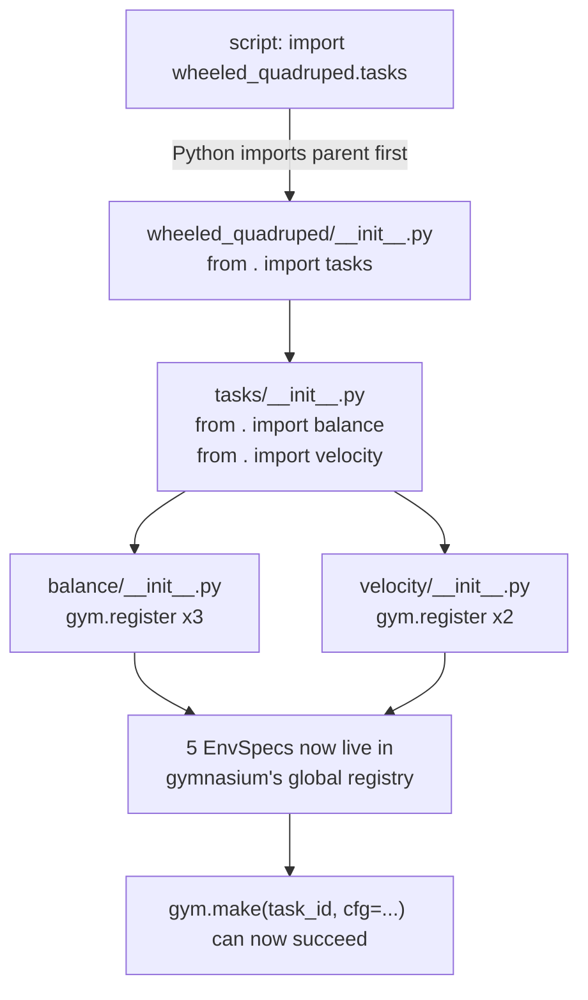
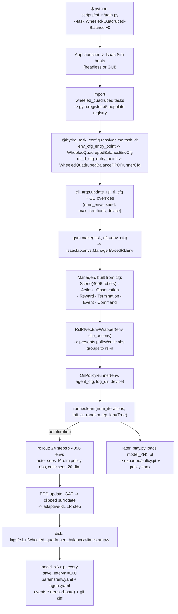

# Code Architecture & Data Flow

> **Abstract.** This chapter is a file-by-file tour of the repository so you can *navigate* it (find the code behind any behavior) and *extend* it (add a task, change a reward) with confidence. We follow a single control command from the moment you type `--task Wheeled-Quadruped-Balance-v0` on the command line, through Python's import machinery and Gymnasium's registry, into an Isaac Lab `ManagerBasedRLEnv`, out through the `RslRlVecEnvWrapper`, into the rsl-rl `OnPolicyRunner`, and finally onto disk as checkpoints, exported policies, and logs.

**Prerequisites / see also:** [Isaac Lab Architecture](04-Isaac-Lab-Architecture.md) (what a `ManagerBasedRLEnv` *is*), [The Balance Task](05-Balance-Task.md) and [The Velocity Task](06-Velocity-Task.md) (what the config classes we route to actually configure), [PPO Algorithm](07-PPO-Algorithm.md) (what the `OnPolicyRunner` does once it has the env), [Training & Reproducing](10-Training-and-Reproducing.md) (the operational how-to that this chapter explains the *internals* of), and [Overview](01-Overview.md) for the big picture.

---

## 1. Why the code is shaped like this: the "external extension" pattern

The single most important structural fact about this repository is that **it is not a fork of Isaac Lab.** It is a small, self-contained Python package that *plugs into* an already-installed Isaac Lab. Isaac Lab (version 2.3.2), Isaac Sim, and the RL libraries (rsl-rl, skrl, stable-baselines3, rl-games) all live somewhere else — inside the `.venv` this project runs against — and this repository contributes only the *new* things: one robot, two tasks, their reward/observation recipes, and a handful of driver scripts.

Think of it like a browser extension. Chrome is enormous and pre-installed; your extension is a few files that register a couple of hooks and let Chrome do the heavy lifting. Here, Isaac Lab is Chrome, and `wheeled_quadruped` is the extension. The proof is in `pyproject.toml`:

```toml
# source/wheeled_quadruped/pyproject.toml
[project]
name = "wheeled_quadruped"
version = "0.2.0"
requires-python = ">=3.10"
dependencies = []          # <-- deliberately empty
```

The empty `dependencies = []` (line 14) is not an oversight — it is the whole design. The comment right above it (lines 11-13) says isaaclab, isaacsim, and the RL libraries "are provided by the Isaac Lab environment this package is installed into." The package declares *no* runtime dependencies because it assumes the giant simulator stack is already present.

### 1.1 The directory layout

```
wheeled_quadruped_robot/               <- repo root (you run scripts from here)
├── pyproject-less top level; the *package* lives one level down:
├── source/
│   └── wheeled_quadruped/             <- the pip-installable project
│       ├── pyproject.toml             <- build config (setuptools)
│       ├── wheeled_quadruped.egg-info/  <- generated by the editable install
│       └── wheeled_quadruped/         <- the actual importable Python package
│           ├── __init__.py            <- `from . import tasks`  (registration trigger)
│           ├── assets/
│           │   ├── __init__.py        <- WHEELED_QUADRUPED_CFG (ArticulationCfg)
│           │   └── quadruped_robot.usd  <- 18.3 MB binary robot mesh/physics
│           └── tasks/
│               ├── __init__.py        <- `from . import balance` then `velocity`
│               ├── balance/
│               │   ├── __init__.py    <- gym.register(...) x3
│               │   ├── balance_env_cfg.py   <- the MDP definition
│               │   └── agents/
│               │       ├── rsl_rl_ppo_cfg.py   <- PPO hyperparameters (Python)
│               │       ├── skrl_ppo_cfg.yaml
│               │       ├── sb3_ppo_cfg.yaml
│               │       └── rl_games_ppo_cfg.yaml
│               └── velocity/
│                   ├── __init__.py    <- gym.register(...) x2
│                   ├── velocity_env_cfg.py    <- subclasses balance
│                   └── agents/
│                       └── rsl_rl_ppo_cfg.py  <- (only rsl-rl here)
└── scripts/                           <- driver programs (NOT part of the package)
    ├── list_envs.py
    ├── verify_env.py
    └── rsl_rl/
        ├── train.py
        ├── play.py
        └── cli_args.py
```

Two nesting facts trip up newcomers, so state them plainly:

1. **The word `wheeled_quadruped` appears twice on the path** — `source/wheeled_quadruped/wheeled_quadruped/`. The outer folder is the *project* (it holds `pyproject.toml`); the inner folder is the *importable package* (it holds `__init__.py`). This is the standard "src layout" for Python packaging.
2. **`scripts/` is deliberately *outside* the package.** The scripts are not shipped when you `pip install`; they are just programs you run. This is why `train.py` has to *explicitly* `import wheeled_quadruped.tasks` (line 98) to make the tasks exist — installing the package does not run the scripts, and running a script does not auto-import the package.

### 1.2 The editable install

The package is installed in **editable** (a.k.a. "development") mode, the artifact of which is the `wheeled_quadruped.egg-info/` directory. Editable mode means pip does *not* copy the files into `site-packages`; instead it drops a pointer so that `import wheeled_quadruped` resolves back to `source/wheeled_quadruped/wheeled_quadruped/`. The practical consequence for you as a contributor: **edit a `.py` file under `source/`, and the next `python train.py ...` sees the change immediately** — no reinstall needed. (You *would* need to reinstall if you changed `pyproject.toml` itself, e.g. added a package-data glob.)

`pyproject.toml` also declares which non-Python files travel with the package (lines 19-22):

```toml
[tool.setuptools.package-data]
"wheeled_quadruped.assets" = ["*.usd"]                    # the robot mesh
"wheeled_quadruped.tasks.balance.agents"  = ["*.yaml"]    # skrl/sb3/rl_games configs
"wheeled_quadruped.tasks.velocity.agents" = ["*.yaml"]    # (declared, though none exist here)
```

Note the last line declares a YAML glob for the velocity agents folder even though **no YAML files exist there** — velocity only ships an rsl-rl Python config. The declaration is harmless (it matches zero files) but is worth knowing so you are not surprised when you go looking for a `skrl_ppo_cfg.yaml` under `tasks/velocity/agents/` and find none.

---

## 2. The registration mechanism: how a task-id string becomes a running environment

When you run `python scripts/rsl_rl/train.py --task Wheeled-Quadruped-Balance-v0`, that task-id is just a *string*. Something has to turn it into (a) an environment configuration object and (b) an agent (PPO) configuration object. That "something" is the **Gymnasium registry**, populated at import time by `gym.register(...)` calls.

### 2.1 What `gym.register` stores

Gymnasium keeps a global dictionary from task-id → `EnvSpec`. Each `gym.register` call adds one entry. Here is the balance registration verbatim (`tasks/balance/__init__.py`, lines 16-27):

```python
gym.register(
    id="Wheeled-Quadruped-Balance-v0",
    entry_point="isaaclab.envs:ManagerBasedRLEnv",     # the env CLASS
    disable_env_checker=True,
    kwargs={
        "env_cfg_entry_point": f"{__name__}.balance_env_cfg:WheeledQuadrupedBalanceEnvCfg",
        "rsl_rl_cfg_entry_point": f"{agents.__name__}.rsl_rl_ppo_cfg:WheeledQuadrupedBalancePPORunnerCfg",
        "skrl_cfg_entry_point":   f"{agents.__name__}:skrl_ppo_cfg.yaml",
        "sb3_cfg_entry_point":    f"{agents.__name__}:sb3_ppo_cfg.yaml",
        "rl_games_cfg_entry_point": f"{agents.__name__}:rl_games_ppo_cfg.yaml",
    },
)
```

Read the three key pieces:

- **`entry_point="isaaclab.envs:ManagerBasedRLEnv"`** — the `"module:ClassName"` string naming the *environment class* Gymnasium will instantiate. Crucially, this is a **stock Isaac Lab class**, not a custom one. This project writes **zero** environment subclasses; every task uses the generic manager-based env, and all task-specific behavior is injected through the *configuration* object. (See [Isaac Lab Architecture](04-Isaac-Lab-Architecture.md) for what a "manager-based" env means.)
- **`env_cfg_entry_point`** — another `"module:ClassName"` string, this time naming the *configuration* class. With `__name__` being `wheeled_quadruped.tasks.balance`, the f-string expands to `"wheeled_quadruped.tasks.balance.balance_env_cfg:WheeledQuadrupedBalanceEnvCfg"`. This is the [balance MDP definition](05-Balance-Task.md).
- **`rsl_rl_cfg_entry_point`** — names the PPO runner config class: `"wheeled_quadruped.tasks.balance.agents.rsl_rl_ppo_cfg:WheeledQuadrupedBalancePPORunnerCfg"`.

The other three keys (`skrl_`, `sb3_`, `rl_games_`) point at YAML *files* using a slightly different `"package:filename"` resource syntax (note the colon before a bare filename rather than a class). Those are for alternative RL frameworks and are **not consumed by any script in this repo** — the only scripts present are `rsl_rl/train.py` and `rsl_rl/play.py`, which read `rsl_rl_cfg_entry_point`. The YAML entry points are reachable only via other Isaac Lab launcher scripts outside this repository.

### 2.2 Exactly which ids exist

The balance module registers **three** ids, the velocity module **two**. Here is the complete table (all five wire to `entry_point="isaaclab.envs:ManagerBasedRLEnv"`):

| Task id | `env_cfg_entry_point` class | Agent entry points wired |
|---|---|---|
| `Wheeled-Quadruped-Balance-v0` | `WheeledQuadrupedBalanceEnvCfg` | rsl_rl **+** skrl + sb3 + rl_games |
| `Custom-Wheeled-Quadruped-v0` *(legacy alias)* | `WheeledQuadrupedBalanceEnvCfg` | rsl_rl + skrl + sb3 + rl_games |
| `Wheeled-Quadruped-Balance-Play-v0` | `WheeledQuadrupedBalanceEnvCfg_PLAY` | rsl_rl + skrl + sb3 + rl_games |
| `Wheeled-Quadruped-Velocity-v0` | `WheeledQuadrupedVelocityEnvCfg` | **rsl_rl only** |
| `Wheeled-Quadruped-Velocity-Play-v0` | `WheeledQuadrupedVelocityEnvCfg_PLAY` | rsl_rl only |

Three things to internalize:

1. **`Custom-Wheeled-Quadruped-v0` is a byte-for-byte duplicate of the Balance-v0 registration** (`tasks/balance/__init__.py`, lines 30-41) — same env cfg, same four agent entry points. Its own comment (line 29) calls it a "Legacy alias kept for backwards compatibility." If you see it in `list_envs.py` output, it is not a second task; it is a second *name* for the balance task.
2. **The `-Play-v0` ids swap only the cfg class**, from `...EnvCfg` to `...EnvCfg_PLAY`. The Play cfg is a subclass that shrinks the scene to 32 envs, turns off observation noise, and removes the random-push event (see `balance_env_cfg.py` lines 262-275; velocity adds a fixed forward command). Play variants share the *train* agent config — there is no separate "play PPO cfg."
3. **Velocity registers only `rsl_rl_cfg_entry_point`.** There are no skrl/sb3/rl_games YAML files under `tasks/velocity/agents/`, so those keys are simply absent (`tasks/velocity/__init__.py`, lines 16-24).

### 2.3 From string back to Python object

At env-build time the string is resolved back into a live class. Two mechanisms do this depending on the caller:

- **The training/play scripts use Hydra** (Section 4.3): the `@hydra_task_config(args_cli.task, args_cli.agent)` decorator reads the registry entry for the task, pulls the class named by `env_cfg_entry_point` and by the requested agent entry point, and hands `main()` two fully-instantiated config objects.
- **The utility scripts use Isaac Lab's parse helpers**: `verify_env.py` calls `isaaclab_tasks.utils.parse_env_cfg(task)`; `cli_args.parse_rsl_rl_cfg` calls `load_cfg_from_registry(task_name, "rsl_rl_cfg_entry_point")`. Both look up the same registry entry.

Either way, the flow is: **task-id string → registry `EnvSpec.kwargs` → `"module:Class"` string → imported class → instantiated config object → passed to `gym.make(task, cfg=...)`.**

---

## 3. The import chain: why `import wheeled_quadruped.tasks` is enough

The registry entries in Section 2 only exist *after* the `gym.register(...)` calls execute. Those calls live at module top level, so they run as an **import side effect.** The chain is a cascade of `from . import ...` statements:



Trace it in the real files:

- `wheeled_quadruped/__init__.py` (line 8): `from . import tasks` — its docstring says "Importing this package registers all gym tasks ... as a side effect."
- `tasks/__init__.py` (lines 6-7): `from . import balance` **then** `from . import velocity`. Order matters only cosmetically (balance ids appear first in `list_envs.py`); functionally both must run.
- `tasks/balance/__init__.py` and `tasks/velocity/__init__.py`: each does `from . import agents` (to make `agents.__name__` available for building the entry-point strings) and then calls `gym.register`.

A subtle but load-bearing point: the scripts write `import wheeled_quadruped.tasks`, **not** `import wheeled_quadruped`. Python guarantees that importing a submodule first imports its parent package, so `wheeled_quadruped/__init__.py` runs regardless. `verify_env.py` and `list_envs.py` import `wheeled_quadruped.tasks` directly (with a `# noqa: F401` to silence the "unused import" linter, because the import is *only* for its side effect). Either import style triggers the exact same five registrations.

The `agents/__init__.py` files, incidentally, are **empty** (license header only). The YAML agent files are never `import`-ed as Python; they are resolved later as *package resources* from the `"package:filename.yaml"` strings. The empty `__init__.py` exists solely so that `agents` is a real subpackage whose `agents.__name__` (e.g. `"wheeled_quadruped.tasks.balance.agents"`) can be interpolated into the registration f-strings.

---

## 4. The scripts

The `scripts/` tree contains everything you actually *run*. There are five files across two groups: two "diagnostics" at the top level, and the rsl-rl train/play/shared-args trio.

### 4.1 `list_envs.py` — "what tasks exist?"

The simplest script. It launches Isaac Sim **headless** (`AppLauncher(headless=True)`, line 33), imports `wheeled_quadruped.tasks` to trigger registration (line 42), then walks `gym.registry.values()` and prints a `PrettyTable` of every id containing the keyword (default `"Wheeled-Quadruped"`, overridable with `--keyword`). For each match it prints `[S. No., Task Name, Entry Point, env_cfg_entry_point]` (lines 58-66). It uses `.get("env_cfg_entry_point", "")` defensively so a registration missing that key would print blank rather than crash.

> **Why launch the simulator just to list strings?** Because importing the task package pulls in Isaac Lab config classes, which in turn import Isaac Sim modules that only exist after `AppLauncher` has bootstrapped the Omniverse app. This "launch app *before* importing tasks" ordering is a hard rule mirrored by every script here; violate it and imports fail.

### 4.2 `verify_env.py` — the post-install smoke test

This is your first line of defense after any change. Invocation (from its own docstring, line 15):

```
python scripts/verify_env.py --task Wheeled-Quadruped-Balance-v0 --num_envs 8 --steps 200 --headless
```

CLI args (lines 26-28): `--task` (default `Wheeled-Quadruped-Balance-v0`), `--num_envs` (default 8), `--steps` (default 200), plus the standard `AppLauncher` args (which is where `--headless` and `--device` come from).

What it does, in order (lines 66-147):

1. Builds the env config with `parse_env_cfg(task, device, num_envs)` and creates the env with `gym.make(task, cfg=env_cfg)`.
2. Prints the Gym observation/action spaces, then reaches into `env.unwrapped.scene["robot"]` to print the articulation's `joint_names`, `body_names`, `num_joints`, `num_bodies`. This is the fastest way to confirm the USD loaded the four expected joints in the expected order.
3. Resets and prints the *shape* of every observation group — this is how you verify the policy group is 16-dim (balance) or 19-dim (velocity) and the critic group 20/23-dim without re-deriving it by hand (see [Balance Task](05-Balance-Task.md) for the dimension arithmetic).
4. Runs `--steps` steps of **random actions**, sampled as `actions = 2.0 * torch.rand(action_space.shape) - 1.0` (line 118) — i.e. uniform in $[-1, 1]$. This is worth pausing on: it confirms the **action space is a normalized $[-1,1]$ box** irrespective of the physical scale factors (0.5 for thigh position, 5.0/12.0 for wheel velocity) that the action *terms* apply downstream. The raw policy output is dimensionless; the scaling lives in the config.
5. On every step it scans all observation tensors *and* the reward for NaN/Inf via the recursive helper `_find_bad_tensors` (lines 49-63), which descends into nested dicts and only inspects floating-point tensors.
6. Accumulates `total_resets` and `mean_reward`, prints a `PASS`/`FAIL` summary, and **returns exit code 0 (PASS) / 1 (FAIL)** so CI can gate on it. The whole thing is wrapped in `try/except/finally` with `simulation_app.close()` always called (lines 149-166), so the simulator shuts down cleanly even on an exception.

### 4.3 `train.py` — the training entry point

This is the workhorse. Its structure follows a strict "launch first, import second" ordering dictated by Isaac Sim.

**Phase 1 — argument parsing and app launch (lines 10-52).** Before *any* Isaac Lab import, it:
- imports `cli_args` as a **same-directory local module** (`import cli_args  # isort: skip`, line 16). This is why the script must be run with `scripts/rsl_rl/` on `sys.path` (i.e. run from that directory, or with it added). `cli_args` is not part of the installed package.
- builds an `argparse` parser with the task-level flags, then *appends* two more flag groups: `cli_args.add_rsl_rl_args(parser)` (line 38) and `AppLauncher.add_app_launcher_args(parser)` (line 40).
- calls `parser.parse_known_args()` (line 41), splitting recognized flags from leftover `hydra_args`. It then **rewrites `sys.argv`** to contain only the Hydra leftovers (line 48) so Hydra, which reads `sys.argv` itself, does not choke on the argparse flags.
- launches the simulator: `app_launcher = AppLauncher(args_cli); simulation_app = app_launcher.app` (lines 51-52).

The train-script CLI flags (lines 19-40):

| Flag | Default | Meaning |
|---|---|---|
| `--task` | `Wheeled-Quadruped-Balance-v0` | which registered env to build |
| `--agent` | `rsl_rl_cfg_entry_point` | which registry key names the agent cfg |
| `--num_envs` | `None` (→ cfg default 4096) | parallel environments |
| `--max_iterations` | `None` (→ cfg default) | PPO iterations to run |
| `--seed` | `None` | RNG seed (`-1` → random 0–10000, handled in `cli_args`) |
| `--video`, `--video_length` (200), `--video_interval` (2000) | | periodic training video capture |
| `--distributed` | `False` | multi-GPU / multi-node |
| `--resume`, `--load_run`, `--checkpoint` | | resume from a prior run (via `cli_args`) |
| `--logger`, `--log_project_name`, `--run_name`, `--experiment_name` | | logging destination (via `cli_args`) |

**Phase 2 — version guard (lines 54-72).** It reads the installed `rsl-rl-lib` version via `importlib.metadata` and compares against `RSL_RL_VERSION = "3.0.1"`. If the installed version is older, it prints the exact `pip install rsl-rl-lib==3.0.1` command and `exit(1)`. This hard floor exists because the asymmetric-actor-critic `obs_groups` wiring (Section 5) is an rsl-rl ≥ 3.0 feature.

**Phase 3 — heavy imports and TF32 (lines 76-110).** Only now does it import `torch`, `gymnasium`, `rsl_rl.runners`, Isaac Lab env types, and — critically — `import wheeled_quadruped.tasks` (line 98) to register the environments. It sets `torch.backends.cuda.matmul.allow_tf32 = True` and `cudnn.allow_tf32 = True` (with `deterministic=False`, `benchmark=False`) to trade a little numerical precision for throughput on the GPU.

**Phase 4 — the Hydra-decorated `main` (lines 113-221).** The decorator

```python
@hydra_task_config(args_cli.task, args_cli.agent)
def main(env_cfg: ManagerBasedRLEnvCfg | ..., agent_cfg: RslRlBaseRunnerCfg):
```

does the string→object resolution of Section 2.3: it looks up `args_cli.task` in the registry, reads the `env_cfg_entry_point` and the entry point named by `args_cli.agent` (default `"rsl_rl_cfg_entry_point"`), imports both classes, instantiates them, and injects them as `env_cfg` and `agent_cfg`. Inside `main` the script then:

1. Applies the non-Hydra CLI overrides: `agent_cfg = cli_args.update_rsl_rl_cfg(agent_cfg, args_cli)` (line 117), then overrides `env_cfg.scene.num_envs`, `agent_cfg.max_iterations`, `env_cfg.seed`, `env_cfg.sim.device` from the CLI where provided (lines 117-142). This layering — *config-class defaults, then CLI overrides* — is the mental model to hold: the YAML/Python cfg is the baseline; flags patch it.
2. Builds the log directory (Section 6): `logs/rsl_rl/{experiment_name}/{timestamp}[_{run_name}]` (lines 145-155).
3. Creates the env: `env = gym.make(args_cli.task, cfg=env_cfg, render_mode=...)` (line 169).
4. Optionally wraps for video (`gym.wrappers.RecordVideo`, lines 180-189), then **always** wraps for rsl-rl: `env = RslRlVecEnvWrapper(env, clip_actions=agent_cfg.clip_actions)` (line 194). This wrapper is the adapter that presents Isaac Lab's dict-of-observation-groups to rsl-rl in the shape the runner expects (see [Asymmetric Actor-Critic](08-Asymmetric-Actor-Critic-and-Sim2Real.md)).
5. Constructs the runner: `OnPolicyRunner(env, agent_cfg.to_dict(), log_dir=log_dir, device=...)` if `agent_cfg.class_name == "OnPolicyRunner"`, else `DistillationRunner`, else `ValueError` (lines 197-202). For this project it is always `OnPolicyRunner`.
6. Logs git state (`runner.add_git_repo_to_log(__file__)`), optionally loads a resume checkpoint, and **dumps the resolved configs** to `log_dir/params/env.yaml` and `agent.yaml` (lines 212-213) — this is your reproducibility record.
7. Runs training: `runner.learn(num_learning_iterations=agent_cfg.max_iterations, init_at_random_ep_len=True)` (line 216). The `init_at_random_ep_len=True` staggers the initial episode phases across the 4096 parallel envs so they do not all reset in lockstep.

### 4.4 `play.py` — inference and export

`play.py` mirrors `train.py`'s launch/import skeleton but its `main` (lines 84-204) does inference instead of learning. Notable differences:

- **Checkpoint resolution (lines 87-114).** It strips the task name to find the *training* experiment: `task_name = args_cli.task.split(":")[-1]; train_task_name = task_name.replace("-Play", "")` (lines 88-89). So `Wheeled-Quadruped-Balance-Play-v0` looks up checkpoints under the *balance train* experiment. The checkpoint source is chosen in priority order: `--use_pretrained_checkpoint` (fetch from Nucleus), else `--checkpoint` (an explicit path), else `get_checkpoint_path(...)` (latest in the log dir).
- **Policy export (lines 172-174).** *On every play invocation*, it exports the trained network twice: `export_policy_as_jit(..., filename="policy.pt")` and `export_policy_as_onnx(..., filename="policy.onnx")`, into `logs/.../exported/`. These are the deployment artifacts — a TorchScript module and an ONNX graph — that carry the policy *and* its observation normalizer (if any) with no rsl-rl dependency. This is the bridge to hardware (see [Asymmetric Actor-Critic & Sim2Real](08-Asymmetric-Actor-Critic-and-Sim2Real.md)).
- **The inference loop (lines 176-201).** `dt = env.unwrapped.step_dt` (the control period $\Delta t = 0.02$ s). Then repeatedly: `actions = policy(obs); obs, _, dones, _ = env.step(actions); policy_nn.reset(dones)`. With `--real-time` it sleeps `dt - elapsed` each step so the viewer runs at wall-clock speed; with `--video` it stops after `video_length` steps.

### 4.5 `cli_args.py` — the shared argument helper

Imported by both `train.py` and `play.py` (as a same-directory module). It defines three functions:

- `add_rsl_rl_args(parser)` (lines 16-40): registers the shared flags `--experiment_name`, `--run_name`, `--resume`, `--load_run`, `--checkpoint`, `--logger` (choices `{wandb, tensorboard, neptune}`), `--log_project_name`.
- `parse_rsl_rl_cfg(task_name, args_cli)` (lines 42-57): loads the default agent cfg via `load_cfg_from_registry(task_name, "rsl_rl_cfg_entry_point")` then applies `update_rsl_rl_cfg`. (Used by the utility path; `train.py`/`play.py` get their cfg from the Hydra decorator instead and only call `update_rsl_rl_cfg`.)
- `update_rsl_rl_cfg(agent_cfg, args_cli)` (lines 60-91): the override layer. It sets `seed` (mapping `-1` → a random int in $[0, 10000]$), `resume`, `load_run`, `load_checkpoint` (from `--checkpoint`), `run_name`, `logger`, and — when the logger is `wandb`/`neptune` — `wandb_project`/`neptune_project` from `--log_project_name`.

---

## 5. End-to-end data flow: one command, top to bottom

Putting Sections 2-4 together, here is the full path from your keystroke to a saved checkpoint. Follow the arrows top to bottom.



The key conceptual boundary is the `RslRlVecEnvWrapper`: **above it, everything is Isaac Lab** (a manager-based env whose behavior is 100% determined by the config object); **below it, everything is rsl-rl** (the runner, the PPO algorithm, the storage buffer). The wrapper's job is to translate Isaac Lab's observation *dictionary* (`{"policy": ..., "critic": ...}`) into the grouped tensors the rsl-rl actor and critic consume — the mechanism behind the asymmetric actor-critic detailed in [Chapter 8](08-Asymmetric-Actor-Critic-and-Sim2Real.md). It also applies action clipping.

Because *no environment subclass exists in this repo*, every arrow between `gym.make` and the reward manager is stock Isaac Lab code parameterized by the config class you routed to. That is the payoff of the manager-based design: to change what the robot rewards, terminates on, observes, or how it is randomized, **you edit a config, not an environment.**

---

## 6. The logs and checkpoints on disk

`train.py` builds the log path as `logs/rsl_rl/{experiment_name}/{timestamp}[_{run_name}]` (lines 145-155), where `experiment_name` comes from the agent cfg — `"wheeled_quadruped_balance"` or `"wheeled_quadruped_velocity"`. A completed run directory looks like:

```
logs/rsl_rl/wheeled_quadruped_balance/
└── 2026-07-18_09-14-03[_my_run_name]/
    ├── model_0.pt           # checkpoint at iteration 0
    ├── model_100.pt         # every save_interval = 100 iterations
    ├── model_200.pt
    │   ...
    ├── model_1000.pt        # final (max_iterations)
    ├── params/
    │   ├── env.yaml         # the fully-resolved env cfg (dump_yaml, line 212)
    │   └── agent.yaml       # the fully-resolved agent cfg (line 213)
    ├── exported/            # created by play.py, NOT train.py
    │   ├── policy.pt        # TorchScript (JIT) policy
    │   └── policy.onnx      # ONNX policy
    ├── videos/
    │   ├── train/           # if --video passed to train.py
    │   └── play/            # if --video passed to play.py
    └── events.out.tfevents.*  # TensorBoard scalars (loss, reward, KL, ...)
```

Details worth knowing:

- **`model_<N>.pt` cadence** is set by `save_interval` in the PPO runner cfg (`save_interval = 100`, `rsl_rl_ppo_cfg.py` line 15). Balance runs `max_iterations = 1000` (11 checkpoints: 0, 100, …, 1000); velocity runs `max_iterations = 3000`.
- **`params/env.yaml` + `params/agent.yaml` are the reproducibility record.** Because the scripts dump the *resolved* configs (after all CLI overrides), you can reconstruct exactly what was trained even if you later edit the source. Combined with `runner.add_git_repo_to_log(__file__)` (which snapshots the git commit and diff), a run is fully traceable.
- **`exported/` is written by `play.py`, not `train.py`.** Training saves rsl-rl-native `.pt` checkpoints (weights + optimizer state, requiring rsl-rl to load); play *exports* framework-independent `policy.pt`/`policy.onnx` for deployment. If you never run `play.py`, you have no `exported/` folder.
- **Checkpoint lookup** for resume/play uses `get_checkpoint_path(log_root, load_run, load_checkpoint)`, which finds the latest run and latest `model_*.pt` unless you pin `--load_run`/`--checkpoint`.

---

## 7. Extending the code

### 7.1 To change a reward

Rewards live in the `RewardsCfg` class of the task's env cfg — for balance, `balance_env_cfg.py` (lines 193-219). Each reward is a `RewTerm(func=..., weight=..., params=...)`. Two kinds of edits:

- **Re-tune an existing term:** change its `weight`. Example: to punish leaving the target height harder, edit `base_height = RewTerm(func=mdp.base_height_l2, weight=-20.0, ...)` and lower the weight further. Remember the sign convention: the reward *functions* return non-negative quadratic penalties; the **negative weight** is what makes them penalties. And every term is internally multiplied by $\Delta t = 0.02$ s by the reward manager, so a weight of $-20$ contributes at most $-20 \cdot (h-h^\*)^2 \cdot 0.02$ per step (see [Balance Task](05-Balance-Task.md) and [Isaac Lab Architecture](04-Isaac-Lab-Architecture.md) for the dt-scaling rule).
- **Add a new term:** add an attribute to `RewardsCfg` naming a stock `isaaclab.envs.mdp` reward function. This project writes **no custom MDP functions** — every reward is a stock `mdp.*` symbol parameterized by joint/body names. Browse `isaaclab.envs.mdp.rewards` for available kernels.

The velocity task shows the *override* idiom for tuning inherited rewards without copying them. `VelocityRewardsCfg(RewardsCfg)` inherits all ten balance terms and adds two tracking terms; then `WheeledQuadrupedVelocityEnvCfg.__post_init__` re-weights three and deletes one (`velocity_env_cfg.py` lines 118-132):

```python
def __post_init__(self):
    super().__post_init__()
    self.rewards.alive.weight = 0.25          # was 1.0
    self.rewards.base_height.weight = -10.0   # was -20.0
    self.rewards.flat_orientation.weight = -2.0  # was -5.0
    self.rewards.wheel_spin = None            # remove the term entirely
    self.actions.wheel_vel.scale = 12.0       # was 5.0
```

Setting a term attribute to `None` in `__post_init__` **removes** it (the reward manager skips `None` terms). This is the clean, subclass-friendly way to disable an inherited reward without editing the parent class.

### 7.2 To add a new task

The velocity task *is* the worked example of "add a task," and it is the only cross-task Python dependency in the whole package. To add a third task, follow its pattern (`velocity_env_cfg.py`):

1. **Create the cfg module.** Add `tasks/mytask/mytask_env_cfg.py`. Rather than start from scratch, subclass `WheeledQuadrupedBalanceEnvCfg` (import it from `wheeled_quadruped.tasks.balance.balance_env_cfg`) and override only what differs — new `CommandsCfg`, extended `ObservationsCfg`/`RewardsCfg`, and a `__post_init__` that re-tunes weights. Provide a `..._PLAY` subclass for evaluation.
2. **Create the agent cfg.** Add `tasks/mytask/agents/rsl_rl_ppo_cfg.py` with a `configclass` subclassing `RslRlOnPolicyRunnerCfg`. Copy `velocity/agents/rsl_rl_ppo_cfg.py` and change `experiment_name`, and any hyperparameters (velocity, for instance, uses a wider `[256, 128, 64]` MLP and 3000 iterations vs balance's `[128, 128]`/1000). Add the empty `agents/__init__.py`.
3. **Register the ids.** Add `tasks/mytask/__init__.py` with `gym.register` calls pointing `env_cfg_entry_point` and `rsl_rl_cfg_entry_point` at your new classes (copy velocity's two-id train/play pattern).
4. **Wire the import chain.** Add `from . import mytask` to `tasks/__init__.py` so registration fires on import.
5. **Declare package data** if you added YAML agent files: extend `[tool.setuptools.package-data]` in `pyproject.toml` and reinstall (editable install picks up `.py` edits automatically, but a `pyproject.toml` change needs a reinstall).
6. **Verify:** `python scripts/list_envs.py` should now show your ids, and `python scripts/verify_env.py --task Wheeled-Quadruped-MyTask-v0 --headless` should print `PASS`.

Then train with `python scripts/rsl_rl/train.py --task Wheeled-Quadruped-MyTask-v0`. No script changes are needed — the scripts are task-agnostic; they resolve everything through the registry from the `--task` string. See [Training & Reproducing](10-Training-and-Reproducing.md) for the full run recipe.

---

## 8. Summary

- The repo is a **thin external Isaac Lab extension** (`dependencies = []`, editable install), contributing one robot, two tasks, and five driver scripts; the simulator and RL libraries are pre-installed.
- **Behavior is data, not code:** there are zero env subclasses and zero custom MDP functions. Every task is the stock `ManagerBasedRLEnv` parameterized by a config class, using stock `isaaclab.envs.mdp` terms.
- A **task-id string** resolves through Gymnasium's registry (`gym.register` kwargs) to an `env_cfg_entry_point` class and a `rsl_rl_cfg_entry_point` class, populated as an **import side effect** of `import wheeled_quadruped.tasks`.
- **Five ids exist:** three for balance (including the `Custom-` legacy alias and a `-Play-` eval variant), two for velocity; only balance wires the non-rsl-rl frameworks.
- The **scripts** launch Isaac Sim first, import tasks to register them, use `@hydra_task_config` to turn the `--task`/`--agent` strings into config objects, wrap the env in `RslRlVecEnvWrapper`, and hand it to an `OnPolicyRunner`.
- Runs land in `logs/rsl_rl/<experiment>/<timestamp>/` as `model_<N>.pt` checkpoints plus resolved `params/*.yaml`; `play.py` additionally emits `exported/policy.pt` and `policy.onnx` for deployment.
- **Extending** means editing configs: change a `weight` (or set a term to `None`) to alter rewards; subclass the balance cfg, add an agent cfg, `gym.register`, and hook the import chain to add a task.
