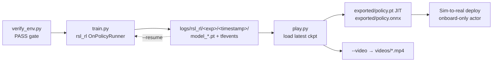

# Training, Results & Reproduction

> **Abstract.** This is the practical lab manual for the wheeled-quadruped project: the exact software stack and version pins, the verify → train → play → export → record workflow with copy-pasteable commands, the **real** learning curves recovered from the checkpoint logs (balance is *solved*, mean reward $\approx 19.5$ at a full $1000/1000$-step episode length), and the operational lore you only learn by getting burned (the resume-buffer dip, the empty-run-directory trap, and the infamous Windows QuickEdit freeze). It closes with a reward-tuning playbook and the roadmap.
>
> **Prerequisites / see also.** [Overview](01-Overview.md) · [RL & MDP Foundations](03-RL-and-MDP-Foundations.md) · [Isaac Lab Architecture](04-Isaac-Lab-Architecture.md) · [Balance Task](05-Balance-Task.md) · [Velocity Task](06-Velocity-Task.md) · [PPO Algorithm](07-PPO-Algorithm.md) · [Asymmetric Actor-Critic & Sim2Real](08-Asymmetric-Actor-Critic-and-Sim2Real.md) · [Code Architecture](09-Code-Architecture.md)

---

## 1. The stack

Everything here targets a single reference workstation: an **RTX 4090 Laptop GPU (16 GB VRAM)**, Windows 11, GPU driver 591.44. The software stack:

| Component | Version | Role |
|---|---|---|
| Python | **3.11.x** | The interpreter Isaac Sim 5.1 / Isaac Lab 2.3.2 target |
| NVIDIA Isaac Sim | **5.1.0** | PhysX simulator + USD renderer (pip-installed, no `isaaclab.bat` wrapper) |
| NVIDIA Isaac Lab | **2.3.2.post1** | Manager-based RL env framework (the modern `isaaclab` namespace) |
| PyTorch | **2.7.0 + cu128** | Autograd / GPU tensor backend; CUDA 12.8 build must match Isaac Sim |
| rsl-rl-lib | **≥ 3.0.1** | The PPO trainer this repo's scripts drive (see [PPO Algorithm](07-PPO-Algorithm.md)) |
| `wheeled_quadruped` | 0.2.0 (this repo) | The task package, `pip install -e` from `source/wheeled_quadruped` |

A crucial subtlety about *where* these pins live: **this repo pins none of them.** `source/wheeled_quadruped/pyproject.toml` declares `dependencies = []` and only `requires-python = ">=3.10"`. Isaac Sim, Isaac Lab, PyTorch, and the RL libraries are all assumed pre-installed in the environment. The versions above are the *reference-machine* facts, not repo constraints, so reproducing the results means recreating this environment yourself, from [SETUP_WINDOWS.md](../SETUP_WINDOWS.md). The one hard, code-level version check that *does* live in the repo is in `scripts/rsl_rl/train.py:61`, it refuses to start unless the installed `rsl-rl-lib` is at least **3.0.1**, printing pip-install instructions and exiting otherwise.

### 1.1 Install-time gotchas (the ones that eat an afternoon)

These are dependency-resolution landmines that surface *after* the headline `pip install "isaaclab[all]==2.3.2.post1"` command, because pip's resolver can pick transitive versions that don't agree with the torch 2.7 / Python 3.11 combination:

- **`tensordict` version drift.** Isaac Lab / rsl-rl pull in `tensordict`. A newer `tensordict` built against a different torch ABI throws import-time errors (`undefined symbol`, or a `TensorDict` API mismatch) the moment you `import isaaclab_tasks`. Pin it explicitly: `pip install tensordict==0.8.3`. This is the version that matches torch 2.7.0+cu128 on this machine.
- **`h5py` on Windows / Python 3.11.** Logging and some agent backends transitively want `h5py`. If pip tries to *build* it from source (no matching wheel) the install fails on the HDF5 headers. Force a prebuilt wheel (`pip install h5py --only-binary :all:`) before the Isaac Lab install so the resolver reuses it.
- **First launch looks frozen for 10+ minutes.** The very first time any script imports Isaac Sim, Omniverse pulls and compiles its extension registry and shader cache with almost no output. This is normal, do **not** kill it. (It is also easy to confuse with the QuickEdit freeze in §10, which is a *different* thing.)
- **Long paths.** Isaac Sim's dependency tree exceeds the legacy 260-character path limit; enable `LongPathsEnabled` (SETUP_WINDOWS.md Step 2) or the install fails with filename-too-long errors.

---

## 2. Verify before you train

Never launch a multi-hour training run against an environment you haven't smoke-tested. The repo ships a dedicated acceptance gate, `scripts/verify_env.py`:

```powershell
python scripts\verify_env.py --task Wheeled-Quadruped-Balance-v0 --num_envs 8 --steps 200 --headless
```

Internally (`verify_env.py:71-146`) it builds the env via `parse_env_cfg` + `gym.make`, prints the robot's joint/body names, resets, prints every observation-group shape, then runs `--steps` random-action rollouts. The random actions are drawn as `2*rand-1`, uniform on $[-1,1]$, which confirms the action space is a normalized box regardless of the physical scale factors ($0.5$ for thighs, $5.0$ or $12.0$ for wheels) that the action terms apply downstream (see [Balance Task §Actions](05-Balance-Task.md)). Every observation and reward tensor is scanned for NaN/Inf each step by `_find_bad_tensors`, and the script exits `0` (PASS) or `1` (FAIL).

**Eyeball these in the output before proceeding:**

- `num_joints = 4` (2 rear wheels + 2 front thighs), `robot` present in the scene.
- **Policy** observation width **16**, **critic** width **20** (balance). For velocity: **19 / 23**. These are the actor/critic obs dimensions from [Asymmetric Actor-Critic §Dimensions](08-Asymmetric-Actor-Critic-and-Sim2Real.md).
- No NaN/Inf; resets observed; finite mean reward.

If verify FAILs, stop and fix the environment, a NaN here becomes a wasted GPU-hour later.

---

## 3. Training

The end-to-end pipeline the scripts implement:



### 3.1 The commands

On the **16 GB** laptop GPU, **start at `--num_envs 2048`.** The config default is `num_envs = 4096` (`balance_env_cfg.py`), but 4096 parallel PhysX scenes plus any rendering can exceed 16 GB. Move up to 4096 only after confirming VRAM headroom with `nvidia-smi`. The rsl-rl trainer scales cleanly with any `num_envs` because it uses `num_mini_batches = 4` (a divisor), unlike the rl_games/SB3 YAMLs which hard-assume 4096.

```powershell
# Balance policy, headless (start here)
python scripts\rsl_rl\train.py --task Wheeled-Quadruped-Balance-v0 --headless --num_envs 2048

# Velocity policy (built on top of the balancer)
python scripts\rsl_rl\train.py --task Wheeled-Quadruped-Velocity-v0 --headless --num_envs 2048
```

Both tasks share the same timing: physics at 200 Hz (`sim.dt = 0.005`), control at 50 Hz (`decimation = 4`, so $\Delta t = 0.02$ s), and 20 s episodes = **1000 control steps** (see [Isaac Lab Architecture §Timing](04-Isaac-Lab-Architecture.md)). Each PPO iteration collects `num_steps_per_env = 24` steps per env before an update. The trainer runs `runner.learn(num_learning_iterations = max_iterations, init_at_random_ep_len = True)`, balance caps at `max_iterations = 1000`, velocity at `3000`.

`train.py` accepts `--seed`, `--max_iterations`, `--experiment_name`, `--run_name`, `--logger {tensorboard,wandb,neptune}`, and (via `--video --video_length 200 --video_interval 2000`) periodic training-time video capture. Hydra resolves the env and agent config classes straight from the gym registry using `--task` and `--agent` (default `rsl_rl_cfg_entry_point`).

---

## 4. How to read the two headline metrics

Before looking at any numbers, understand exactly what TensorBoard's `Train/mean_reward` and `Train/mean_episode_length` mean *for this project*, or you will misread them.

**Per-step reward is dt-scaled.** The RewardManager computes, each control step,

$$r_t = \sum_i w_i \, f_i(s_t)\, \Delta t, \qquad \Delta t = 0.02\ \text{s}.$$

Here $w_i$ is a term's config weight, $f_i$ its (non-negative) kernel, and the $\Delta t$ factor is applied by the manager itself (see [Balance Task §Rewards](05-Balance-Task.md) and [PPO Algorithm](07-PPO-Algorithm.md)). Penalties are negative *only* because their weights are negative. `mean_reward` is the mean **episode-summed** reward across envs.

**The reward ceiling tells you what "solved" looks like.** For balance, the dominant positive term is `alive` with $w = 1.0$: it contributes $1.0 \times 0.02 = 0.02$ per step, i.e. up to $0.02 \times 1000 = \mathbf{20.0}$ over a full episode. The squared-error penalties (`base_height` at $-20$, `flat_orientation` at $-5$, and the rest) shave a little off. So a **converged balancer scores just under 20**, and that is precisely what we see. There is nothing magic about 19.5; it is "collected the entire alive stream, paid a small posture tax."

**Episode length is the survival signal.** `mean_episode_length` is the average number of **control steps** an episode lasts before terminating. The maximum is 1000 (the 20 s cap). Episodes end early only on the two failure terminations, tilt past $\pi/3$ (60°) or base height below 0.4 m (see [Balance Task §Terminations](05-Balance-Task.md)). Therefore:

- `mean_episode_length → 1000` means **no early falls**, every episode survives the full 20 s including the mid-episode push. This is the single clearest "it learned to stay up" indicator.
- A rising episode length is learning; a plateau below 1000 means the policy still tips in some fraction of envs.

---

## 5. Results, balance is solved

The numbers below are extracted directly from the checkpointed TensorBoard event files under `logs/rsl_rl/wheeled_quadruped_balance/`. Two runs tell the full story.

**Run A (`2026-07-18_02-23-10`), the genuine emergence.** Trained from scratch (random policy) and stopped around iteration 478:

| Iter | `mean_reward` | `mean_episode_length` | What's happening |
|---:|---:|---:|---|
| 0 | −1.68 | 15.7 | Random policy, falls in ~0.3 s |
| 100 | 0.00 | 70.9 | Just starting to not-fall |
| **200** | **8.81** | **553.4** | **Sharp emergence**, surviving over half the episode |
| 300 | 17.21 | 930.4 | Nearly always upright |
| 400 | 18.38 | 974.3 | Converging |
| ~478 | 18.87 | 987.8 | Stopped here |

The **balance capability emerges sharply between iterations ~100 and ~300**: episode length rockets from 71 → 553 → 930 steps as the policy crosses from "falls immediately" to "essentially never falls." This is the characteristic hockey-stick of a stability task, once the policy finds the neighborhood of the balancing fixed point, competence compounds fast.

**Run B (`2026-07-18_04-12-15`), resumed to convergence.** This run **resumed from Run A's `model_400`** (confirmed in its saved `params/agent.yaml`: `resume: true`, `load_run: 2026-07-18_02-23-10`, `load_checkpoint: model_.*.pt`) and trained the full budget to iteration 1399:

| Iter | `mean_reward` | `mean_episode_length` | Note |
|---:|---:|---:|---|
| 400 | 0.25 | 13.4 | ⚠️ **resume-buffer artifact, not forgetting** (see below) |
| 450 | 18.38 | 959.7 | Statistics repopulated |
| 550 | 19.13 | 997.7 | |
| 600 | 19.24 | 997.6 | |
| 1000 | 19.45 | **1000.0** | Full survival |
| **1399** | **19.52** | **1000.0** | **Solved** |

**Final result: mean reward $\approx 19.5$ at $1000/1000$ episode length**, the robot balances indefinitely, recovers from the periodic pushes, and never tips across the whole batch. Against the $\sim 20$ ceiling from §4, that is essentially optimal.

> **⚠️ The iteration-400 dip is a logging artifact, not a regression.** When you `--resume`, rsl-rl reloads the network weights but **resets the running reward / episode-length buffers**, and `init_at_random_ep_len = True` seeds episodes at random lengths. So the *first* logged iteration after a resume reports statistics from a near-empty buffer of freshly-started episodes, here reward 0.25, length 13.4, even though the loaded policy is the competent `model_400`. By iteration 450 the buffers refill and the true value (~18.4) reappears. **Do not panic and do not conclude the policy forgot.** Give it a few iterations before reading the resumed curve.

---

## 6. Velocity, in progress

The velocity task (`Wheeled-Quadruped-Velocity-v0`) is a live, *un-converged* run. From `logs/rsl_rl/wheeled_quadruped_velocity/2026-07-18_08-50-16/` (of a `max_iterations = 3000` budget):

| Iter | `mean_reward` | `ep_len` | `track_lin_vel_xy` | `track_ang_vel_z` |
|---:|---:|---:|---:|---:|
| 100 | 0.92 | 85 | 0.04 | 0.03 |
| 200 | 19.47 | 904 | 0.51 | 0.33 |
| 400 | 22.27 | 936 | 0.58 | 0.34 |
| ~422 | 22.31 | 908 | 0.59 | 0.33 |

Two things to read here. First, **the reward magnitude is higher than balance's** (~22 vs ~19.5) and that is *expected*, not better balancing: velocity down-weights `alive` to 0.25 (ceiling $5.0$) but adds `track_lin_vel_xy` ($w=1.0$, ceiling $20$) and `track_ang_vel_z` ($w=0.5$, ceiling $10$), so the reward is measured on a different scale entirely (see [Velocity Task §Reward re-weighting](06-Velocity-Task.md)). Never compare raw reward across the two tasks. Second, the tracking terms use the exp-kernel $\exp(-\lVert c-v\rVert^2/\sigma^2)$; a value of ~0.59 out of a max of 1.0 means the policy is following commands *decently but not tightly*, consistent with an early run only ~14% through its budget and a first-pass reward weighting that still needs tuning.

---

## 7. Play, export, and record video

`play.py` loads a trained checkpoint and runs it deterministically. Point it at the **Play** task id, the eval variant with 32 envs, noise off, and the periodic push removed:

```powershell
# Watch the trained balancer
python scripts\rsl_rl\play.py --task Wheeled-Quadruped-Balance-Play-v0 --num_envs 32

# Real-time playback (sleep to wall-clock so it looks natural)
python scripts\rsl_rl\play.py --task Wheeled-Quadruped-Balance-Play-v0 --num_envs 32 --real-time

# Record a clip (headless-friendly): 200-step MP4 into logs/.../videos/
python scripts\rsl_rl\play.py --task Wheeled-Quadruped-Balance-Play-v0 --num_envs 32 --video --video_length 200
```

Checkpoint resolution (`play.py:88-89`): it strips `-Play` from the task id to find the training experiment folder (`wheeled_quadruped_balance`), then picks the latest run and latest `model_*.pt`. **Every play invocation also exports the policy** (`play.py:172-174`), unconditionally, to `logs/.../exported/`:

- `policy.pt`, a TorchScript JIT trace, and
- `policy.onnx`, an ONNX graph.

Both wrap the **actor only** (the 16-input onboard policy), with the observation normalizer folded in, this is the artifact you carry to hardware. The critic is training-only scaffolding and is not exported (see [Asymmetric Actor-Critic §Sim2Real](08-Asymmetric-Actor-Critic-and-Sim2Real.md)). The inference loop is plain: `actions = policy(obs); obs, _, dones, _ = env.step(actions); policy.reset(dones)`.

---

## 8. Resume, checkpoints, and the empty-run-dir pitfall

**Where things land.** Runs are written to `logs\rsl_rl\<experiment_name>\<timestamp>\`, where `<experiment_name>` is `wheeled_quadruped_balance` or `wheeled_quadruped_velocity`. Checkpoints are `model_<iteration>.pt`, saved every `save_interval = 100` iterations. Each run dir also captures `params/{env,agent}.yaml` (the fully-resolved config, invaluable for knowing exactly what produced a policy), a `git/` diff, the `tfevents` log, and (after a play) `exported/` and `videos/`.

**Resuming.** Pass `--resume`, optionally with `--load_run <timestamp>` and `--checkpoint <n>`:

```powershell
python scripts\rsl_rl\train.py --task Wheeled-Quadruped-Balance-v0 --headless --num_envs 2048 --resume
```

Without `--load_run`, rsl-rl picks the **latest** run directory; without `--checkpoint`, it regex-matches the **highest** `model_*.pt` (this is literally how Run B above continued Run A from `model_400`).

> **⚠️ The empty-run-directory pitfall.** `train.py` creates the new timestamped run directory *at launch*, before the first checkpoint is written (the first save is 100 iterations in). If a run crashes, OOM, a QuickEdit freeze you gave up on, a driver hiccup, in its first 100 iterations, it leaves behind an **empty** (checkpoint-less) run directory that is now the *newest* timestamp. A subsequent `--resume` (or any `play.py`, which auto-selects the latest run) will select that empty dir and fail with "no checkpoint found", even though a perfectly good older run sits right next to it. **Fix:** delete the stale empty run directory, or point explicitly with `--load_run <good_timestamp>`. You can see exactly this fingerprint in the velocity logs: `2026-07-18_08-47-10` holds only `model_0`/`model_1` (a stillborn launch) sitting beside the real run `2026-07-18_08-50-16`.

---

## 9. The Windows QuickEdit freeze (operational lesson)

The most disorienting non-bug you will hit on Windows. Symptom: mid-training, **all log output stops, `nvidia-smi` shows GPU utilization collapse to ~0%, and the process looks hung**, but it hasn't crashed, thrown, or printed anything.

Cause: Windows console windows (Command Prompt, PowerShell, Windows Terminal) ship with **QuickEdit Mode** enabled. A single **click inside the window** silently enters text-selection mode, which **pauses the console's stdout pipe**. The training process keeps running until its stdout buffer fills, then **blocks on `write()`** waiting for the console to drain, which never happens while selection mode is held. To the eye it is a total freeze.

**It is not a crash. Recover it in place:** press **Enter** or **Esc**, or **right-click** in the window, to exit selection mode; the buffered writes flush and training resumes exactly where it paused, no progress lost.

**Prevent it:**
- Disable **QuickEdit Mode** in the console's Properties → Options (do this once, permanently).
- Or run detached and redirect output to a file so an accidental click can't stall the pipe:
  ```powershell
  python scripts\rsl_rl\train.py --task Wheeled-Quadruped-Balance-v0 --headless --num_envs 2048 *> train.log
  ```
  then `Get-Content train.log -Wait` (or TensorBoard) to watch progress without ever touching the training console.

The lesson generalizes: for long unattended GPU runs, **never leave the training process bound to an interactive console you might click into.** Redirect to a log and monitor out-of-band.

---

## 10. TensorBoard

The rsl-rl runner logs to TensorBoard by default. Launch it against the experiment root and watch both tasks at once:

```powershell
tensorboard --logdir logs\rsl_rl
```

The scalars that matter, and how to read them:

| Tag | Read it as |
|---|---|
| `Train/mean_reward` | Progress toward the ~20 ceiling (§4); the headline number |
| `Train/mean_episode_length` | Survival, **→ 1000 is "solved"** (§4) |
| `Episode_Reward/<term>` | Per-term contribution (e.g. `base_height`, `track_lin_vel_xy`), where reward is being won or lost |
| `Episode_Termination/{time_out,bad_orientation,base_too_low}` | *How* episodes end. Rising `time_out` share = fewer falls = good |
| `Loss/learning_rate` | The **adaptive** LR (§[PPO](07-PPO-Algorithm.md)), it moves on its own toward the `desired_kl = 0.01` target |
| `Policy/mean_noise_std` | Exploration collapsing over training as the policy sharpens |
| `Perf/total_fps` | Throughput, your VRAM/`num_envs` tradeoff, live |

The per-term `Episode_Reward/*` breakdown is your primary debugging lens: if the robot behaves badly but total reward looks fine, one term is usually dominating or fighting another. That directly feeds the tuning guide below.

---

## 11. Reward-tuning playbook

If training fails or plateaus, change **one axis at a time** and re-evaluate with the `_PLAY` variant (noise and pushes off) so you read the policy, not the disturbances. Adjust in roughly this order, the earlier items are both more common and more catastrophic.

1. **Signs first, always.** Every squared-error term (`base_height_l2`, `flat_orientation_l2`, all `*_l2` penalties) is a **cost** and *must* carry a **negative** weight. A positive weight on a squared error pays the robot to *maximize* the error. An earlier prototype gave `base_height_l2` a positive weight and it literally learned to leave the target height. If a policy trains but converges to something absurd (collapses, launches, drifts), **check the signs before anything else.**
2. **`base_height` vs `flat_orientation` ratio (balance).** These two define "standing." If the robot **squats / over-corrects height** while staying level, its height penalty ($-20$) is too strong relative to orientation, reduce its magnitude or raise `flat_orientation`. If it **holds height but leans/tips**, do the reverse. Tune them as a *ratio*, not independently.
3. **Tracking-vs-hold ratio (velocity).** If it **balances but won't drive**, the balance-hold terms still dominate. The config already softens them (`alive` $1.0\to0.25$, `base_height` $-20\to-10$, `flat_orientation` $-5\to-2$, `wheel_spin` removed); push those further and/or raise the tracking weights above the current $+1.0$ / $+0.5$. Watch `Episode_Reward/track_lin_vel_xy` climb toward its max of 1.0. If tracking is jerky, *widen* the exp-kernel $\sigma$ (currently $\sqrt{0.25}=0.5$) for a softer gradient; *narrow* it to demand tighter tracking.
4. **Entropy coefficient (`entropy_coef = 0.005`).** If the policy collapses early to a rigid low-return behavior (premature determinism, watch `Policy/mean_noise_std` crash), raise it (e.g. 0.01) to keep exploring. If it stays jittery and never sharpens, lower it.
5. **Push magnitude (`push_robot`, $\pm 0.5$ m/s).** If the policy never becomes robust, falls on the first disturbance at eval, the pushes are too weak to teach recovery; increase them. If it can't get off the ground early in training, they're overwhelming a not-yet-competent policy; soften or lengthen the interval, then restore.
6. **Smoothness (`action_rate = -0.01`).** Buzzy/vibrating motion → increase its magnitude. Sluggish, under-reacting policy → decrease it.

See [Balance Task §Rewards](05-Balance-Task.md) and [Velocity Task](06-Velocity-Task.md) for the full weight tables these refer to.

---

## 12. Roadmap

Grounded in the current state of the repo and logs:

- **Balance, done.** Solved to mean reward $\approx 19.5$ at $1000/1000$ episode length; policy exported to `policy.pt` / `policy.onnx`.
- **Velocity, training, not yet converged.** ~420 of 3000 iterations, tracking rewards climbing (~0.59 lin / ~0.33 ang). Next: run to convergence and iterate on the tracking-vs-balance weight ratio (§11.3), which is still a first pass.
- **Curriculum (future).** Both tasks currently train at full difficulty from step 0, full push magnitude, full command range, full domain randomization. Easing pushes/commands in as competence grows would likely speed convergence, especially for velocity.
- **Sim-to-real (next milestone).** The entire onboard-only actor design ([Asymmetric Actor-Critic & Sim2Real](08-Asymmetric-Actor-Critic-and-Sim2Real.md)) exists to make this possible: the exported 16-input policy consumes only signals a real IMU + joint encoders can produce. Deploying it on the physical robot is the target once velocity lands.
