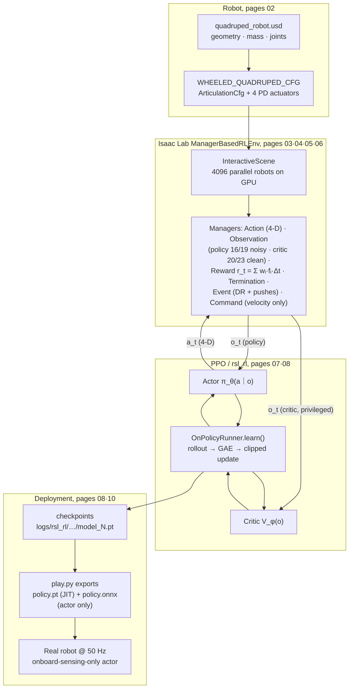

# Wheeled-Quadruped Robot, Project Wiki

Welcome to the complete, textbook-style documentation for the **wheeled quadruped**: a four-legged robot that has been re-purposed into a two-wheeled self-balancer. It stands pitched up on its two rear wheels like a Segway, holds itself upright as a **3-D inverted pendulum**, and, once it can balance, learns to **drive around while staying up**. Both skills are learned end-to-end with deep reinforcement learning (**PPO**, via `rsl_rl`) inside NVIDIA **Isaac Lab 2.3.2**, training thousands of simulated robots in parallel on a single GPU.

This wiki is written as a **course, not a reference dump**. It builds from the physics of *why balancing is hard*, through the reinforcement-learning theory, the Isaac Lab simulation stack, the two task definitions term-by-term, the PPO algorithm in full mathematical detail, the asymmetric actor-critic that makes the policy deployable on real hardware, the code architecture, and finally the real training results (**balance is solved**: mean reward ≈ 19.5 at a full 1000/1000-step episode). Every technical claim is grounded in an actual repository file, and every symbol is defined the first time it appears, and collected here in the [Notation Glossary](#notation-glossary).

> **The one-sentence version.** A ~18 kg four-legged robot balances on two rear wheels using only wheel torque and front-leg posture, controlled at 50 Hz by a neural network that sees only what an onboard IMU and joint encoders could measure, trained entirely in simulation, exported to `policy.pt` / `policy.onnx` for the real machine.

---

## Master table of contents

| # | Page | What it covers |
|---|------|----------------|
|, | **[Home](Home.md)** *(this page)* | The landing page: project abstract, master contents, reading order, the big-picture diagram, and the shared notation glossary. |
| 01 | **[Overview](01-Overview.md)** | What a "wheeled quadruped" is, the inverted-pendulum framing (fall time τ ≈ 0.29 s → why 50 Hz control), the two tasks at a glance, and the end-to-end architecture map. Start here. |
| 02 | **[The Robot](02-The-Robot.md)** | Morphology and physics: the **four** actuated joints (2 thigh position servos + 2 wheel velocity servos), the implicit PD actuator law, the 0.828 m stance geometry, and the URDF→USD fixed-joint merge that names the trunk `robot1_base_footprint`. |
| 03 | **[RL & MDP Foundations](03-RL-and-MDP-Foundations.md)** | Reinforcement learning from scratch: the MDP tuple, returns and discounting, value functions and Bellman equations, why this robot is really a **POMDP**, Gaussian policies, and both tasks written out as concrete MDPs. |
| 04 | **[Isaac Lab Architecture](04-Isaac-Lab-Architecture.md)** | The PhysX → Isaac Sim → Isaac Lab stack, the **manager-based** paradigm (Scene / Action / Observation / Reward / Termination / Event / Command), the exact `step()` order, the two-clock timing, and 4096-way GPU parallelism. |
| 05 | **[Balance Task](05-Balance-Task.md)** | The full balance MDP: the 16/20-dim observation groups, the 4-dim action space and actuator model, all **10 reward terms** with a worked single-step calculation, the 3 terminations, and the 5 domain-randomization events. |
| 06 | **[Velocity Task](06-Velocity-Task.md)** | How velocity subclasses balance: the commanded-velocity generator, differential-drive kinematics (why the wheel scale jumps 5 → 12), the exponential tracking rewards, and the reward re-weighting that lets the robot drive instead of freeze. |
| 07 | **[PPO Algorithm](07-PPO-Algorithm.md)** | The training algorithm end-to-end: the policy-gradient theorem, GAE advantages, the clipped surrogate, clipped value loss, entropy bonus, the analytic-KL adaptive learning rate, the network sizes, and the full `OnPolicyRunner` batch arithmetic. |
| 08 | **[Asymmetric Actor-Critic & Sim2Real](08-Asymmetric-Actor-Critic-and-Sim2Real.md)** | Why the **critic** sees privileged clean state ($v$, $h$) while the **actor** sees only noisy onboard signals, the variance argument that justifies it, domain randomization term-by-term, and exactly what gets exported to hardware. |
| 09 | **[Code Architecture](09-Code-Architecture.md)** | A file-by-file tour: the external-extension package pattern, the gym-registration chain (5 ids from an import side effect), the train/play/verify scripts, the end-to-end data flow, on-disk logs, and how to extend the code. |
| 10 | **[Training & Reproducing](10-Training-and-Reproducing.md)** | The lab manual: the software stack and install gotchas, the verify → train → play → export workflow with copy-pasteable commands, the **real learning curves**, TensorBoard reading, a reward-tuning playbook, and the roadmap. |
| 11 | **[Sim-to-Sim Validation](11-Sim-to-Sim-Validation.md)** | Running the trained policies in **MuJoCo**, an independent physics engine, as a cheap rehearsal for sim-to-real: how the model is rebuilt from the URDF, the matched observation/action contract, the cross-engine results (3 of 4 survive every episode), and the terrain-fidelity lesson. |

---

## How to read this wiki

The pages are numbered in dependency order, each assumes the concepts introduced before it, but you do not have to read them all in sequence. Pick the path that matches why you are here.

### Beginner path, read straight through
If you are new to reinforcement learning, robotics, or this project, read the pages in order. Nothing is assumed beyond basic calculus and linear algebra; every RL concept is built from the ground up.

### Reference path, jump to what you need
If you already know PPO and just want a specific answer:

| I want to… | Go to |
|---|---|
| Understand the robot's joints, gains, and geometry | [02 The Robot](02-The-Robot.md) |
| See every observation / reward / termination with weights | [05 Balance Task](05-Balance-Task.md), [06 Velocity Task](06-Velocity-Task.md) |
| Read the PPO / GAE / clipped-surrogate math | [07 PPO Algorithm](07-PPO-Algorithm.md) |
| Know why the policy is deployable on real hardware | [08 Asymmetric Actor-Critic & Sim2Real](08-Asymmetric-Actor-Critic-and-Sim2Real.md) |
| Find the code behind a behavior, or add a task | [09 Code Architecture](09-Code-Architecture.md) |
| Actually run training / play / export | [10 Training & Reproducing](10-Training-and-Reproducing.md) |
| See the policies validated in a second physics engine (MuJoCo) | [11 Sim-to-Sim Validation](11-Sim-to-Sim-Validation.md) |
| Understand Isaac Lab's managers and the `step()` loop | [04 Isaac Lab Architecture](04-Isaac-Lab-Architecture.md) |

---

## The big picture

One diagram ties the whole project together: the robot geometry becomes a configured articulation, which is cloned into thousands of parallel Isaac Lab environments, whose observations and rewards drive a PPO actor-critic, whose trained **actor** is exported for deployment on the real robot. Each stage is a page above.

The key idea to carry through every page: the **actor is deliberately blindfolded**, it only ever consumes signals a real IMU and joint encoders could produce, while the **critic**, used only during training, is allowed to read the simulator's ground truth. That asymmetry is what makes a simulation-trained policy runnable on real hardware with no motion capture. See [page 08](08-Asymmetric-Actor-Critic-and-Sim2Real.md).

---

## Notation glossary

Every page uses the symbols below with the same meaning. This is the canonical reference; skim it once and refer back as needed. (In the joint vector, the fixed order is $q = [\text{front-left-thigh},\ \text{front-right-thigh},\ \text{rl-wheel},\ \text{rr-wheel}]$.)

### Time and control

| Symbol | Meaning | Value / units |
|---|---|---|
| $t$ | Discrete control timestep index |, (integer; 0 … 999 per episode) |
| $f_c$ | Control frequency (policy decision rate) | $50$ Hz |
| $\Delta t$ | Control period $= D \cdot dt$ | $0.02$ s |
| $dt$ | Physics timestep (PhysX integration) | $0.005$ s ($200$ Hz) |
| $D$ | Decimation (physics substeps per control step) | $4$ |
|, | Episode length | $20.0$ s $= 1000$ control steps |

### MDP and learning

| Symbol | Meaning | Value / units |
|---|---|---|
| $s_t$ | Full environment (simulator) state at step $t$ |, |
| $o_t$ | Observation, noisy, partial view of $s_t$ | policy $\in \mathbb{R}^{16/19}$, critic $\in \mathbb{R}^{20/23}$ |
| $a_t$ | Action, 2 thigh position + 2 wheel velocity targets | $\in \mathbb{R}^{4}$, normalized $\approx[-1,1]$ |
| $r_t$ | Scalar reward, $r_t = \sum_i w_i\, f_i(s_t)\,\Delta t$ | reward units (dt-scaled) |
| $\gamma$ | Discount factor | $0.99$ (effective horizon $\approx 100$ steps $= 2$ s) |
| $G_t$ | Return, $G_t = \sum_{k\ge 0}\gamma^k r_{t+k}$ | reward units |
| $\pi_\theta(a\mid o)$ | Policy (actor), a diagonal Gaussian, parameters $\theta$ |, |
| $V_\varphi(o)$ | Value function (critic), parameters $\varphi$ | reward units |
| $A_t$ | Advantage $= Q(o_t,a_t) - V(o_t)$ (estimated by GAE) | reward units |
| $\lambda$ | GAE bias-variance parameter | $0.95$ |
| $w_i,\ f_i$ | Reward term weight and (non-negative) kernel |, |
| $\varepsilon$ | PPO clip half-width (`clip_param`) | $0.2$ |
| $\sigma$ | Learnable policy standard deviation (per action dim) | init $1.0$ |

### Robot state (base frame unless noted)

| Symbol | Meaning | Value / units |
|---|---|---|
| $q$ | Joint positions, order $[\text{FL-thigh},\text{FR-thigh},\text{rl-wheel},\text{rr-wheel}]$ | $\in \mathbb{R}^4$; rad |
| $\dot q$ | Joint velocities | $\in \mathbb{R}^4$; rad/s |
| $q_{\text{default}}$ | Default / nominal joint positions | $\mathbf{0}$ rad |
| $v = (v_x,v_y,v_z)$ | Base (torso) linear velocity | m/s |
| $\omega = (\omega_x,\omega_y,\omega_z)$ | Base angular velocity | rad/s |
| $g_b = R_b^{\top}\hat g$ | Projected gravity (world "down" in base frame) | unit vector; $\approx(0,0,-1)$ upright |
| $R_b$ | Base-to-world rotation matrix; $\hat g = (0,0,-1)$ |, |
| $h = p_z$ | Base height (world $z$ of the base origin) | m; target $h^\star = 0.828$ |
| $c = (c_x,c_y,c_z)$ | Commanded velocity $=(\text{lin-vel-x}^\star,\text{lin-vel-y}^\star,\text{ang-vel-z}^\star)$ | (m/s, m/s, rad/s); velocity task only |

### Actuator / physical model

| Symbol | Meaning | Value / units |
|---|---|---|
| $\tau$ | Joint torque, $\tau = k_p(q^\star-q)+k_d(\dot q^\star-\dot q)$ | N·m |
| $q^\star,\ \dot q^\star$ | Commanded PD position / velocity targets | rad, rad/s |
| $k_p,\ k_d$ | PD stiffness / damping (thighs 1000/20; wheels 0/10) |, |
| $r$ | Wheel radius (comment-only, unverified) | $\approx 0.1008$ m |
| $b$ *(pg 06)* / $w$ *(pg 02)* | Track width, rear wheel spacing (comment-only) | $\approx 0.44$ m |

> **A note on unverified numbers.** Wheel radius ($\approx 0.1008$ m), track width ($\approx 0.44$ m), trunk mass ($\approx 17.94$ kg), and the thigh limit ($\pm 0.785$ rad) appear only as **code comments / docstrings**, not as configured parameters, the robot's `.usd` geometry is a compressed binary asset that could not be independently read. They are labeled *comment-only* throughout the wiki and should be treated as approximate design intent. The spawn/target height $h^\star = 0.828$ m and all gains, weights, and timing values *are* verified config values.

---

*This wiki documents the `wheeled_quadruped` Isaac Lab extension (package version 0.2.0). For setup see [SETUP_WINDOWS.md](../SETUP_WINDOWS.md); for the training walkthrough see [TRAINING.md](../TRAINING.md) and [page 10](10-Training-and-Reproducing.md). Begin at [01 · Overview](01-Overview.md).*
